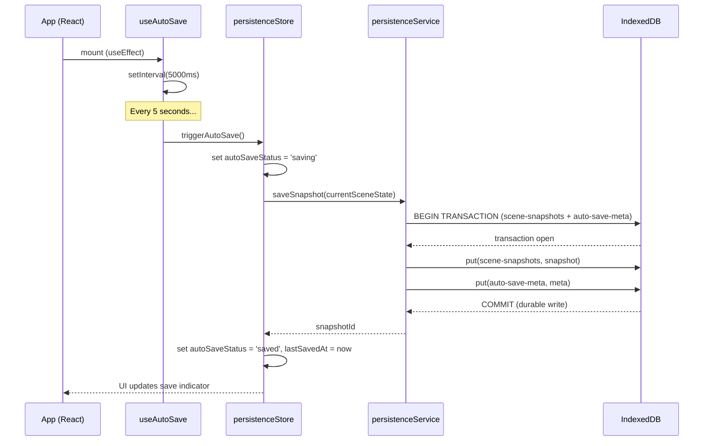
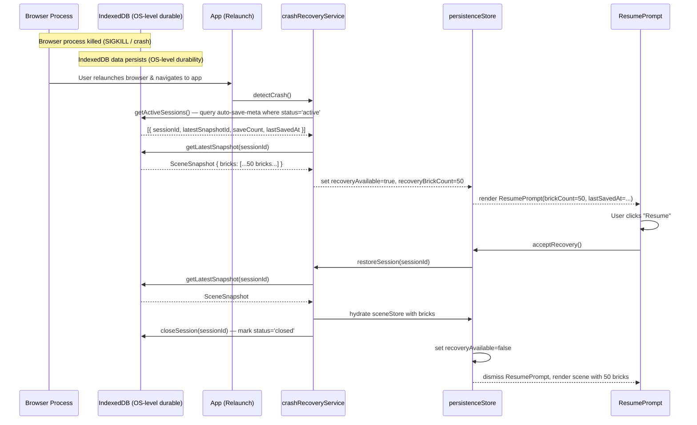
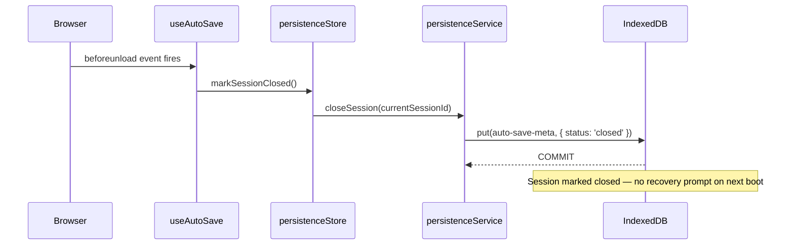
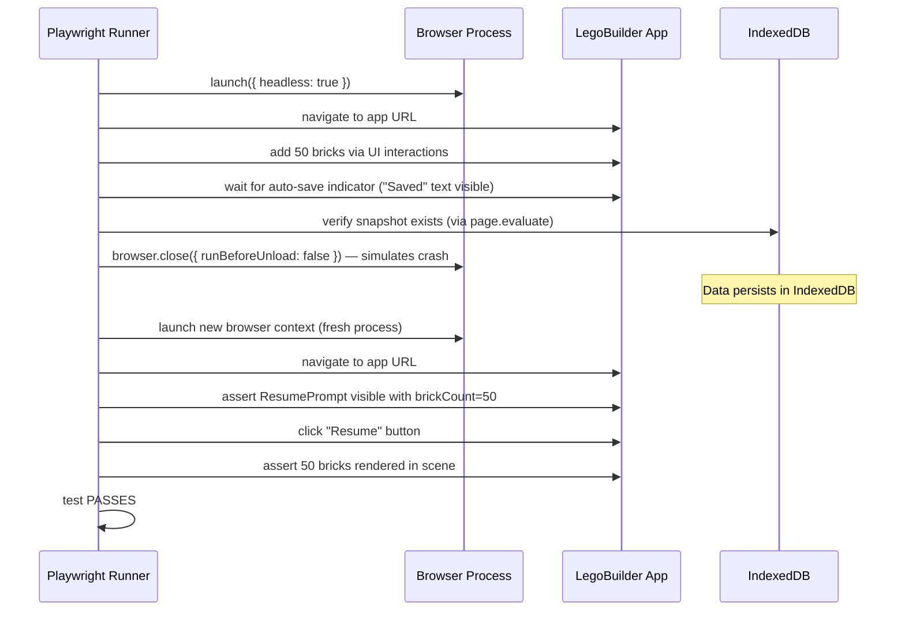

# Low-Level Design: NFR-REL-001 — Auto-Save Crash Durability

**Feature ID:** NFR-REL-001
**Issue:** [#35](https://github.com/sreenivasmrpivot/legobuilder/issues/35)
**Title:** Ensure auto-saved data survives browser crash with zero data loss
**Author:** Spectra Design Agent
**Status:** Draft — Awaiting Gate 6a Review
**Dependencies:** FR-PERS-001 (#19), FR-PERS-002 (#20)

---

## 1. Overview

NFR-REL-001 is a **reliability non-functional requirement** that mandates zero data loss when the browser process is killed unexpectedly. The LegoBuilder app auto-saves scene state to IndexedDB on a 5-second interval. Because IndexedDB transactions are ACID-compliant and durable by default, data written inside a completed transaction survives a browser crash. This LLD defines:

- The `persistenceService` write path and transaction atomicity contract
- The `crashRecoveryService` read path and resume-prompt flow
- The Zustand store integration (`persistenceStore`)
- The Playwright E2E crash-recovery test architecture
- Error handling, security, and performance targets

---

## 2. Architecture Context

```
+------------------------------------------------------------------+
|                        React SPA (Browser)                       |
|                                                                   |
|  +--------------+    +------------------+   +----------------+  |
|  |  SceneStore  +---->  persistenceStore +---> persistenceSvc |  |
|  |  (Zustand)   |    |   (Zustand)      |   |  (idb library) |  |
|  +--------------+    +------------------+   +-------+--------+  |
|                                                      |           |
|  +---------------------------------------------------v--------+  |
|  |                    IndexedDB (Browser Storage)              |  |
|  |   DB: legobuilder-v1                                        |  |
|  |   Store: scene-snapshots  (keyPath: snapshotId)             |  |
|  |   Store: auto-save-meta   (keyPath: sessionId)              |  |
|  +------------------------------------------------------------+  |
|                                                                   |
|  +----------------------------------------------------------+    |
|  |              crashRecoveryService                        |    |
|  |  Reads IndexedDB on app boot -> shows ResumePrompt UI   |    |
|  +----------------------------------------------------------+    |
+------------------------------------------------------------------+

                    +------------------------------+
                    |  Playwright E2E Test Runner  |
                    |  crashRecovery.spec.ts       |
                    |  - Launches browser          |
                    |  - Adds 50 bricks            |
                    |  - Waits for auto-save       |
                    |  - Kills browser process     |
                    |  - Relaunches browser        |
                    |  - Asserts resume prompt     |
                    |  - Asserts 50 bricks restored|
                    +------------------------------+
```

---

## 3. Data Models

### 3.1 IndexedDB Schema

**Database name:** `legobuilder-v1`
**Version:** 1 (bumped to 2 if schema changes are needed)

#### Object Store: `scene-snapshots`

```typescript
interface SceneSnapshot {
  snapshotId: string;          // UUID v4 — primary key
  sessionId: string;           // UUID v4 — links to auto-save-meta
  timestamp: number;           // Unix epoch ms (Date.now())
  schemaVersion: number;       // Integer — for forward-compat migrations
  bricks: BrickRecord[];       // Full brick array (serialised scene state)
  cameraState: CameraState;    // Camera position/rotation/zoom
  sceneMetadata: SceneMetadata; // Name, created-at, last-modified
}

interface BrickRecord {
  id: string;                  // UUID v4
  type: string;                // e.g. "2x4", "1x1", "plate-2x4"
  position: [number, number, number]; // [x, y, z] in stud units
  rotation: [number, number, number, number]; // quaternion [x,y,z,w]
  color: string;               // hex string e.g. "#FF0000"
}

interface CameraState {
  position: [number, number, number];
  target: [number, number, number];
  zoom: number;
}

interface SceneMetadata {
  name: string;
  createdAt: number;           // Unix epoch ms
  lastModifiedAt: number;      // Unix epoch ms
}
```

#### Object Store: `auto-save-meta`

```typescript
interface AutoSaveMeta {
  sessionId: string;           // UUID v4 — primary key
  latestSnapshotId: string;    // FK -> scene-snapshots.snapshotId
  saveCount: number;           // Monotonically increasing counter
  lastSavedAt: number;         // Unix epoch ms
  appVersion: string;          // SemVer string e.g. "1.0.0"
  status: 'active' | 'closed'; // 'closed' on graceful tab close
}
```

**Indexes:**
- `scene-snapshots` -> index on `sessionId` (for querying all snapshots of a session)
- `scene-snapshots` -> index on `timestamp` (for ordering)
- `auto-save-meta` -> index on `lastSavedAt` (for finding most recent session)

### 3.2 Zustand Store: `persistenceStore`

```typescript
interface PersistenceState {
  // Status
  autoSaveStatus: 'idle' | 'saving' | 'saved' | 'error';
  lastSavedAt: number | null;       // Unix epoch ms
  saveCount: number;
  currentSessionId: string | null;
  currentSnapshotId: string | null;

  // Recovery
  recoveryAvailable: boolean;       // true if unresolved session found on boot
  recoverySessionId: string | null; // sessionId of the recoverable session
  recoverySnapshotId: string | null;
  recoveryBrickCount: number | null;

  // Actions
  initSession: () => Promise<void>;
  triggerAutoSave: () => Promise<void>;
  markSessionClosed: () => Promise<void>;
  checkForRecovery: () => Promise<void>;
  acceptRecovery: () => Promise<void>;
  dismissRecovery: () => Promise<void>;
}
```

---

## 4. Component Architecture

### 4.1 Module Map

```
frontend/src/
+-- services/
|   +-- persistenceService.ts       # IndexedDB read/write via idb library
|   +-- crashRecoveryService.ts     # Boot-time recovery detection
|   +-- dbSchema.ts                 # IDB schema definition & upgrade logic
+-- stores/
|   +-- persistenceStore.ts         # Zustand store for persistence state
+-- hooks/
|   +-- useAutoSave.ts              # Interval-based auto-save hook
|   +-- useRecoveryCheck.ts         # Boot-time recovery check hook
+-- components/
|   +-- ResumePrompt/
|       +-- ResumePrompt.tsx         # Modal dialog for crash recovery
|       +-- ResumePrompt.test.tsx    # Unit tests
|       +-- index.ts
+-- tests/
    +-- e2e/
        +-- crashRecovery.spec.ts   # Playwright crash-recovery E2E test
```

### 4.2 `persistenceService.ts` — Interface Contract

```typescript
import { openDB, IDBPDatabase } from 'idb';
import type { SceneSnapshot, AutoSaveMeta } from './dbSchema';

export interface PersistenceService {
  /**
   * Opens (or upgrades) the IndexedDB database.
   * Must be called once at app startup before any other method.
   */
  init(): Promise<void>;

  /**
   * Writes a scene snapshot and updates auto-save-meta in a single
   * atomic transaction. Returns the snapshotId on success.
   * Throws PersistenceError on transaction failure.
   */
  saveSnapshot(snapshot: Omit<SceneSnapshot, 'snapshotId'>): Promise<string>;

  /**
   * Reads the latest snapshot for a given sessionId.
   * Returns null if no snapshot exists.
   */
  getLatestSnapshot(sessionId: string): Promise<SceneSnapshot | null>;

  /**
   * Returns all auto-save-meta records with status='active'.
   * Used by crashRecoveryService to detect unresolved sessions.
   */
  getActiveSessions(): Promise<AutoSaveMeta[]>;

  /**
   * Marks a session as 'closed' (graceful tab close).
   * Prevents false-positive recovery prompts on next boot.
   */
  closeSession(sessionId: string): Promise<void>;

  /**
   * Deletes all snapshots and meta for a given sessionId.
   * Called after user dismisses recovery or after successful restore.
   */
  purgeSession(sessionId: string): Promise<void>;
}
```

### 4.3 `crashRecoveryService.ts` — Interface Contract

```typescript
export interface RecoveryCandidate {
  sessionId: string;
  snapshotId: string;
  brickCount: number;
  lastSavedAt: number;
  appVersion: string;
}

export interface CrashRecoveryService {
  /**
   * Scans IndexedDB for active sessions that were not gracefully closed.
   * Returns the most recent candidate, or null if none found.
   * Called once at app boot before rendering the main scene.
   */
  detectCrash(): Promise<RecoveryCandidate | null>;

  /**
   * Loads the snapshot for the given sessionId into the scene store.
   * Marks the session as closed after successful restore.
   */
  restoreSession(sessionId: string): Promise<void>;

  /**
   * Discards the recovery candidate without restoring.
   * Purges the stale session from IndexedDB.
   */
  discardSession(sessionId: string): Promise<void>;
}
```

### 4.4 `useAutoSave.ts` — Hook Contract

```typescript
/**
 * Registers a setInterval that calls persistenceStore.triggerAutoSave()
 * every AUTO_SAVE_INTERVAL_MS (default: 5000ms).
 *
 * - Clears the interval on component unmount.
 * - Skips save if autoSaveStatus === 'saving' (prevents overlapping writes).
 * - Registers a 'beforeunload' listener that calls markSessionClosed()
 *   for graceful tab-close detection.
 *
 * Usage: call once in the root App component.
 */
export function useAutoSave(intervalMs?: number): void;

export const AUTO_SAVE_INTERVAL_MS = 5000;
```

### 4.5 `ResumePrompt.tsx` — Component Props

```typescript
interface ResumePromptProps {
  brickCount: number;           // Number of bricks in the recoverable session
  lastSavedAt: number;          // Unix epoch ms — displayed as human-readable time
  onResume: () => void;         // Calls persistenceStore.acceptRecovery()
  onDiscard: () => void;        // Calls persistenceStore.dismissRecovery()
}

/**
 * Modal dialog rendered when recoveryAvailable === true in persistenceStore.
 * Blocks scene interaction until user makes a choice.
 * Accessible: focus-trapped, ARIA role="dialog", keyboard-navigable.
 */
export function ResumePrompt(props: ResumePromptProps): JSX.Element;
```

---

## 5. API Endpoints

NFR-REL-001 is a **purely client-side feature**. There are no backend API endpoints. All persistence is handled via the browser's IndexedDB API through the `idb` library. No network requests are made during auto-save or crash recovery.

| Operation | Mechanism | Latency Target |
|-----------|-----------|----------------|
| Auto-save write | IndexedDB transaction (idb) | < 50 ms p99 |
| Boot recovery check | IndexedDB cursor scan | < 100 ms p99 |
| Session restore | IndexedDB read + Zustand hydration | < 200 ms p99 |
| Session close (beforeunload) | IndexedDB transaction | < 30 ms p99 |

---

## 6. Sequence Diagrams

### 6.1 Normal Auto-Save Flow



### 6.2 Browser Crash & Recovery Flow



### 6.3 Graceful Tab Close Flow



### 6.4 Playwright Crash Recovery Test Flow



---

## 7. Transaction Atomicity Contract

The core durability guarantee relies on IndexedDB's ACID transaction model:

| Property | Guarantee | Implementation |
|----------|-----------|----------------|
| **Atomicity** | Both `scene-snapshots` and `auto-save-meta` writes succeed or both fail | Single `readwrite` transaction spanning both object stores |
| **Consistency** | `latestSnapshotId` in meta always points to a valid snapshot | Written in same transaction; FK integrity enforced in service layer |
| **Isolation** | Concurrent save attempts do not interleave | `autoSaveStatus === 'saving'` guard in `useAutoSave` prevents overlap |
| **Durability** | Committed data survives browser crash | IndexedDB flushes to OS-level storage before resolving the transaction promise |

### Critical Implementation Rule

```typescript
// CORRECT — both writes in one transaction
async saveSnapshot(snapshot: Omit<SceneSnapshot, 'snapshotId'>): Promise<string> {
  const snapshotId = crypto.randomUUID();
  const db = await this.getDB();
  const tx = db.transaction(['scene-snapshots', 'auto-save-meta'], 'readwrite');
  await tx.objectStore('scene-snapshots').put({ ...snapshot, snapshotId });
  await tx.objectStore('auto-save-meta').put({
    sessionId: snapshot.sessionId,
    latestSnapshotId: snapshotId,
    saveCount: (await tx.objectStore('auto-save-meta').get(snapshot.sessionId))?.saveCount + 1 ?? 1,
    lastSavedAt: Date.now(),
    appVersion: APP_VERSION,
    status: 'active',
  });
  await tx.done; // Resolves only after OS-level flush (durable)
  return snapshotId;
}

// WRONG — two separate transactions (not atomic)
// await db.put('scene-snapshots', snapshot);  // <- crash here = orphaned snapshot
// await db.put('auto-save-meta', meta);        // <- never written
```

---

## 8. Error Handling Strategy

### 8.1 Error Types

```typescript
export class PersistenceError extends Error {
  constructor(
    message: string,
    public readonly code: PersistenceErrorCode,
    public readonly cause?: unknown
  ) {
    super(message);
    this.name = 'PersistenceError';
  }
}

export enum PersistenceErrorCode {
  DB_OPEN_FAILED = 'DB_OPEN_FAILED',         // IndexedDB unavailable (private mode?)
  TRANSACTION_FAILED = 'TRANSACTION_FAILED', // Write transaction aborted
  QUOTA_EXCEEDED = 'QUOTA_EXCEEDED',         // Browser storage quota hit
  SCHEMA_MISMATCH = 'SCHEMA_MISMATCH',       // DB version mismatch
  RECOVERY_FAILED = 'RECOVERY_FAILED',       // Could not read recovery data
}
```

### 8.2 Error Handling Matrix

| Scenario | Detection | Recovery Action | User Feedback |
|----------|-----------|-----------------|---------------|
| IndexedDB unavailable (private/incognito mode) | `openDB()` rejects | Disable auto-save; warn user | Toast: "Auto-save unavailable in private mode" |
| Storage quota exceeded | `QuotaExceededError` on write | Purge oldest snapshots (keep latest 3); retry | Toast: "Storage full — old saves removed" |
| Transaction aborted mid-write | `tx.done` rejects | Log error; retry on next interval | Save indicator shows error state |
| Schema version mismatch on upgrade | `onupgradeneeded` error | Wipe and recreate DB | Toast: "Storage reset due to version upgrade" |
| Recovery data corrupted | JSON parse error or missing fields | Discard corrupted session | Toast: "Previous session could not be recovered" |
| `beforeunload` write fails | Transaction rejects | Log silently (no user action possible) | None (browser closing) |

### 8.3 Retry Policy

- Auto-save failures: retry on the next scheduled interval (5 seconds). No exponential backoff — simplicity preferred.
- Recovery failures: log to console, set `recoveryAvailable = false`, proceed with fresh session.
- DB open failures: retry once after 1 second; if still failing, disable persistence and show persistent warning banner.

---

## 9. Security Considerations

| Concern | Risk | Mitigation |
|---------|------|------------|
| **Data exposure** | IndexedDB data readable by same-origin JS | Same-origin policy enforced by browser; no cross-origin access |
| **Sensitive data in storage** | Scene data (brick positions, colors) is not PII | No encryption required; data is non-sensitive |
| **Storage quota abuse** | Malicious page could fill user's storage | Snapshot size capped at ~500KB per save; quota error handled gracefully |
| **Schema injection** | Malformed data on recovery could corrupt state | All recovered data validated against TypeScript interfaces before hydration |
| **Version downgrade** | Old app version reads new schema | `schemaVersion` field in snapshot; migration guard in `dbSchema.ts` |
| **XSS via stored data** | Stored brick data rendered as text/3D, not HTML | No `innerHTML` usage; React renders brick data as 3D geometry only |

---

## 10. Performance Targets

| Metric | Target | Measurement |
|--------|--------|-------------|
| Auto-save write latency (p99) | < 50 ms | Playwright `performance.measure()` in E2E test |
| Boot recovery check latency (p99) | < 100 ms | `performance.mark()` around `detectCrash()` |
| Session restore latency (p99) | < 200 ms | Time from `acceptRecovery()` to scene rendered |
| Auto-save interval | 5,000 ms | Configurable via `AUTO_SAVE_INTERVAL_MS` constant |
| Max snapshot size | 500 KB | Enforced by `persistenceService` before write |
| IndexedDB storage budget | < 50 MB total | Purge policy: keep latest 10 snapshots per session |
| Concurrent save guard | 0 overlapping writes | `autoSaveStatus === 'saving'` guard in hook |

---

## 11. Accessibility

| Requirement | Implementation |
|-------------|----------------|
| `ResumePrompt` is keyboard-navigable | Focus trapped inside modal; Tab cycles between "Resume" and "Discard" buttons |
| Screen reader announces prompt | `role="dialog"`, `aria-modal="true"`, `aria-labelledby` pointing to prompt title |
| Prompt does not auto-dismiss | User must explicitly choose Resume or Discard |
| Save status indicator | `aria-live="polite"` region announces "Saved" / "Saving..." / "Save failed" |
| Reduced motion | No animations on ResumePrompt (static modal) |

---

## 12. Test Case Mapping

| Test ID | Description | Type | File |
|---------|-------------|------|------|
| T-BE-REL-001-01 | Browser crash: 50 bricks survive, resume prompt shown | E2E (Playwright) | `frontend/tests/e2e/crashRecovery.spec.ts` |
| T-BE-REL-001-02 | Graceful close: resume prompt shown on reopen | E2E (Playwright) | `frontend/tests/e2e/crashRecovery.spec.ts` |
| T-UNIT-REL-001-01 | `saveSnapshot()` writes both stores in one transaction | Unit | `frontend/src/services/persistenceService.test.ts` |
| T-UNIT-REL-001-02 | `detectCrash()` returns null when no active sessions | Unit | `frontend/src/services/crashRecoveryService.test.ts` |
| T-UNIT-REL-001-03 | `detectCrash()` returns candidate when active session exists | Unit | `frontend/src/services/crashRecoveryService.test.ts` |
| T-UNIT-REL-001-04 | `closeSession()` marks status='closed' | Unit | `frontend/src/services/persistenceService.test.ts` |
| T-UNIT-REL-001-05 | `ResumePrompt` renders with correct brick count | Unit | `frontend/src/components/ResumePrompt/ResumePrompt.test.tsx` |
| T-UNIT-REL-001-06 | `useAutoSave` registers beforeunload listener | Unit | `frontend/src/hooks/useAutoSave.test.ts` |
| T-UNIT-REL-001-07 | Quota exceeded error triggers purge-and-retry | Unit | `frontend/src/services/persistenceService.test.ts` |
| T-UNIT-REL-001-08 | Corrupted recovery data is discarded gracefully | Unit | `frontend/src/services/crashRecoveryService.test.ts` |

### CI Gate

The Playwright crash-recovery test (`T-BE-REL-001-01`, `T-BE-REL-001-02`) runs in CI on every PR. If data is lost (brick count mismatch or resume prompt absent), the test fails and blocks merge.

```yaml
# .github/workflows/ci.yml (relevant step)
- name: Run E2E crash recovery tests
  run: npx playwright test frontend/tests/e2e/crashRecovery.spec.ts
  env:
    CI: true
```

---

## 13. Implementation Notes for Coding Agent

1. **Use `idb` library** (already in tech stack) — do not use raw `indexedDB` API.
2. **Single transaction for both stores** — see Section 7. This is the core durability guarantee.
3. **`beforeunload` listener** — must be synchronous-compatible. IndexedDB writes in `beforeunload` are best-effort; the transaction must be started before the event fires (i.e., the session must already be 'active' in IDB).
4. **Playwright crash simulation** — use `browser.close({ runBeforeUnload: false })` to simulate a crash (skips `beforeunload`). Use a fresh browser context for the recovery check.
5. **Schema version** — include `schemaVersion: 1` in all snapshots. Increment when `BrickRecord` or `CameraState` shape changes.
6. **Session ID lifecycle** — generate `sessionId` once at app boot (`crypto.randomUUID()`). Store in `persistenceStore`. Do not regenerate on hot reload.
7. **Snapshot pruning** — after each save, delete snapshots older than the 10 most recent for the current session to prevent unbounded storage growth.
8. **Private/incognito mode** — `openDB()` may throw `DOMException: The operation is not supported`. Catch and disable persistence gracefully.
9. **Dependencies** — this feature depends on FR-PERS-001 (basic persistence service) and FR-PERS-002 (auto-save interval). Ensure those are implemented first.

---

## 14. Open Questions

| # | Question | Owner | Priority |
|---|----------|-------|----------|
| 1 | Should we keep only the latest snapshot per session, or a rolling window of 10? | Product | Medium |
| 2 | Should the resume prompt show a thumbnail preview of the scene? | Design/Product | Low |
| 3 | What is the maximum acceptable snapshot size before we warn the user? | Engineering | Medium |
| 4 | Should crash recovery work across devices (cloud sync)? | Product | Low (out of scope for NFR-REL-001) |

---

*Generated by Spectra Design Agent — Gate 6a review required before implementation.*
