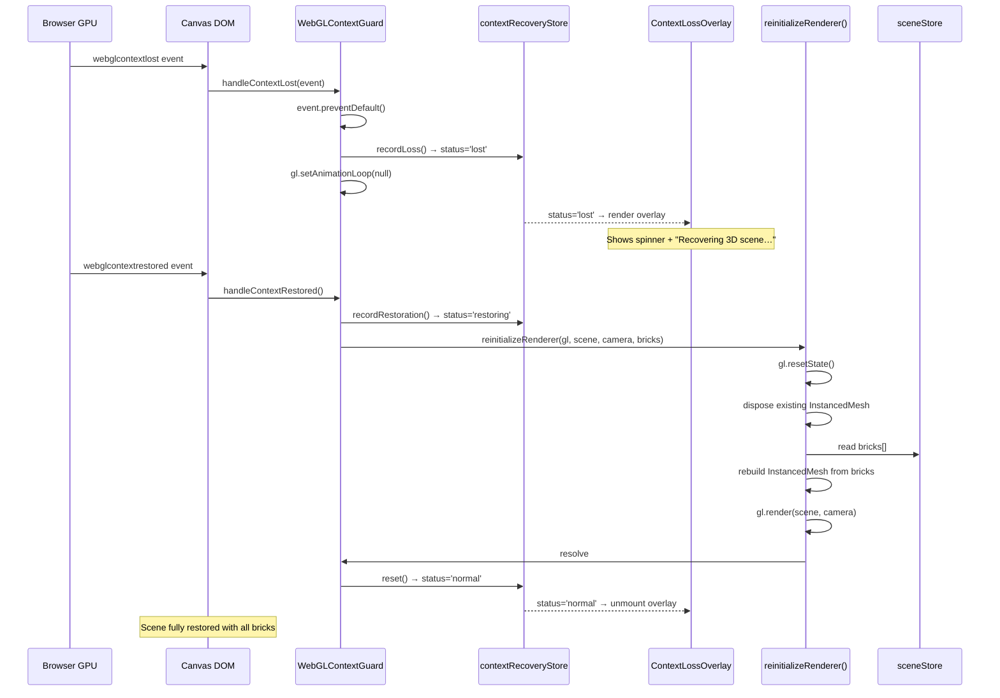
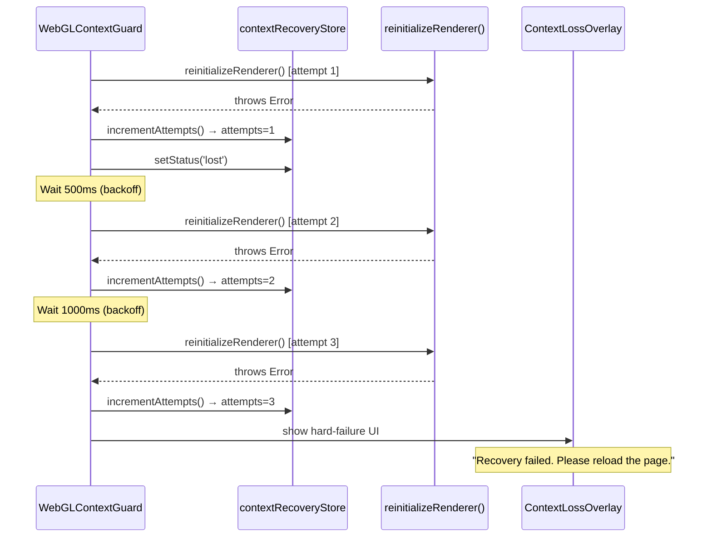
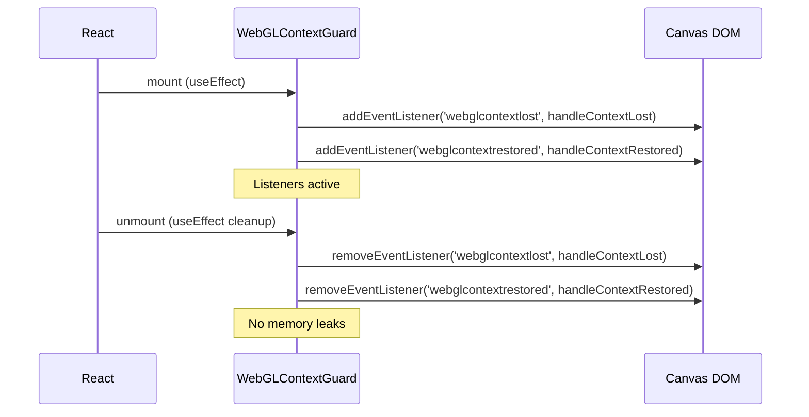

# Low-Level Design: NFR-REL-002 — Graceful Recovery from WebGL Context Loss

**Feature ID:** NFR-REL-002
**Issue:** [#36](https://github.com/sreenivasmrpivot/legobuilder/issues/36)
**Title:** Implement graceful recovery from WebGL context loss
**Area:** Frontend
**Author:** Spectra Design Agent
**Status:** Draft — Awaiting Gate 6a Design Review
**Dependencies:** FR-SCENE-001 (#8), FR-SCENE-002 (#7)

---

## 1. Overview

WebGL context loss is a browser-level event that occurs when the GPU driver reclaims the WebGL context from a canvas element. This can happen due to:
- GPU driver crashes or resets
- System resource pressure (too many WebGL contexts open simultaneously)
- Browser tab backgrounding on mobile devices
- Hardware/driver instability

This NFR mandates that the LegoBuilder application **does not crash** when context loss occurs, **shows a recovery UI** during the restoration window, and **fully re-renders the scene** (all bricks in correct positions and colors) once the context is restored.

React Three Fiber (R3F) provides partial built-in handling via its `onCreated` callback and renderer lifecycle, but does **not** automatically handle full scene reconstruction after context restoration. This LLD defines the supplementary design required.

---

## 2. Scope

| In Scope | Out of Scope |
|---|---|
| Detecting `webglcontextlost` and `webglcontextrestored` events | WebGL 2.0 fallback to WebGL 1.0 |
| Pausing the render loop on context loss | Server-side rendering (SSR) |
| Showing a recovery overlay UI | Multi-canvas scenarios |
| Reinitializing Three.js renderer on restoration | Persistent undo/redo state recovery |
| Rebuilding `InstancedMesh` from `sceneStore` state | Cross-tab state synchronization |
| Integration test via `WEBGL_lose_context` extension | Native app (Electron/Capacitor) |

---

## 3. Architecture Overview

### 3.1 Component Hierarchy

```
App
└── <Canvas> (R3F — Three.js WebGL canvas)
    ├── WebGLContextGuard          ← NEW: context loss event listener + recovery orchestrator
    │   └── ContextLossOverlay     ← NEW: recovery UI shown during context loss window
    ├── SceneRoot
    │   ├── GroundGrid
    │   ├── SceneLighting
    │   └── BrickInstanceRenderer  ← reads sceneStore; rebuilt on context restore
    └── CameraController
```

### 3.2 State Management

The recovery mechanism relies on **Zustand `sceneStore`** as the single source of truth. Because all brick data (position, color, type) is stored in Zustand (not in Three.js GPU objects), scene reconstruction after context restoration is a pure read from the store — no data is lost.

```
sceneStore (Zustand)
  bricks: BrickInstance[]     ← authoritative brick data
  selectedBrickId: string | null

contextRecoveryStore (Zustand) ← NEW
  status: 'normal' | 'lost' | 'restoring' | 'restored'
  lostAt: number | null        ← timestamp of context loss
  restoredAt: number | null    ← timestamp of restoration
  recoveryAttempts: number     ← for exponential backoff if needed
```

---

## 4. Component Specifications

### 4.1 `WebGLContextGuard` Component

**File:** `frontend/src/components/scene/WebGLContextGuard.tsx`

**Purpose:** Attaches native DOM event listeners to the R3F canvas element and orchestrates the recovery lifecycle.

**Props Interface:**
```typescript
interface WebGLContextGuardProps {
  children: React.ReactNode;
  onContextLost?: () => void;     // optional callback for telemetry
  onContextRestored?: () => void; // optional callback for telemetry
}
```

**Behavior:**
1. On mount: obtain canvas ref via R3F `useThree()` hook (`gl.domElement`).
2. Register `webglcontextlost` event listener → calls `handleContextLost()`.
3. Register `webglcontextrestored` event listener → calls `handleContextRestored()`.
4. On unmount: remove both event listeners (cleanup).
5. `handleContextLost()`: calls `event.preventDefault()` (required to allow restoration), sets `contextRecoveryStore.status = 'lost'`, pauses R3F frame loop via `gl.setAnimationLoop(null)`.
6. `handleContextRestored()`: sets `contextRecoveryStore.status = 'restoring'`, calls `reinitializeRenderer()`, then sets `status = 'normal'`.

**Key Implementation Notes:**
- `event.preventDefault()` on `webglcontextlost` is **mandatory** — without it, the browser will not attempt to restore the context.
- R3F's `useThree()` provides `gl` (the `WebGLRenderer`) and `invalidate()` for manual frame control.
- The component renders `null` itself; it is a pure behavior component wrapping children.

### 4.2 `ContextLossOverlay` Component

**File:** `frontend/src/components/scene/ContextLossOverlay.tsx`

**Purpose:** Renders a user-facing overlay when WebGL context is lost, informing the user that recovery is in progress.

**Props Interface:**
```typescript
interface ContextLossOverlayProps {
  status: 'normal' | 'lost' | 'restoring' | 'restored';
}
```

**Render Logic:**
```typescript
// Overlay is visible only when status is 'lost' or 'restoring'
if (status === 'normal' || status === 'restored') return null;

return (
  <div role="status" aria-live="polite" aria-label="WebGL recovery in progress">
    <Spinner />
    <p>Recovering 3D scene…</p>
  </div>
);
```

**Styling:** Positioned absolutely over the canvas (`position: absolute; inset: 0; z-index: 10`), semi-transparent dark background, centered spinner + message. Respects `prefers-reduced-motion` (spinner replaced with static icon).

**Accessibility:**
- `role="status"` + `aria-live="polite"` announces recovery to screen readers.
- `aria-label` provides descriptive context.
- Focus is not trapped (overlay is non-interactive).

### 4.3 `reinitializeRenderer()` Function

**File:** `frontend/src/lib/webgl/contextRecovery.ts`

**Purpose:** Performs the full renderer reinitialization sequence after context restoration.

**Signature:**
```typescript
export async function reinitializeRenderer(
  gl: THREE.WebGLRenderer,
  scene: THREE.Scene,
  camera: THREE.Camera,
  bricks: BrickInstance[]
): Promise<void>
```

**Steps:**
1. Call `gl.forceContextRestore()` if available (Three.js r152+).
2. Reset renderer state: `gl.resetState()`.
3. Dispose existing `InstancedMesh` objects from the scene to free GPU memory.
4. Rebuild `InstancedMesh` from `bricks` array (same logic as initial render in `BrickInstanceRenderer`).
5. Re-add rebuilt meshes to the scene.
6. Trigger a single render frame: `gl.render(scene, camera)`.
7. Resume R3F frame loop.

**Error Handling:** If reinitialization throws, catch the error, log to console, set `contextRecoveryStore.status = 'lost'` again (retry path), and increment `recoveryAttempts`. After 3 failed attempts, show a hard-failure message with a "Reload Page" button.

### 4.4 `contextRecoveryStore` (Zustand)

**File:** `frontend/src/stores/contextRecoveryStore.ts`

**Schema:**
```typescript
type ContextStatus = 'normal' | 'lost' | 'restoring' | 'restored';

interface ContextRecoveryState {
  status: ContextStatus;
  lostAt: number | null;
  restoredAt: number | null;
  recoveryAttempts: number;

  // Actions
  setStatus: (status: ContextStatus) => void;
  recordLoss: () => void;
  recordRestoration: () => void;
  incrementAttempts: () => void;
  reset: () => void;
}

const useContextRecoveryStore = create<ContextRecoveryState>((set) => ({
  status: 'normal',
  lostAt: null,
  restoredAt: null,
  recoveryAttempts: 0,

  setStatus: (status) => set({ status }),
  recordLoss: () => set({ status: 'lost', lostAt: Date.now() }),
  recordRestoration: () => set({ status: 'restoring', restoredAt: Date.now() }),
  incrementAttempts: () => set((s) => ({ recoveryAttempts: s.recoveryAttempts + 1 })),
  reset: () => set({ status: 'normal', lostAt: null, restoredAt: null, recoveryAttempts: 0 }),
}));
```

---

## 5. API / Event Contracts

This feature is entirely client-side. There are no HTTP API endpoints. The "API" is the browser's WebGL event system and the internal Zustand store interface.

### 5.1 Browser Event API

| Event | Target | Handler | `preventDefault` Required? |
|---|---|---|---|
| `webglcontextlost` | `canvas` DOM element | `handleContextLost` | **Yes** — prevents permanent loss |
| `webglcontextrestored` | `canvas` DOM element | `handleContextRestored` | No |

### 5.2 Internal Store Actions (called in sequence)

**Context Loss Flow:**
```
webglcontextlost event
  → event.preventDefault()
  → contextRecoveryStore.recordLoss()        // status: 'lost'
  → gl.setAnimationLoop(null)                // pause render loop
  → onContextLost?.()                        // optional telemetry callback
```

**Context Restoration Flow:**
```
webglcontextrestored event
  → contextRecoveryStore.recordRestoration() // status: 'restoring'
  → reinitializeRenderer(gl, scene, camera, bricks)
  → contextRecoveryStore.reset()             // status: 'normal'
  → onContextRestored?.()                    // optional telemetry callback
```

### 5.3 `WEBGL_lose_context` Extension (Test API)

Used exclusively in integration tests to simulate context loss:

```typescript
const ext = gl.getExtension('WEBGL_lose_context');
ext?.loseContext();    // triggers webglcontextlost
ext?.restoreContext(); // triggers webglcontextrestored
```

---

## 6. Data Models

### 6.1 `BrickInstance` (existing — from FR-SCENE-001)

```typescript
interface BrickInstance {
  id: string;           // UUID
  type: BrickType;      // e.g., '2x4', '1x2', '2x2'
  position: [x: number, y: number, z: number]; // stud-unit coordinates
  rotation: [x: number, y: number, z: number]; // Euler angles in radians
  color: string;        // hex color string e.g. '#FF0000'
}
```

This model is the **authoritative source** for scene reconstruction. Because it lives in Zustand (not in Three.js GPU memory), it survives context loss intact.

### 6.2 `ContextRecoveryState` (new)

See Section 4.4 above.

### 6.3 Recovery Attempt Log (in-memory only)

```typescript
interface RecoveryAttempt {
  attemptNumber: number;
  startedAt: number;    // Date.now()
  succeededAt: number | null;
  failedAt: number | null;
  error: string | null;
}
```

Stored in component-local state (not Zustand) — used only for retry logic and not persisted.

---

## 7. Sequence Diagrams

### 7.1 Happy Path: Context Loss → Recovery



### 7.2 Failure Path: Reinitialization Fails (Retry)



### 7.3 Component Mount / Unmount Lifecycle



---

## 8. Error Handling Strategy

| Scenario | Detection | Response | User Impact |
|---|---|---|---|
| WebGL context lost | `webglcontextlost` DOM event | Pause render loop, show overlay | Spinner shown; no crash |
| Context not restored within 10s | Timeout in `handleContextLost` | Show "taking longer than expected" message | Informational message |
| `reinitializeRenderer` throws (attempt 1–2) | try/catch in Guard | Exponential backoff retry (500ms, 1000ms) | Overlay remains visible |
| `reinitializeRenderer` throws (attempt 3) | try/catch in Guard | Show hard-failure UI with reload button | User prompted to reload |
| `WEBGL_lose_context` extension unavailable | `getExtension` returns null | Test skipped with `test.skip` | Test environment only |
| `sceneStore` empty on restoration | bricks.length === 0 | Render empty scene (valid state) | No bricks shown (correct) |
| R3F `useThree()` returns null gl | Guard checks `gl` before attaching | Log warning, skip listener attachment | No crash; no recovery |

### 8.1 Timeout Handling

If `webglcontextrestored` is not fired within **10 seconds** of `webglcontextlost`:

```typescript
const RECOVERY_TIMEOUT_MS = 10_000;

const timeoutId = setTimeout(() => {
  if (contextRecoveryStore.getState().status === 'lost') {
    // Update overlay message to indicate extended recovery
    setExtendedRecovery(true);
  }
}, RECOVERY_TIMEOUT_MS);

// Clear timeout when context is restored
return () => clearTimeout(timeoutId);
```

### 8.2 Retry Backoff Schedule

| Attempt | Delay Before Retry |
|---|---|
| 1 | 0ms (immediate) |
| 2 | 500ms |
| 3 | 1000ms |
| 4+ | Hard failure — show reload UI |

---

## 9. Security Considerations

| Concern | Mitigation |
|---|---|
| XSS via overlay content | Overlay uses static React JSX — no `dangerouslySetInnerHTML` |
| GPU fingerprinting via context loss | No GPU info is exposed to external parties; recovery is internal |
| Denial of service via repeated context loss | Retry cap at 3 attempts; hard failure prevents infinite loops |
| Memory leaks via unremoved listeners | `useEffect` cleanup removes all listeners on unmount |
| Stale closure capturing old `gl` reference | `useRef` used for `gl` to always capture current renderer |

---

## 10. Performance Considerations

| Metric | Target | Strategy |
|---|---|---|
| Time to first frame after restoration | < 2 seconds | Rebuild InstancedMesh from Zustand (O(n) bricks) |
| Overlay render cost | Negligible | Pure CSS/React — no Three.js involvement |
| Memory after recovery | ≤ pre-loss baseline | Explicit `dispose()` of old InstancedMesh before rebuild |
| Render loop pause duration | Entire loss window | `gl.setAnimationLoop(null)` prevents wasted GPU cycles |
| Bundle size impact | < 2KB gzipped | No new dependencies; pure React + Zustand |

### 10.1 `InstancedMesh` Disposal

Before rebuilding, existing `InstancedMesh` objects must be properly disposed to prevent GPU memory leaks:

```typescript
scene.traverse((object) => {
  if (object instanceof THREE.InstancedMesh) {
    object.geometry.dispose();
    if (Array.isArray(object.material)) {
      object.material.forEach((m) => m.dispose());
    } else {
      object.material.dispose();
    }
    scene.remove(object);
  }
});
```

---

## 11. Accessibility

| Requirement | Implementation |
|---|---|
| Screen reader announcement | `role="status"` + `aria-live="polite"` on overlay |
| Reduced motion | CSS `@media (prefers-reduced-motion: reduce)` replaces spinner with static icon |
| Keyboard navigation | Overlay is non-interactive; no focus trap |
| Color contrast | Overlay text meets WCAG AA (4.5:1 minimum) |
| Hard-failure reload button | Focusable `<button>` with descriptive label |

---

## 12. File Structure

```
frontend/
├── src/
│   ├── components/
│   │   └── scene/
│   │       ├── WebGLContextGuard.tsx       ← NEW: context loss orchestrator
│   │       └── ContextLossOverlay.tsx      ← NEW: recovery UI overlay
│   ├── stores/
│   │   └── contextRecoveryStore.ts         ← NEW: Zustand recovery state
│   └── lib/
│       └── webgl/
│           └── contextRecovery.ts          ← NEW: reinitializeRenderer()
└── tests/
    └── integration/
        └── webglContextLoss.test.ts        ← NEW: integration test (T-BE-REL-002-01)
```

---

## 13. Integration Test Design

**Test File:** `frontend/tests/integration/webglContextLoss.test.ts`
**Test ID:** T-BE-REL-002-01
**Framework:** Vitest + React Testing Library + `@react-three/test-renderer` (or jsdom with WebGL mock)

### 13.1 Test Cases

#### TC-01: Application does not crash on context loss
```
Given: A scene with 3 bricks is rendered
When:  WEBGL_lose_context extension triggers loseContext()
Then:  No unhandled exception is thrown
       contextRecoveryStore.status === 'lost'
       ContextLossOverlay is visible in the DOM
```

#### TC-02: Scene fully restored after context restoration
```
Given: Context loss has occurred (TC-01 state)
When:  WEBGL_lose_context extension triggers restoreContext()
Then:  contextRecoveryStore.status === 'normal'
       ContextLossOverlay is not in the DOM
       BrickInstanceRenderer re-renders with same 3 bricks
       All brick positions and colors match pre-loss sceneStore state
```

#### TC-03: Loading indicator shown during recovery
```
Given: Context loss has occurred
When:  The canvas is inspected before restoreContext() is called
Then:  An element with role="status" is present
       The element contains recovery messaging
       aria-live="polite" is set
```

#### TC-04: Hard failure after 3 failed reinitializations
```
Given: reinitializeRenderer() is mocked to always throw
When:  Context is restored
Then:  After 3 attempts, a reload button is shown
       contextRecoveryStore.recoveryAttempts === 3
```

### 13.2 Test Utilities

```typescript
// Helper to simulate context loss in tests
export function simulateContextLoss(canvas: HTMLCanvasElement): void {
  const ext = (canvas.getContext('webgl') as WebGLRenderingContext)
    ?.getExtension('WEBGL_lose_context');
  if (!ext) throw new Error('WEBGL_lose_context not available in test environment');
  ext.loseContext();
}

export function simulateContextRestore(canvas: HTMLCanvasElement): void {
  const ext = (canvas.getContext('webgl') as WebGLRenderingContext)
    ?.getExtension('WEBGL_lose_context');
  ext?.restoreContext();
}
```

---

## 14. Dependencies

| Dependency | Version | Purpose | New? |
|---|---|---|---|
| `three` | ^0.160.0 | WebGLRenderer, InstancedMesh, scene graph | Existing |
| `@react-three/fiber` | ^8.x | R3F canvas, `useThree()` hook | Existing |
| `zustand` | ^4.x | `contextRecoveryStore` state management | Existing |
| `react` | ^18.x | Component lifecycle, hooks | Existing |
| `vitest` | ^1.x | Integration test runner | Existing |
| `@testing-library/react` | ^14.x | DOM assertions in tests | Existing |

**No new npm dependencies are required.** All functionality is implemented using existing project dependencies.

---

## 15. Acceptance Criteria Mapping

| Acceptance Criterion | Design Element | Test Case |
|---|---|---|
| App does not crash on context loss | `event.preventDefault()` in `handleContextLost`; try/catch in Guard | TC-01 |
| All bricks restored in original positions/colors | `reinitializeRenderer()` reads from `sceneStore.bricks` | TC-02 |
| Loading indicator shown during recovery | `ContextLossOverlay` renders when `status === 'lost'` or `'restoring'` | TC-03 |

---

## 16. Open Questions

| # | Question | Impact | Proposed Resolution |
|---|---|---|---|
| 1 | Does R3F v8 handle `webglcontextlost` internally? | May reduce implementation scope | Verify in R3F source; supplement if incomplete |
| 2 | Should recovery state persist across page sessions (localStorage)? | Affects store design | No — recovery is transient; in-memory only |
| 3 | Is `gl.forceContextRestore()` available in the target Three.js version? | Affects reinit step 1 | Check Three.js r160 changelog; use conditional call |
| 4 | Should telemetry (e.g., Sentry) be notified on context loss? | Affects `onContextLost` callback | Out of scope for NFR-REL-002; add in observability NFR |

---

## 17. Revision History

| Version | Date | Author | Changes |
|---|---|---|---|
| 1.0 | 2026-04-11 | Spectra Design Agent | Initial LLD draft |
