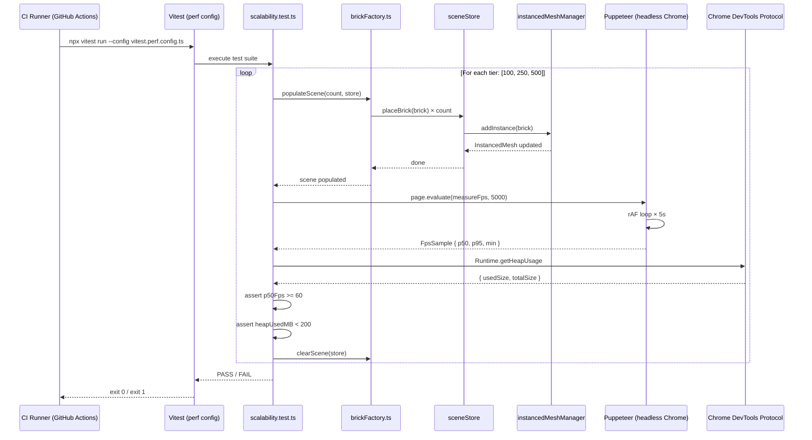
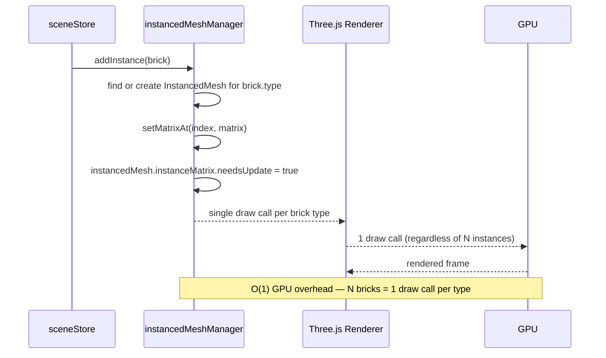
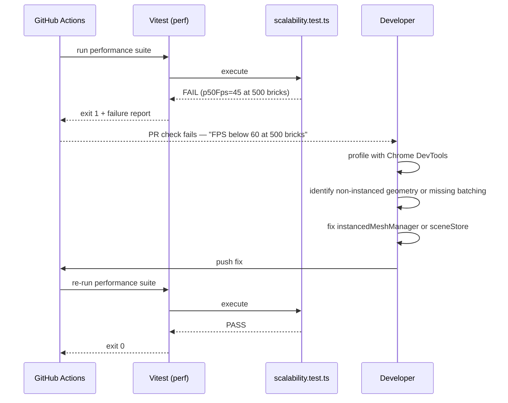

# Low-Level Design: NFR-SCALE-001
## Validate Scene Supports Up to 500 Bricks Without Performance Degradation

**FR-ID:** NFR-SCALE-001  
**Issue:** [#30](https://github.com/sreenivasmrpivot/legobuilder/issues/30)  
**Author:** Spectra Design Agent  
**Status:** Draft — Awaiting Gate 6a Human Review  
**Dependencies:** NFR-PERF-001 (#27), FR-SCENE-002 (#7)  

---

## 1. Overview

This document defines the low-level design for validating that the LegoBuilder 3D scene can render and interact with up to 500 bricks without performance degradation. The validation is implemented as a **performance test suite** (`frontend/tests/performance/scalability.test.ts`) that programmatically places 100, 250, and 500 bricks via `sceneStore` actions, measures frame rate using `requestAnimationFrame` timestamps via Puppeteer/Chrome DevTools Protocol (CDP), and asserts heap memory stays below 200 MB at peak load.

The key architectural enabler is **Three.js `InstancedMesh` batching** (FR-SCENE-002), which collapses N draw calls into a single GPU draw call per brick type, achieving O(1) GPU overhead regardless of brick count.

---

## 2. Component Architecture

### 2.1 Module Map

```
frontend/
├── tests/
│   └── performance/
│       ├── scalability.test.ts          # Main performance test suite (NEW)
│       ├── helpers/
│       │   ├── brickFactory.ts          # Programmatic brick placement helper (NEW)
│       │   ├── fpsProbe.ts              # rAF-based FPS measurement utility (NEW)
│       │   └── memoryProbe.ts           # CDP heap snapshot utility (NEW)
│       └── fixtures/
│           └── scalabilityScenes.ts     # Pre-defined 100/250/500 brick layouts (NEW)
src/
├── stores/
│   └── sceneStore.ts                   # Existing — placeBrick / removeBrick actions
├── engine/
│   └── instancedMeshManager.ts         # Existing (FR-SCENE-002) — InstancedMesh pool
├── utils/
│   └── performanceMonitor.ts           # Existing scaffold — FPS / frame time tracking
```

### 2.2 Dependency Graph

```
scalability.test.ts
  ├── brickFactory.ts  ──→  sceneStore (placeBrick action)
  ├── fpsProbe.ts      ──→  Puppeteer page.evaluate() + rAF timestamps
  ├── memoryProbe.ts   ──→  CDP Runtime.getHeapUsage
  └── scalabilityScenes.ts  (static data — no runtime deps)

sceneStore.placeBrick
  └── instancedMeshManager.addInstance()  ──→  Three.js InstancedMesh
```

### 2.3 Test Runner Integration

| Tool | Role |
|------|------|
| **Vitest** | Unit/integration test runner for store-level assertions |
| **Puppeteer** | Headless Chrome driver for FPS and memory measurement |
| **Chrome DevTools Protocol (CDP)** | `Runtime.getHeapUsage`, `Performance.getMetrics` |
| **@vitest/coverage-v8** | Coverage instrumentation (NFR-MAINT-001) |

The performance tests run in a **separate Vitest project** (`vitest.perf.config.ts`) to isolate them from the unit test suite and avoid inflating coverage numbers with performance scaffolding.

---

## 3. Data Models

### 3.1 Brick Placement Input

```typescript
// Reuses existing Brick type from src/types/brick.ts
interface Brick {
  id: string;           // UUID
  type: BrickType;      // e.g. '2x4', '1x2', '2x2'
  position: Vector3;    // { x, y, z } in grid units
  rotation: number;     // 0 | 90 | 180 | 270 degrees
  color: BrickColor;    // hex string from catalog
}
```

### 3.2 FPS Sample Record

```typescript
interface FpsSample {
  brickCount: number;       // 100 | 250 | 500
  samples: number[];        // Array of per-frame FPS values (5-second window)
  p50Fps: number;           // 50th percentile FPS
  p95Fps: number;           // 95th percentile FPS (worst-case)
  minFps: number;           // Absolute minimum observed
  durationMs: number;       // Total measurement window in ms
}
```

### 3.3 Memory Sample Record

```typescript
interface MemorySample {
  brickCount: number;       // 100 | 250 | 500
  heapUsedMB: number;       // JS heap used (MB) via CDP Runtime.getHeapUsage
  heapTotalMB: number;      // JS heap total allocated (MB)
  gpuMemoryEstimateMB?: number; // Optional: from Performance.getMetrics
}
```

### 3.4 Scalability Test Result

```typescript
interface ScalabilityTestResult {
  timestamp: string;        // ISO 8601
  gitSha: string;           // Commit SHA for traceability
  fps: FpsSample[];         // One entry per brick count tier
  memory: MemorySample[];   // One entry per brick count tier
  passed: boolean;          // true if ALL thresholds met
  failures: string[];       // Human-readable failure messages
}
```

---

## 4. API / Interface Specifications

> This is a pure frontend NFR — there are no HTTP API endpoints. The "API" is the internal TypeScript interface between the test harness and the application stores/engine.

### 4.1 `brickFactory.ts` — Public Interface

```typescript
/**
 * Programmatically places `count` bricks into the scene via sceneStore.
 * Bricks are placed in a grid pattern to avoid collision failures.
 * @param count  Number of bricks to place (100 | 250 | 500)
 * @param store  Zustand sceneStore instance (injected for testability)
 */
export async function populateScene(
  count: number,
  store: SceneStore
): Promise<void>;

/**
 * Clears all bricks from the scene and resets the store.
 */
export async function clearScene(store: SceneStore): Promise<void>;
```

### 4.2 `fpsProbe.ts` — Public Interface

```typescript
/**
 * Measures FPS over a `durationMs` window using requestAnimationFrame.
 * Runs inside the browser context via Puppeteer page.evaluate().
 * @param page       Puppeteer Page instance
 * @param durationMs Measurement window (default: 5000ms)
 * @returns          FpsSample with p50, p95, min FPS
 */
export async function measureFps(
  page: Page,
  durationMs?: number
): Promise<FpsSample>;
```

### 4.3 `memoryProbe.ts` — Public Interface

```typescript
/**
 * Reads JS heap usage via Chrome DevTools Protocol.
 * Requires CDP session to be attached to the Puppeteer page.
 * @param page  Puppeteer Page instance
 * @returns     MemorySample with heapUsedMB and heapTotalMB
 */
export async function measureHeap(
  page: Page
): Promise<MemorySample>;
```

### 4.4 `sceneStore` Actions Used

| Action | Signature | Purpose |
|--------|-----------|---------|
| `placeBrick` | `(brick: Brick) => void` | Add a brick to the scene |
| `removeBrick` | `(id: string) => void` | Remove a brick by ID |
| `clearScene` | `() => void` | Reset scene to empty state |
| `getBricks` | `() => Brick[]` | Read current brick list |

---

## 5. Sequence Diagrams

### 5.1 Performance Test Execution Flow



### 5.2 InstancedMesh Scaling Path (FR-SCENE-002 Integration)



### 5.3 CI Failure & Remediation Flow



---

## 6. Performance Thresholds & Acceptance Criteria

| Brick Count | FPS Threshold | Memory Threshold | Test Case |
|-------------|--------------|-----------------|----------|
| 100 bricks | p50 ≥ 60 FPS | heap < 200 MB | T-PERF-SCALE-001-01 |
| 250 bricks | p50 ≥ 60 FPS | heap < 200 MB | T-PERF-SCALE-001-01 |
| 500 bricks | p50 ≥ 60 FPS | heap < 200 MB | T-PERF-SCALE-001-02 |

**Measurement methodology:**
- FPS measured over a **5-second rAF window** after scene stabilization (500ms settle delay post-placement)
- p50 (median) FPS used as the primary metric to filter transient spikes
- p95 FPS logged for trend analysis but not a hard gate
- Heap measured via `Runtime.getHeapUsage` after GC hint (`Runtime.collectGarbage`)

**CI gate:** Any threshold miss → `exit 1` → PR check fails → merge blocked.

---

## 7. Vitest Performance Config (`vitest.perf.config.ts`)

```typescript
import { defineConfig } from 'vitest/config';

export default defineConfig({
  test: {
    name: 'performance',
    include: ['frontend/tests/performance/**/*.test.ts'],
    exclude: ['frontend/tests/unit/**', 'frontend/tests/e2e/**'],
    environment: 'node',          // Puppeteer runs in Node context
    testTimeout: 120_000,         // 2 min per test (browser startup + 3 tiers)
    hookTimeout: 30_000,
    reporters: ['verbose', 'json'],
    outputFile: 'reports/performance-results.json',
    // No coverage — performance tests are not coverage targets
    coverage: { enabled: false },
    // Sequential execution — browser sessions cannot be parallelized safely
    pool: 'forks',
    poolOptions: { forks: { singleFork: true } },
  },
});
```

---

## 8. GitHub Actions CI Integration

```yaml
# .github/workflows/performance.yml  (NEW)
name: Performance Tests

on:
  pull_request:
    branches: [main]
  push:
    branches: [main]

jobs:
  scalability:
    name: Scalability — 100/250/500 Bricks
    runs-on: ubuntu-latest
    timeout-minutes: 15

    steps:
      - uses: actions/checkout@v4

      - name: Setup Node.js
        uses: actions/setup-node@v4
        with:
          node-version: '20'
          cache: 'npm'
          cache-dependency-path: frontend/package-lock.json

      - name: Install dependencies
        run: npm ci
        working-directory: frontend

      - name: Install Puppeteer browsers
        run: npx puppeteer browsers install chrome
        working-directory: frontend

      - name: Run scalability tests
        run: npx vitest run --config vitest.perf.config.ts
        working-directory: frontend
        env:
          PUPPETEER_HEADLESS: 'true'
          CI: 'true'

      - name: Upload performance report
        if: always()
        uses: actions/upload-artifact@v4
        with:
          name: performance-report-${{ github.sha }}
          path: frontend/reports/performance-results.json
          retention-days: 30
```

**Makefile target:**
```makefile
perf-test:
	cd frontend && npx vitest run --config vitest.perf.config.ts
```

---

## 9. Error Handling Strategy

| Failure Mode | Detection | Response |
|-------------|-----------|----------|
| Browser launch failure | Puppeteer throws on `launch()` | `beforeAll` hook fails → entire suite skipped with clear error |
| Scene population timeout | `populateScene` exceeds 10s | Test fails with `"Scene population timed out at N bricks"` |
| FPS below threshold | `p50Fps < 60` | Test fails with `"FPS degradation: p50=${fps} at ${count} bricks (threshold: 60)"` |
| Memory above threshold | `heapUsedMB >= 200` | Test fails with `"Memory exceeded: ${heap}MB at ${count} bricks (threshold: 200MB)"` |
| CDP session lost | CDP throws mid-measurement | Retry once; if still failing, mark test as `skip` with warning |
| Flaky FPS (high variance) | p95 - p50 > 20 FPS | Log warning; do not fail (variance is environment noise) |
| CI timeout (>15 min) | GitHub Actions job timeout | Job cancelled; artifact upload still runs (`if: always()`) |

---

## 10. Security Considerations

| Concern | Mitigation |
|---------|------------|
| Puppeteer sandbox in CI | Run with `--no-sandbox` flag only in CI (`CI=true` env check); sandbox enabled locally |
| CDP exposure | CDP session is local to the test process; no network exposure |
| Artifact data sensitivity | Performance reports contain only FPS/memory numbers — no PII or secrets |
| Dependency supply chain | Puppeteer pinned to exact version in `package.json`; `npm ci` enforces lockfile |
| Resource exhaustion | `testTimeout: 120_000` and GitHub Actions `timeout-minutes: 15` prevent runaway tests |

---

## 11. Memory & Scaling Analysis

### 11.1 Expected Memory Profile

| Component | Per-Brick Cost | 500 Bricks Total |
|-----------|---------------|------------------|
| `InstancedMesh` matrix buffer | ~64 bytes (4×4 float32) | ~32 KB |
| Zustand store entry | ~200 bytes | ~100 KB |
| Three.js geometry (shared) | ~50 KB per brick type | ~250 KB (5 types) |
| Three.js material (shared) | ~10 KB per material | ~50 KB (5 materials) |
| **Total estimated** | — | **< 1 MB** (well under 200 MB) |

The 200 MB heap threshold provides a 200× safety margin over the theoretical minimum, accommodating React/R3F framework overhead (~50 MB baseline) and browser internals.

### 11.2 Scaling Linearity Assertion

The test suite logs FPS at each tier. A regression is flagged if:
```
(fps_at_500 / fps_at_100) < 0.85
```
This catches non-linear degradation even if all tiers individually pass the 60 FPS gate.

---

## 12. Test Case Mapping

| Test Case ID | Description | File | Assertion |
|-------------|-------------|------|----------|
| T-PERF-SCALE-001-01 | 100 and 250 brick FPS ≥ 60 | `scalability.test.ts` | `expect(sample.p50Fps).toBeGreaterThanOrEqual(60)` |
| T-PERF-SCALE-001-02 | 500 brick FPS ≥ 60 + heap < 200 MB | `scalability.test.ts` | `expect(sample.p50Fps).toBeGreaterThanOrEqual(60)` + `expect(memory.heapUsedMB).toBeLessThan(200)` |

---

## 13. Implementation Checklist (for Coding Agent)

- [ ] Create `frontend/tests/performance/scalability.test.ts` with three `describe` blocks (100, 250, 500 bricks)
- [ ] Create `frontend/tests/performance/helpers/brickFactory.ts` with `populateScene` and `clearScene`
- [ ] Create `frontend/tests/performance/helpers/fpsProbe.ts` with `measureFps` using rAF timestamps
- [ ] Create `frontend/tests/performance/helpers/memoryProbe.ts` with `measureHeap` using CDP
- [ ] Create `frontend/tests/performance/fixtures/scalabilityScenes.ts` with pre-computed brick layouts
- [ ] Create `frontend/vitest.perf.config.ts` with isolated performance project config
- [ ] Create `.github/workflows/performance.yml` CI workflow
- [ ] Add `perf-test` target to `Makefile`
- [ ] Add `puppeteer` to `frontend/package.json` devDependencies
- [ ] Verify `instancedMeshManager` exposes `addInstance` compatible with test harness
- [ ] Verify `sceneStore` exposes `clearScene` action (add if missing)

---

## 14. Open Questions / Assumptions

| # | Question / Assumption | Resolution Needed |
|---|----------------------|------------------|
| 1 | **Assumption:** `instancedMeshManager.ts` (FR-SCENE-002) is implemented before this NFR is validated. | Confirm FR-SCENE-002 (#7) is merged before running performance tests. |
| 2 | **Assumption:** `sceneStore` has a `clearScene` action. | Verify in implementation; add if missing. |
| 3 | **Question:** Should the 60 FPS threshold apply to p50 or p95? | This LLD uses p50 (median) as the primary gate. Human reviewer should confirm. |
| 4 | **Question:** Is Puppeteer acceptable in CI, or should a lighter headless approach (e.g., `jsdom` + mock rAF) be used? | Puppeteer provides real GPU rendering metrics; jsdom cannot measure real FPS. Recommend Puppeteer. |
| 5 | **Assumption:** CI runners are `ubuntu-latest` with software rendering (Mesa/SwiftShader). FPS on CI may be lower than on developer machines. | Consider lowering CI threshold to 30 FPS with a separate local threshold of 60 FPS if CI runners cannot sustain 60 FPS in software rendering. |

---

*Generated by Spectra Design Agent — Gate 6a review required before implementation.*
