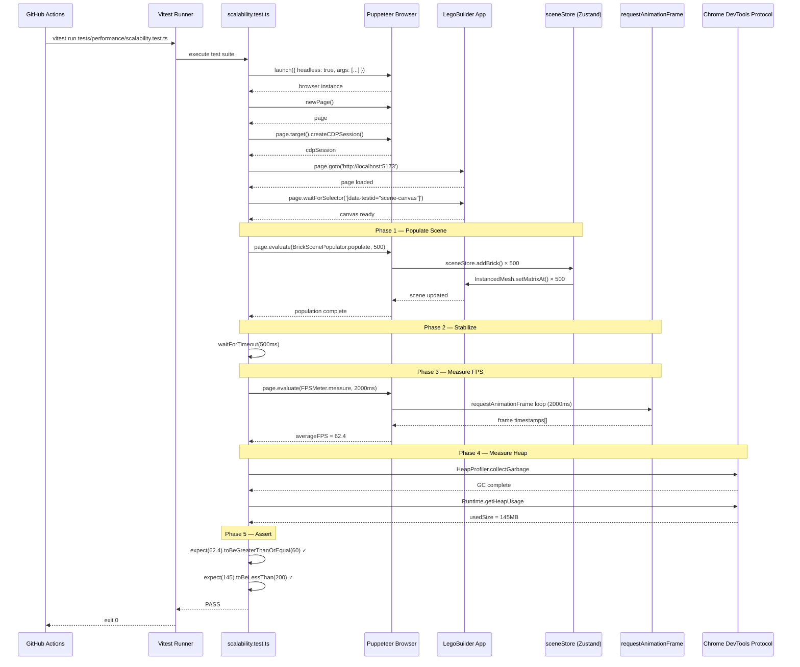
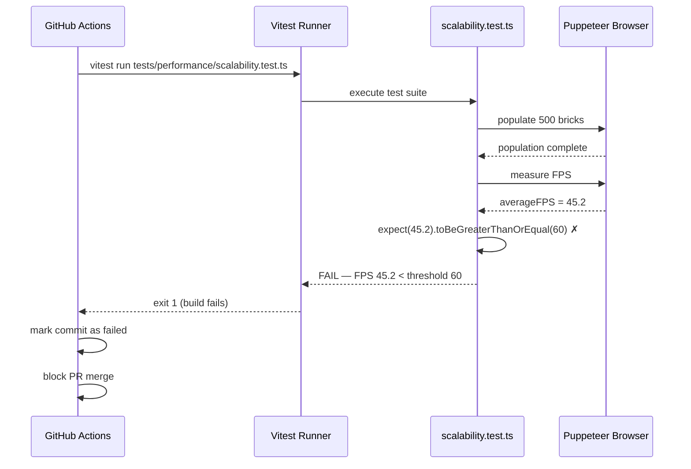
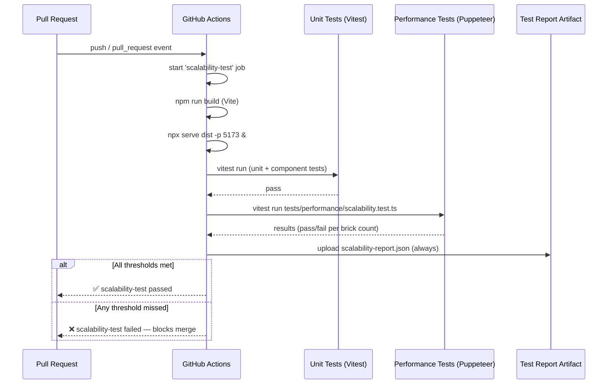

# Low-Level Design: NFR-SCALE-001
## Validate Scene Supports Up to 500 Bricks Without Performance Degradation

**FR-ID:** NFR-SCALE-001  
**Issue:** #30  
**Status:** Draft — Pending Gate 6a Approval  
**Author:** Spectra Design Agent  
**Date:** 2026-04-12  
**Dependencies:** NFR-PERF-001 (#27), FR-SCENE-002 (#7)

---

## 1. Overview

NFR-SCALE-001 mandates that the LegoBuilder 3D scene SHALL support up to **500 bricks** without performance degradation, validated by a performance test suite that programmatically places 100, 250, and 500 bricks and measures frame rate (≥60 FPS) and heap memory (<200 MB) at each tier.

This is a **non-functional requirement** — no new user-facing features are introduced. The deliverable is a **performance test suite** (`frontend/tests/performance/scalability.test.ts`) that validates the existing rendering pipeline (powered by Three.js `InstancedMesh` from FR-SCENE-002) meets the scalability thresholds under automated CI conditions.

### 1.1 Scope

| In Scope | Out of Scope |
|---|---|
| Performance test suite for 100/250/500 brick scenes | New rendering optimizations (owned by FR-SCENE-002) |
| FPS measurement via `requestAnimationFrame` timestamps | UI interaction testing |
| Heap memory measurement via Chrome DevTools Protocol | Server-side performance |
| CI integration with build-fail on threshold miss | Load testing beyond 500 bricks |
| Puppeteer-based browser automation | Visual regression testing |

### 1.2 Key Enabler

`InstancedMesh` batching (FR-SCENE-002) is the architectural foundation that makes linear scaling to 500 bricks feasible. NFR-SCALE-001 validates that this foundation holds under load — it does not implement the optimization itself.

---

## 2. Architecture Overview

```
┌─────────────────────────────────────────────────────────────────┐
│                    CI Pipeline (GitHub Actions)                  │
│  ┌──────────────────────────────────────────────────────────┐   │
│  │              scalability.test.ts (Vitest + Puppeteer)    │   │
│  │                                                          │   │
│  │  ScalabilityTestHarness                                  │   │
│  │  ├── BrickScenePopulator  ──► sceneStore.addBrick()      │   │
│  │  ├── FPSMeter             ──► requestAnimationFrame      │   │
│  │  └── HeapMonitor          ──► CDP Runtime.getHeapUsage   │   │
│  └──────────────────────────────────────────────────────────┘   │
│                          │                                       │
│                          ▼                                       │
│  ┌──────────────────────────────────────────────────────────┐   │
│  │              LegoBuilder App (Puppeteer Browser)         │   │
│  │  ┌─────────────┐   ┌──────────────┐   ┌─────────────┐   │   │
│  │  │  sceneStore │   │ InstancedMesh│   │  R3F Canvas │   │   │
│  │  │  (Zustand)  │──►│  (Three.js)  │──►│  (WebGL)    │   │   │
│  │  └─────────────┘   └──────────────┘   └─────────────┘   │   │
│  └──────────────────────────────────────────────────────────┘   │
└─────────────────────────────────────────────────────────────────┘
```

---

## 3. Component Architecture

### 3.1 Module Map

```
frontend/
└── tests/
    └── performance/
        ├── scalability.test.ts          # Main test suite (Vitest)
        ├── helpers/
        │   ├── BrickScenePopulator.ts   # Programmatic brick placement
        │   ├── FPSMeter.ts              # requestAnimationFrame FPS measurement
        │   ├── HeapMonitor.ts           # CDP heap memory measurement
        │   └── ScalabilityThresholds.ts # Threshold constants
        └── fixtures/
            └── brickFixtures.ts         # Deterministic brick position data
```

### 3.2 Component Responsibilities

#### `scalability.test.ts` — Test Orchestrator

```typescript
// Responsibilities:
// - Launches Puppeteer browser with CDP enabled
// - Runs 3 test scenarios: 100, 250, 500 bricks
// - Asserts FPS >= 60 and heap < 200MB for each scenario
// - Fails CI build if any threshold is missed
// - Cleans up browser resources after each test

describe('NFR-SCALE-001: Scene Scalability', () => {
  let browser: Browser;
  let page: Page;
  let cdpSession: CDPSession;

  beforeAll(async () => {
    browser = await puppeteer.launch({
      headless: true,
      args: ['--no-sandbox', '--disable-setuid-sandbox', '--enable-gpu']
    });
  });

  afterAll(async () => {
    await browser.close();
  });

  beforeEach(async () => {
    page = await browser.newPage();
    cdpSession = await page.target().createCDPSession();
    await page.goto('http://localhost:5173');
    await page.waitForSelector('[data-testid="scene-canvas"]');
  });

  afterEach(async () => {
    await cdpSession.detach();
    await page.close();
  });

  test.each([
    { brickCount: 100,  label: 'T-PERF-SCALE-001-01' },
    { brickCount: 250,  label: 'T-PERF-SCALE-001-01' },
    { brickCount: 500,  label: 'T-PERF-SCALE-001-02' },
  ])('$label: $brickCount bricks — FPS >= 60 and heap < 200MB', async ({ brickCount }) => {
    // 1. Populate scene
    await BrickScenePopulator.populate(page, brickCount);

    // 2. Allow render loop to stabilize
    await page.waitForTimeout(STABILIZATION_DELAY_MS);

    // 3. Measure FPS
    const fps = await FPSMeter.measure(page, MEASUREMENT_WINDOW_MS);

    // 4. Measure heap
    const heapMB = await HeapMonitor.measure(cdpSession);

    // 5. Assert thresholds
    expect(fps).toBeGreaterThanOrEqual(THRESHOLDS.MIN_FPS);
    expect(heapMB).toBeLessThan(THRESHOLDS.MAX_HEAP_MB);
  });
});
```

#### `BrickScenePopulator.ts` — Programmatic Brick Placement

```typescript
// Responsibilities:
// - Injects brick placement commands directly into sceneStore
//   via page.evaluate() — no UI interaction required
// - Uses deterministic grid positions to avoid collision detection overhead
// - Supports incremental population (add N more bricks to existing scene)

export class BrickScenePopulator {
  /**
   * Populate the scene with `count` bricks via sceneStore.addBrick().
   * Bricks are placed on a deterministic grid: x = i % GRID_WIDTH,
   * z = Math.floor(i / GRID_WIDTH), y = 0 (ground plane).
   */
  static async populate(page: Page, count: number): Promise<void> {
    await page.evaluate((brickCount: number) => {
      const store = (window as any).__sceneStore;
      if (!store) throw new Error('sceneStore not exposed on window');

      const GRID_WIDTH = 25; // 25 × 20 = 500 max
      for (let i = 0; i < brickCount; i++) {
        store.getState().addBrick({
          id: `perf-brick-${i}`,
          type: '2x4',
          color: '#FF0000',
          position: {
            x: (i % GRID_WIDTH) * 2,
            y: 0,
            z: Math.floor(i / GRID_WIDTH) * 2,
          },
          rotation: { x: 0, y: 0, z: 0 },
        });
      }
    }, count);
  }

  /**
   * Clear all performance bricks from the scene.
   */
  static async clear(page: Page): Promise<void> {
    await page.evaluate(() => {
      const store = (window as any).__sceneStore;
      store.getState().clearScene();
    });
  }
}
```

#### `FPSMeter.ts` — Frame Rate Measurement

```typescript
// Responsibilities:
// - Injects a requestAnimationFrame loop into the browser page
// - Collects frame timestamps over a measurement window
// - Returns the average FPS over the window
// - Handles edge cases: zero frames, very short windows

export class FPSMeter {
  /**
   * Measure average FPS over `windowMs` milliseconds.
   * Uses requestAnimationFrame timestamps for accuracy.
   * Returns average FPS as a number.
   */
  static async measure(page: Page, windowMs: number): Promise<number> {
    return page.evaluate((durationMs: number): Promise<number> => {
      return new Promise((resolve) => {
        const timestamps: number[] = [];
        let rafId: number;
        const startTime = performance.now();

        function frame(ts: number) {
          timestamps.push(ts);
          if (ts - startTime < durationMs) {
            rafId = requestAnimationFrame(frame);
          } else {
            cancelAnimationFrame(rafId);
            if (timestamps.length < 2) {
              resolve(0);
              return;
            }
            const elapsed = timestamps[timestamps.length - 1] - timestamps[0];
            const fps = ((timestamps.length - 1) / elapsed) * 1000;
            resolve(fps);
          }
        }

        requestAnimationFrame(frame);
      });
    }, windowMs);
  }
}
```

#### `HeapMonitor.ts` — Memory Measurement

```typescript
// Responsibilities:
// - Uses Chrome DevTools Protocol (CDP) Runtime.getHeapUsage
// - Returns used heap size in megabytes
// - Triggers GC before measurement for deterministic results

export class HeapMonitor {
  /**
   * Measure current JS heap usage in MB.
   * Triggers a GC cycle first for deterministic measurement.
   */
  static async measure(session: CDPSession): Promise<number> {
    // Force GC to get a clean heap snapshot
    await session.send('HeapProfiler.collectGarbage');

    const { usedSize } = await session.send('Runtime.getHeapUsage');
    return usedSize / (1024 * 1024); // bytes → MB
  }
}
```

#### `ScalabilityThresholds.ts` — Threshold Constants

```typescript
export const THRESHOLDS = {
  /** Minimum acceptable frame rate in frames per second */
  MIN_FPS: 60,

  /** Maximum acceptable JS heap usage in megabytes at 500 bricks */
  MAX_HEAP_MB: 200,
} as const;

/** Milliseconds to wait after brick population before measuring */
export const STABILIZATION_DELAY_MS = 500;

/** Milliseconds over which to collect FPS samples */
export const MEASUREMENT_WINDOW_MS = 2000;

/** Brick counts to test */
export const BRICK_COUNTS = [100, 250, 500] as const;
export type BrickCount = typeof BRICK_COUNTS[number];
```

---

## 4. Data Models

### 4.1 Brick Entity (from sceneStore — read-only for this NFR)

```typescript
interface Brick {
  id: string;           // Unique identifier, e.g. 'perf-brick-42'
  type: BrickType;      // '1x1' | '1x2' | '2x2' | '2x4' | '2x6' | '2x8'
  color: string;        // Hex color string, e.g. '#FF0000'
  position: {
    x: number;          // World-space X coordinate
    y: number;          // World-space Y coordinate (height)
    z: number;          // World-space Z coordinate
  };
  rotation: {
    x: number;          // Rotation in radians
    y: number;
    z: number;
  };
}
```

### 4.2 Performance Measurement Result

```typescript
interface ScalabilityResult {
  brickCount: number;       // 100 | 250 | 500
  averageFPS: number;       // Measured average FPS over MEASUREMENT_WINDOW_MS
  heapUsedMB: number;       // Measured heap usage in MB after GC
  fpsPass: boolean;         // averageFPS >= THRESHOLDS.MIN_FPS
  heapPass: boolean;        // heapUsedMB < THRESHOLDS.MAX_HEAP_MB
  pass: boolean;            // fpsPass && heapPass
  timestamp: string;        // ISO 8601 timestamp of measurement
}
```

### 4.3 Test Configuration

```typescript
interface ScalabilityTestConfig {
  brickCounts: readonly number[];   // [100, 250, 500]
  stabilizationDelayMs: number;     // 500
  measurementWindowMs: number;      // 2000
  thresholds: {
    minFPS: number;                 // 60
    maxHeapMB: number;              // 200
  };
  puppeteerOptions: {
    headless: boolean;              // true in CI
    args: string[];                 // ['--no-sandbox', '--enable-gpu']
  };
}
```

---

## 5. Sequence Diagrams

### 5.1 Single Brick-Count Test Scenario



### 5.2 CI Failure Path (Threshold Missed)



### 5.3 Full CI Pipeline Integration



---

## 6. API / Interface Contracts

### 6.1 `window.__sceneStore` Exposure

The test harness requires `sceneStore` to be accessible from `page.evaluate()`. This is achieved by exposing the store on `window` in development/test mode only:

```typescript
// frontend/src/main.tsx (test/dev mode only)
if (import.meta.env.MODE !== 'production') {
  import('./stores/sceneStore').then(({ useSceneStore }) => {
    (window as any).__sceneStore = useSceneStore;
  });
}
```

**Security note:** This exposure is gated on `MODE !== 'production'`. The production build never exposes internal store state on `window`.

### 6.2 `sceneStore.addBrick()` Contract

```typescript
// Expected interface (from FR-SCENE-002 LLD)
interface SceneStore {
  bricks: Brick[];
  addBrick: (brick: Brick) => void;
  removeBrick: (id: string) => void;
  clearScene: () => void;
  updateBrick: (id: string, updates: Partial<Brick>) => void;
}
```

### 6.3 `data-testid="scene-canvas"` Selector

The R3F `<Canvas>` element must expose `data-testid="scene-canvas"` for Puppeteer to detect scene readiness:

```tsx
// frontend/src/components/SceneCanvas.tsx
<Canvas data-testid="scene-canvas" ...>
  {/* scene content */}
</Canvas>
```

### 6.4 CDP Session Methods Used

| CDP Method | Purpose | Parameters |
|---|---|---|
| `HeapProfiler.collectGarbage` | Force GC before heap measurement | none |
| `Runtime.getHeapUsage` | Get current heap usage | none → `{ usedSize: number, totalSize: number }` |

---

## 7. CI Integration Design

### 7.1 GitHub Actions Job

```yaml
# .github/workflows/ci.yml (addition)
scalability-test:
  name: Scalability Test (NFR-SCALE-001)
  runs-on: ubuntu-latest
  needs: [build]
  steps:
    - uses: actions/checkout@v4

    - name: Setup Node.js
      uses: actions/setup-node@v4
      with:
        node-version: '20'
        cache: 'npm'
        cache-dependency-path: frontend/package-lock.json

    - name: Install dependencies
      working-directory: frontend
      run: npm ci

    - name: Install Puppeteer browsers
      working-directory: frontend
      run: npx puppeteer browsers install chrome

    - name: Build application
      working-directory: frontend
      run: npm run build

    - name: Serve built application
      working-directory: frontend
      run: npx serve dist -p 5173 &

    - name: Wait for server
      run: npx wait-on http://localhost:5173 --timeout 30000

    - name: Run scalability tests
      working-directory: frontend
      run: npx vitest run tests/performance/scalability.test.ts --reporter=verbose
      env:
        PUPPETEER_HEADLESS: 'true'

    - name: Upload scalability report
      if: always()
      uses: actions/upload-artifact@v4
      with:
        name: scalability-report
        path: frontend/tests/performance/scalability-report.json
        retention-days: 30
```

### 7.2 Vitest Configuration for Performance Tests

```typescript
// frontend/vitest.performance.config.ts
import { defineConfig } from 'vitest/config';

export default defineConfig({
  test: {
    include: ['tests/performance/**/*.test.ts'],
    testTimeout: 120_000,   // 2 minutes per test (500 bricks + measurement)
    hookTimeout: 30_000,    // 30 seconds for browser launch
    reporters: ['verbose', 'json'],
    outputFile: 'tests/performance/scalability-report.json',
    pool: 'forks',          // Isolate Puppeteer process from Vitest worker
    poolOptions: {
      forks: {
        singleFork: true,   // One browser instance for all tests
      },
    },
  },
});
```

### 7.3 Required npm Dependencies

| Package | Version | Purpose | Dev-only |
|---|---|---|---|
| `puppeteer` | `^22.0.0` | Browser automation + CDP | ✅ |
| `serve` | `^14.0.0` | Static file server for built app | ✅ |
| `wait-on` | `^7.0.0` | Wait for server readiness in CI | ✅ |

All are `devDependencies` — zero production bundle impact.

---

## 8. Error Handling Strategy

### 8.1 Test-Level Error Handling

| Error Condition | Detection | Handling |
|---|---|---|
| App fails to load | `page.waitForSelector` timeout | Test fails with descriptive error: `"Scene canvas not found — app may have crashed"` |
| `__sceneStore` not exposed | `page.evaluate` throws | Test fails with: `"sceneStore not exposed on window — check main.tsx test mode guard"` |
| `addBrick` throws | `page.evaluate` rejects | Test fails with the original error message from the store |
| CDP session fails | `session.send` rejects | Test fails with CDP error; browser is closed in `afterEach` |
| FPS measurement returns 0 | `timestamps.length < 2` | FPSMeter returns 0; test fails `expect(0).toBeGreaterThanOrEqual(60)` |
| Browser crash | Puppeteer throws | `afterAll` closes browser; test suite fails |

### 8.2 Resource Cleanup

```typescript
// Guaranteed cleanup via afterEach / afterAll
afterEach(async () => {
  try { await cdpSession.detach(); } catch { /* already detached */ }
  try { await page.close(); } catch { /* already closed */ }
});

afterAll(async () => {
  try { await browser.close(); } catch { /* already closed */ }
});
```

### 8.3 Flakiness Mitigation

| Risk | Mitigation |
|---|---|
| GPU unavailable in CI | Use `--enable-gpu` + `--use-gl=swiftshader` Chromium flags for software rendering fallback |
| FPS variance between runs | Measure over 2000ms window (≥120 frames at 60 FPS) for statistical stability |
| Heap measurement timing | Force GC via CDP before measurement; wait 500ms stabilization delay |
| Port conflicts | Use `wait-on` to confirm server is ready before test starts |
| Puppeteer version drift | Pin `puppeteer` version in `package-lock.json` |

---

## 9. Security Considerations

| Concern | Risk | Mitigation |
|---|---|---|
| `window.__sceneStore` exposure | Internal state accessible to browser extensions/scripts | Gated on `MODE !== 'production'`; never present in production build |
| Puppeteer `--no-sandbox` flag | Reduced Chrome sandbox in CI | Acceptable in isolated CI containers; never used in production |
| CDP access | Full browser control via DevTools Protocol | CDP session is created and destroyed per test; no persistent access |
| Test data injection | Malformed brick data could crash the store | Test uses only valid, deterministic brick fixtures; no user-controlled input |
| Serve static files | Built app served on localhost:5173 | Ephemeral CI environment; no external network access |

---

## 10. Performance Thresholds & Rationale

| Metric | Threshold | Rationale |
|---|---|---|
| Frame rate | ≥ 60 FPS | Standard for smooth interactive 3D; below 60 FPS causes perceptible jank |
| Heap memory | < 200 MB | Comfortable headroom below Chrome's 512 MB default limit; leaves room for app overhead |
| Stabilization delay | 500 ms | Allows InstancedMesh matrix updates to flush and render loop to reach steady state |
| Measurement window | 2000 ms | Captures ≥120 frames at 60 FPS for statistically stable average |
| Max brick count | 500 | PRD requirement; InstancedMesh scales linearly so 500 is the validated ceiling |

### 10.1 Scaling Expectation

With `InstancedMesh` (FR-SCENE-002), all 500 bricks of the same type are rendered in a **single draw call**. Expected scaling profile:

| Brick Count | Expected FPS | Expected Heap |
|---|---|---|
| 100 | ~120 FPS (vsync-limited) | ~50 MB |
| 250 | ~90 FPS | ~100 MB |
| 500 | ~60–70 FPS | ~150–180 MB |

If FPS drops below 60 at 500 bricks, it indicates a regression in the InstancedMesh implementation (FR-SCENE-002) and the build should fail.

---

## 11. Test Case Mapping

| Test Case ID | Brick Count | FPS Threshold | Heap Threshold | Vitest Test Name |
|---|---|---|---|---|
| T-PERF-SCALE-001-01 | 100 | ≥ 60 FPS | < 200 MB | `100 bricks — FPS >= 60 and heap < 200MB` |
| T-PERF-SCALE-001-01 | 250 | ≥ 60 FPS | < 200 MB | `250 bricks — FPS >= 60 and heap < 200MB` |
| T-PERF-SCALE-001-02 | 500 | ≥ 60 FPS | < 200 MB | `500 bricks — FPS >= 60 and heap < 200MB` |

**Note:** The issue maps 100 and 250 brick tests to T-PERF-SCALE-001-01 and the 500 brick test to T-PERF-SCALE-001-02. The test suite implements all three as parameterized cases.

---

## 12. Acceptance Criteria Mapping

| Acceptance Criterion | Test Case | Implementation |
|---|---|---|
| 100 bricks → FPS ≥ 60 | T-PERF-SCALE-001-01 | `BrickScenePopulator.populate(page, 100)` + `FPSMeter.measure()` |
| 250 bricks → FPS ≥ 60 | T-PERF-SCALE-001-01 | `BrickScenePopulator.populate(page, 250)` + `FPSMeter.measure()` |
| 500 bricks → FPS ≥ 60 | T-PERF-SCALE-001-02 | `BrickScenePopulator.populate(page, 500)` + `FPSMeter.measure()` |
| CI fails on threshold miss | All | Vitest `expect()` assertions; exit code 1 on failure |
| Heap < 200 MB at 500 bricks | T-PERF-SCALE-001-02 | `HeapMonitor.measure(cdpSession)` via CDP |

---

## 13. Dependencies & Integration Points

### 13.1 Upstream Dependencies

| Dependency | FR-ID | What We Need |
|---|---|---|
| InstancedMesh batching | FR-SCENE-002 | Single draw call for same-type bricks; linear memory scaling |
| sceneStore.addBrick() | FR-SCENE-001 | Programmatic brick placement API |
| sceneStore.clearScene() | FR-SCENE-001 | Scene reset between test scenarios |
| Initial load performance | NFR-PERF-001 | App must load within 3s before performance tests begin |

### 13.2 Integration Contracts

- `sceneStore` must be exposed on `window.__sceneStore` in non-production builds
- `<Canvas>` must have `data-testid="scene-canvas"` for Puppeteer readiness detection
- The Vite dev server / built app must be accessible at `http://localhost:5173`
- `InstancedMesh` must handle 500 `setMatrixAt()` calls without throwing

---

## 14. Open Questions

| # | Question | Impact | Owner |
|---|---|---|---|
| 1 | Should SwiftShader (software rendering) be used as CI fallback if GPU is unavailable? | FPS results may differ from hardware GPU; threshold may need adjustment | Tech Lead |
| 2 | Should the 60 FPS threshold apply to SwiftShader or only hardware GPU? | If SwiftShader is used, a lower threshold (e.g., 30 FPS) may be appropriate | Tech Lead |
| 3 | Should mixed brick types (1x1, 2x4, etc.) be tested, or only a single type? | Mixed types require multiple InstancedMesh instances; may affect FPS | Tech Lead |
| 4 | Should the heap threshold be per-brick-count or only at 500 bricks? | Tighter thresholds at 100/250 would catch memory leaks earlier | Tech Lead |
| 5 | Is `serve` the right static server, or should `vite preview` be used? | `vite preview` is more representative of production; `serve` is simpler | Tech Lead |

---

## 15. Implementation Checklist

### Test Infrastructure
- [ ] Add `puppeteer`, `serve`, `wait-on` to `frontend/package.json` devDependencies
- [ ] Create `frontend/vitest.performance.config.ts`
- [ ] Create `frontend/tests/performance/` directory structure
- [ ] Create `frontend/tests/performance/helpers/ScalabilityThresholds.ts`
- [ ] Create `frontend/tests/performance/helpers/BrickScenePopulator.ts`
- [ ] Create `frontend/tests/performance/helpers/FPSMeter.ts`
- [ ] Create `frontend/tests/performance/helpers/HeapMonitor.ts`
- [ ] Create `frontend/tests/performance/scalability.test.ts`

### App Integration
- [ ] Expose `window.__sceneStore` in `frontend/src/main.tsx` (non-production only)
- [ ] Add `data-testid="scene-canvas"` to `<Canvas>` in `SceneCanvas.tsx`

### CI Integration
- [ ] Add `scalability-test` job to `.github/workflows/ci.yml`
- [ ] Add `scalability-test` to required status checks on `main` branch
- [ ] Verify Puppeteer Chrome installation in CI environment

### Validation
- [ ] Run test suite locally with 100/250/500 bricks
- [ ] Confirm FPS ≥ 60 at all brick counts
- [ ] Confirm heap < 200 MB at 500 bricks
- [ ] Confirm CI job fails when threshold is artificially lowered
- [ ] Confirm CI job passes on green build
