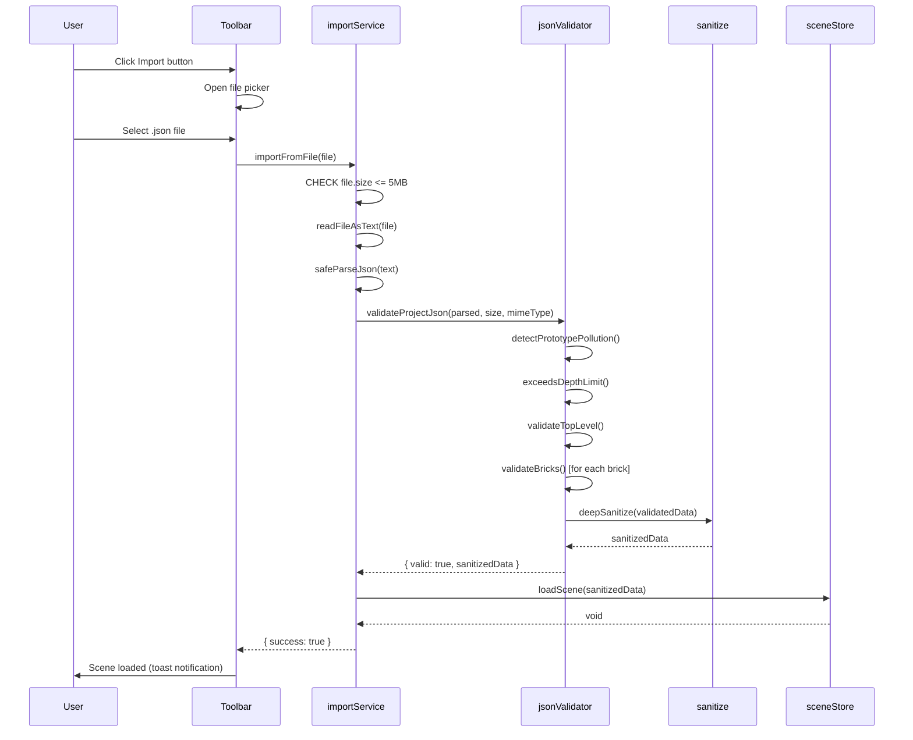
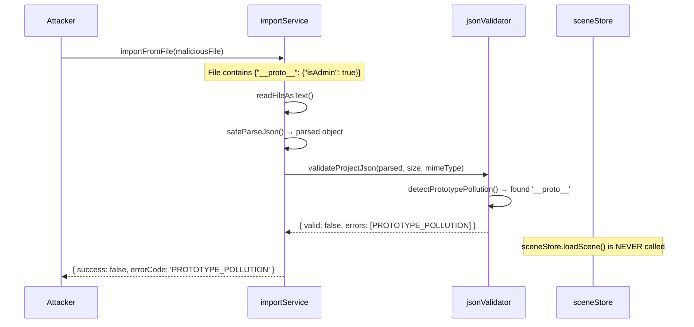
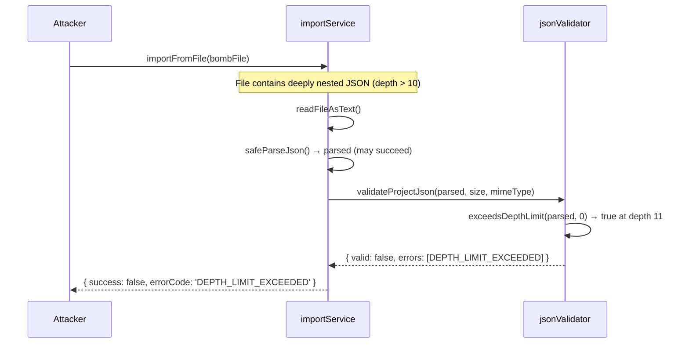
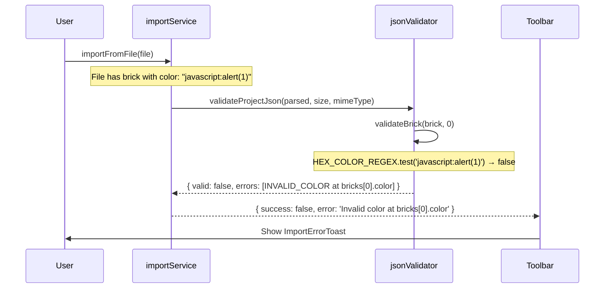

# Low-Level Design: NFR-SEC-001 — JSON Import Validation & Arbitrary Code Execution Prevention

**FR-ID:** NFR-SEC-001  
**Issue:** #32  
**Area:** frontend  
**Status:** Draft — Awaiting Gate 6a Human Review  
**Author:** Spectra Design Agent  
**Date:** 2026-04-12  

---

## 1. Overview

NFR-SEC-001 mandates that **all imported JSON files are validated against the LegoBuilder schema before any data is processed**, and that **no arbitrary code execution is possible from imported data**. This is a pure client-side security NFR for the LegoBuilder SPA (React + Vite + TypeScript).

### 1.1 Problem Statement

The existing `importService.ts` calls `JSON.parse()` on user-supplied file content and passes the result directly to `sceneStore.loadScene()` without structural validation. This creates multiple attack surfaces:

- **Prototype pollution** via `__proto__`, `constructor`, or `prototype` keys
- **JSON bombs** (deeply nested or extremely large payloads causing DoS)
- **XSS via string fields** (malicious strings in `id`, `color`, `catalogId` fields)
- **MIME spoofing** (non-JSON files accepted as JSON)
- **Arbitrary code execution** via `eval()`, `Function()`, or `setTimeout(string)` patterns in downstream code

### 1.2 Scope

| In Scope | Out of Scope |
|---|---|
| JSON file import validation pipeline | Server-side validation (no backend) |
| Prototype pollution prevention | Network request validation |
| JSON bomb / DoS mitigation | WebSocket or API security |
| XSS via string field sanitization | Authentication / authorization |
| MIME type enforcement | Third-party library supply chain |
| ESLint `no-eval` enforcement | Runtime CSP (covered by NFR-SEC-002) |
| Unit tests with malformed/malicious payloads | |

---

## 2. Architecture Overview

```
User selects file
       │
       ▼
┌─────────────────────────────────────────────────────────────────┐
│                     importService.ts                            │
│                                                                 │
│  readFile() → parseJson() → validateProjectJson() → sanitize() │
│                                    │                            │
│                              jsonValidator.ts                   │
│                              sanitize.ts                        │
└─────────────────────────────────────────────────────────────────┘
       │
       ▼ (only on ValidationResult.valid === true)
sceneStore.loadScene(sanitizedData)
```

### 2.1 New Modules

| Module | Path | Responsibility |
|--------|------|----------------|
| `jsonValidator` | `frontend/src/utils/jsonValidator.ts` | Pure validation function — schema checks, depth limit, prototype pollution detection |
| `sanitize` | `frontend/src/utils/sanitize.ts` | String sanitization helpers — strip HTML, enforce allowlists |

### 2.2 Modified Modules

| Module | Path | Change |
|--------|------|--------|
| `importService` | `frontend/src/services/importService.ts` | Wire `validateProjectJson()` before `sceneStore.loadScene()` |
| `eslint.config.js` | `frontend/eslint.config.js` | Add `no-eval`, `no-new-func`, `no-implied-eval` rules |

---

## 3. Data Models

### 3.1 ValidationResult

```typescript
export type ValidationErrorCode =
  | 'FILE_TOO_LARGE'          // File exceeds MAX_FILE_SIZE_BYTES
  | 'INVALID_MIME_TYPE'       // File MIME type is not application/json or text/plain
  | 'INVALID_JSON_SYNTAX'     // JSON.parse() threw SyntaxError
  | 'DEPTH_LIMIT_EXCEEDED'    // Object nesting depth > MAX_DEPTH
  | 'PROTOTYPE_POLLUTION'     // __proto__, constructor, or prototype key detected
  | 'MISSING_REQUIRED_FIELD'  // Top-level required field absent
  | 'INVALID_FIELD_TYPE'      // Field has wrong TypeScript type
  | 'INVALID_SCHEMA_VERSION'  // version field is incompatible
  | 'BRICK_VALIDATION_FAILED' // One or more bricks failed per-brick validation
  | 'BRICK_COUNT_EXCEEDED'    // bricks array length > MAX_BRICK_COUNT
  | 'INVALID_BRICK_ID'        // brickId does not match UUID v4 regex
  | 'INVALID_CATALOG_ID'      // catalogId not in BRICK_CATALOG allowlist
  | 'INVALID_COLOR'           // color does not match #RRGGBB regex
  | 'INVALID_ROTATION'        // rotation not in {0, 90, 180, 270}
  | 'INVALID_POSITION'        // position.x/y/z not finite numbers or out of grid bounds
  | 'INVALID_STRING_CONTENT'; // String field contains disallowed characters

export interface ValidationError {
  code: ValidationErrorCode;
  message: string;           // Human-readable description
  field?: string;            // JSON path to the offending field (e.g., 'bricks[3].color')
  brickIndex?: number;       // Index of the offending brick (if applicable)
}

export interface ValidationResult {
  valid: boolean;
  errors: ValidationError[];  // Empty array when valid === true
  sanitizedData?: ProjectJson; // Present only when valid === true
}
```

### 3.2 ProjectJson (Import Schema)

```typescript
export interface BrickData {
  id: string;           // UUID v4
  catalogId: string;    // Must be in BRICK_CATALOG keys
  position: {
    x: number;          // Integer, -64 to 64
    y: number;          // Integer, 0 to 128
    z: number;          // Integer, -64 to 64
  };
  rotation: 0 | 90 | 180 | 270;
  color: string;        // #RRGGBB hex
}

export interface ProjectJson {
  version: string;      // Semver string, e.g. "1.0.0"
  metadata: {
    name: string;       // Max 256 chars, alphanumeric + spaces + hyphens
    createdAt: string;  // ISO 8601 date string
    schemaVersion: string;
  };
  bricks: BrickData[];  // Max MAX_BRICK_COUNT entries
}
```

### 3.3 Security Constants

```typescript
export const MAX_FILE_SIZE_BYTES = 5 * 1024 * 1024; // 5 MB
export const MAX_DEPTH = 10;                         // Max JSON nesting depth
export const MAX_BRICK_COUNT = 500;                  // Max bricks per import
export const MAX_STRING_LENGTH = 1024;               // Max length for any string field
export const ALLOWED_MIME_TYPES = [
  'application/json',
  'text/plain',
  'text/json',
] as const;
export const UUID_V4_REGEX = /^[0-9a-f]{8}-[0-9a-f]{4}-4[0-9a-f]{3}-[89ab][0-9a-f]{3}-[0-9a-f]{12}$/i;
export const HEX_COLOR_REGEX = /^#[0-9A-Fa-f]{6}$/;
export const VALID_ROTATIONS = new Set([0, 90, 180, 270]);
export const PROTOTYPE_POLLUTION_KEYS = new Set(['__proto__', 'constructor', 'prototype']);
```

---

## 4. Component Architecture

### 4.1 `jsonValidator.ts` — Pure Validation Engine

```typescript
// frontend/src/utils/jsonValidator.ts

import type { ValidationResult, ValidationError, ProjectJson } from '../types/project';
import {
  MAX_FILE_SIZE_BYTES,
  MAX_DEPTH,
  MAX_BRICK_COUNT,
  MAX_STRING_LENGTH,
  UUID_V4_REGEX,
  HEX_COLOR_REGEX,
  VALID_ROTATIONS,
  PROTOTYPE_POLLUTION_KEYS,
} from '../constants/security';
import { BRICK_CATALOG } from '../constants/brickCatalog';
import { sanitizeString } from './sanitize';

/**
 * Validates and sanitizes a raw parsed JSON object against the ProjectJson schema.
 * Pure function — no I/O, no side effects.
 * Returns ValidationResult with sanitizedData on success.
 */
export function validateProjectJson(
  raw: unknown,
  fileSizeBytes: number,
  mimeType: string
): ValidationResult;

/**
 * Checks object nesting depth recursively.
 * Returns true if depth exceeds MAX_DEPTH.
 */
function exceedsDepthLimit(obj: unknown, currentDepth: number): boolean;

/**
 * Scans all keys in an object recursively for prototype pollution keys.
 * Returns the first offending key path, or null if clean.
 */
function detectPrototypePollution(obj: unknown, path: string): string | null;

/**
 * Validates a single BrickData entry.
 * Returns array of ValidationErrors (empty if valid).
 */
function validateBrick(brick: unknown, index: number): ValidationError[];
```

**Validation Algorithm (validateProjectJson):**

```
1. CHECK file size: fileSizeBytes > MAX_FILE_SIZE_BYTES → FILE_TOO_LARGE (short-circuit)
2. CHECK MIME type: mimeType not in ALLOWED_MIME_TYPES → INVALID_MIME_TYPE (short-circuit)
3. CHECK prototype pollution: detectPrototypePollution(raw, '') → PROTOTYPE_POLLUTION (short-circuit)
4. CHECK depth: exceedsDepthLimit(raw, 0) → DEPTH_LIMIT_EXCEEDED (short-circuit)
5. CHECK top-level type: typeof raw !== 'object' || raw === null → MISSING_REQUIRED_FIELD
6. CHECK required fields: version, metadata, bricks present → MISSING_REQUIRED_FIELD
7. CHECK version: semver parse, major version compatibility → INVALID_SCHEMA_VERSION
8. CHECK metadata.name: string, max 256 chars → INVALID_FIELD_TYPE / INVALID_STRING_CONTENT
9. CHECK metadata.createdAt: valid ISO 8601 → INVALID_FIELD_TYPE
10. CHECK bricks: Array.isArray → INVALID_FIELD_TYPE
11. CHECK bricks.length <= MAX_BRICK_COUNT → BRICK_COUNT_EXCEEDED
12. FOR EACH brick: validateBrick(brick, index) → BRICK_VALIDATION_FAILED
13. IF any errors: return { valid: false, errors }
14. ELSE: deep-clone with structuredClone(), sanitize all strings → return { valid: true, sanitizedData }
```

**validateBrick Algorithm:**

```
1. CHECK id: UUID_V4_REGEX.test(brick.id) → INVALID_BRICK_ID
2. CHECK catalogId: BRICK_CATALOG.has(brick.catalogId) → INVALID_CATALOG_ID
3. CHECK color: HEX_COLOR_REGEX.test(brick.color) → INVALID_COLOR
4. CHECK rotation: VALID_ROTATIONS.has(brick.rotation) → INVALID_ROTATION
5. CHECK position: object with x, y, z → INVALID_FIELD_TYPE
6. CHECK position.x: Number.isFinite(x) && x >= -64 && x <= 64 → INVALID_POSITION
7. CHECK position.y: Number.isFinite(y) && y >= 0 && y <= 128 → INVALID_POSITION
8. CHECK position.z: Number.isFinite(z) && z >= -64 && z <= 64 → INVALID_POSITION
```

### 4.2 `sanitize.ts` — String Sanitization Helpers

```typescript
// frontend/src/utils/sanitize.ts

/**
 * Strips HTML tags and encodes dangerous characters from a string.
 * Used on all string fields after validation passes.
 */
export function sanitizeString(input: string): string;

/**
 * Truncates a string to maxLength characters.
 */
export function truncateString(input: string, maxLength: number): string;

/**
 * Deep-clones an object using structuredClone() and sanitizes all string values.
 * Breaks any prototype chain from JSON.parse() output.
 */
export function deepSanitize<T>(obj: T): T;
```

**sanitizeString implementation:**
```typescript
export function sanitizeString(input: string): string {
  return input
    .replace(/&/g, '&amp;')
    .replace(/</g, '&lt;')
    .replace(/>/g, '&gt;')
    .replace(/"/g, '&quot;')
    .replace(/'/g, '&#x27;')
    .replace(/\//g, '&#x2F;');
}
```

### 4.3 Updated `importService.ts`

```typescript
// frontend/src/services/importService.ts

import { validateProjectJson } from '../utils/jsonValidator';
import type { ValidationResult } from '../types/project';

export interface ImportResult {
  success: boolean;
  error?: string;       // User-facing error message
  errorCode?: string;   // Machine-readable error code
}

/**
 * Reads a File object, validates it against the ProjectJson schema,
 * and loads the sanitized data into sceneStore.
 * 
 * Returns ImportResult — never throws.
 */
export async function importFromFile(file: File): Promise<ImportResult>;

/**
 * Reads file content as text using FileReader.
 * Returns the raw string content.
 */
function readFileAsText(file: File): Promise<string>;

/**
 * Parses JSON string. Returns { data, error } — never throws.
 */
function safeParseJson(text: string): { data: unknown; error: string | null };
```

**importFromFile pipeline:**

```
1. CHECK file.size > MAX_FILE_SIZE_BYTES → return { success: false, errorCode: 'FILE_TOO_LARGE' }
2. READ file content via readFileAsText()
3. PARSE JSON via safeParseJson() → on SyntaxError: return { success: false, errorCode: 'INVALID_JSON_SYNTAX' }
4. VALIDATE via validateProjectJson(parsed, file.size, file.type)
5. IF !result.valid → return { success: false, errorCode: result.errors[0].code, error: result.errors[0].message }
6. CALL sceneStore.loadScene(result.sanitizedData)
7. RETURN { success: true }
```

---

## 5. Sequence Diagrams

### 5.1 Happy Path — Valid JSON Import



### 5.2 Error Path — Prototype Pollution Attack



### 5.3 Error Path — JSON Bomb (Depth Limit)



### 5.4 Error Path — Invalid Brick Data



---

## 6. Error Handling Strategy

### 6.1 Error Code Registry

| Code | Trigger | User Message | Scene Modified? |
|------|---------|-------------|----------------|
| `FILE_TOO_LARGE` | file.size > 5 MB | "File is too large. Maximum size is 5 MB." | No |
| `INVALID_MIME_TYPE` | MIME not in allowlist | "File must be a JSON file." | No |
| `INVALID_JSON_SYNTAX` | JSON.parse() throws | "File contains invalid JSON." | No |
| `DEPTH_LIMIT_EXCEEDED` | Nesting depth > 10 | "File structure is too deeply nested." | No |
| `PROTOTYPE_POLLUTION` | `__proto__` / `constructor` key | "File contains unsafe data and was rejected." | No |
| `MISSING_REQUIRED_FIELD` | Required field absent | "File is missing required fields." | No |
| `INVALID_FIELD_TYPE` | Wrong TypeScript type | "File contains invalid field types." | No |
| `INVALID_SCHEMA_VERSION` | Major version mismatch | "File was created with an incompatible version of LegoBuilder." | No |
| `BRICK_COUNT_EXCEEDED` | bricks.length > 500 | "File contains too many bricks (max 500)." | No |
| `BRICK_VALIDATION_FAILED` | Per-brick validation fails | "File contains invalid brick data at position N." | No |
| `INVALID_BRICK_ID` | UUID v4 regex fails | "File contains an invalid brick ID." | No |
| `INVALID_CATALOG_ID` | Not in BRICK_CATALOG | "File references an unknown brick type." | No |
| `INVALID_COLOR` | Hex color regex fails | "File contains an invalid color value." | No |
| `INVALID_ROTATION` | Not in {0,90,180,270} | "File contains an invalid rotation value." | No |
| `INVALID_POSITION` | Out of grid bounds | "File contains a brick outside the valid grid area." | No |

**Invariant:** `sceneStore.loadScene()` is NEVER called when `valid === false`. The scene is never partially modified.

### 6.2 Fail-Fast vs. Collect-All Strategy

| Error Type | Strategy | Rationale |
|---|---|---|
| `FILE_TOO_LARGE` | Fail-fast | No point reading the file |
| `INVALID_MIME_TYPE` | Fail-fast | No point parsing |
| `INVALID_JSON_SYNTAX` | Fail-fast | Cannot proceed |
| `DEPTH_LIMIT_EXCEEDED` | Fail-fast | DoS risk |
| `PROTOTYPE_POLLUTION` | Fail-fast | Security critical |
| Per-brick errors | Collect-all | Better UX: show all errors at once |
| Top-level field errors | Collect-all | Better UX |

---

## 7. Security Considerations

### 7.1 Threat Model

| Threat | Attack Vector | Mitigation |
|--------|--------------|------------|
| **Prototype Pollution** | `{"__proto__": {"isAdmin": true}}` | `detectPrototypePollution()` scans all keys before any property access; `structuredClone()` breaks prototype chain |
| **JSON Bomb (DoS)** | Deeply nested `{"a":{"a":{...}}}` | `exceedsDepthLimit()` short-circuits at depth 10 |
| **Large File DoS** | 500 MB JSON file | `file.size` check before `FileReader.readAsText()` |
| **XSS via String Fields** | `"name": "<script>alert(1)</script>"` | `sanitizeString()` HTML-encodes all string fields; React's JSX escaping provides second layer |
| **MIME Spoofing** | Rename `malware.exe` to `scene.json` | MIME type check + JSON.parse() will fail on non-JSON content |
| **Arbitrary Code Execution** | `eval()`, `Function()`, `setTimeout(string)` | ESLint `no-eval`, `no-new-func`, `no-implied-eval` rules; `JSON.parse()` is the only parser |
| **Brick Count DoS** | 1,000,000 bricks in array | `MAX_BRICK_COUNT = 500` check before per-brick iteration |
| **Integer Overflow** | `position.x = 9007199254740992` | `Number.isFinite()` + grid bounds check |
| **Unicode Injection** | Null bytes, RTL override chars | `sanitizeString()` strips control characters |

### 7.2 ESLint Rules Added

```javascript
// frontend/eslint.config.js additions
{
  rules: {
    'no-eval': 'error',
    'no-new-func': 'error',
    'no-implied-eval': 'error',
    'no-script-url': 'error',
  }
}
```

### 7.3 Why Not `ajv` or `zod`?

| Option | Bundle Size | Control | Decision |
|--------|------------|---------|----------|
| Hand-rolled validator | ~2 KB | Full | ✅ Chosen |
| `ajv` | ~30 KB gzipped | Medium | ❌ Too large |
| `zod` | ~12 KB gzipped | High | ❌ Already have `zod` for export; could reuse |

**Note:** If `zod` is already a project dependency (used in `exportService.ts`), the team may choose to define a `ProjectJsonSchema` using `zod` instead of the hand-rolled validator. The interface contracts in this LLD remain the same regardless of the validation library used.

---

## 8. Performance Budget

| Operation | Target | Measurement |
|-----------|--------|-------------|
| `validateProjectJson()` for 500 bricks | ≤ 200 ms | `performance.now()` in unit test |
| `deepSanitize()` for 500 bricks | ≤ 50 ms | `performance.now()` in unit test |
| Total import pipeline (read + parse + validate + load) | ≤ 1 s | E2E test |
| Bundle size increase | ≤ 8 KB gzipped | Vite bundle analyzer |
| Memory overhead during validation | ≤ 10 MB | Chrome DevTools |

---

## 9. Accessibility

| Requirement | Implementation |
|-------------|----------------|
| Import error announced to screen readers | `ImportErrorToast` uses `role="alert"` and `aria-live="assertive"` |
| Error message is descriptive | Each `ValidationErrorCode` maps to a human-readable message |
| File input is keyboard-accessible | Native `<input type="file">` with `aria-label="Import scene JSON"` |
| Loading state announced | `aria-busy="true"` on Toolbar Import button during import |

---

## 10. Test Case Mapping

### 10.1 Unit Tests (`frontend/tests/unit/jsonValidator.test.ts`)

| Test ID | Description | Input | Expected |
|---------|-------------|-------|----------|
| T-FE-SEC-001-01 | Valid JSON passes validation | Well-formed ProjectJson with 3 bricks | `{ valid: true, sanitizedData: {...} }` |
| T-FE-SEC-001-02 | Prototype pollution rejected | `{"__proto__": {"x": 1}, ...}` | `{ valid: false, errors: [PROTOTYPE_POLLUTION] }` |
| T-FE-SEC-001-03 | JSON bomb rejected | Object with depth 15 | `{ valid: false, errors: [DEPTH_LIMIT_EXCEEDED] }` |
| T-FE-SEC-001-04 | Malicious color rejected | `bricks[0].color = "javascript:alert(1)"` | `{ valid: false, errors: [INVALID_COLOR] }` |
| T-FE-SEC-001-05 | File too large rejected | `fileSizeBytes = 6 * 1024 * 1024` | `{ valid: false, errors: [FILE_TOO_LARGE] }` |
| T-FE-SEC-001-06 | Invalid UUID rejected | `bricks[0].id = "not-a-uuid"` | `{ valid: false, errors: [INVALID_BRICK_ID] }` |
| T-FE-SEC-001-07 | Unknown catalogId rejected | `bricks[0].catalogId = "unknown-type"` | `{ valid: false, errors: [INVALID_CATALOG_ID] }` |
| T-FE-SEC-001-08 | Invalid rotation rejected | `bricks[0].rotation = 45` | `{ valid: false, errors: [INVALID_ROTATION] }` |
| T-FE-SEC-001-09 | Out-of-bounds position rejected | `bricks[0].position.x = 999` | `{ valid: false, errors: [INVALID_POSITION] }` |
| T-FE-SEC-001-10 | Brick count exceeded | `bricks.length = 501` | `{ valid: false, errors: [BRICK_COUNT_EXCEEDED] }` |
| T-FE-SEC-001-11 | Missing required field | `{ version: '1.0.0' }` (no bricks) | `{ valid: false, errors: [MISSING_REQUIRED_FIELD] }` |
| T-FE-SEC-001-12 | Invalid schema version | `version: '99.0.0'` | `{ valid: false, errors: [INVALID_SCHEMA_VERSION] }` |
| T-FE-SEC-001-13 | sanitizedData is structuredClone | Verify `result.sanitizedData !== raw` | Deep equality but different reference |
| T-FE-SEC-001-14 | HTML in name field is sanitized | `metadata.name = "<b>test</b>"` | `sanitizedData.metadata.name = "&lt;b&gt;test&lt;/b&gt;"` |
| T-FE-SEC-001-15 | constructor key rejected | `{"constructor": {"name": "evil"}, ...}` | `{ valid: false, errors: [PROTOTYPE_POLLUTION] }` |

### 10.2 Integration Tests (`frontend/tests/unit/importService.test.ts`)

| Test ID | Description | Expected |
|---------|-------------|----------|
| T-FE-SEC-001-INT-01 | Valid file → sceneStore.loadScene() called | `loadScene` called with sanitizedData |
| T-FE-SEC-001-INT-02 | Invalid file → sceneStore.loadScene() NOT called | `loadScene` never called |
| T-FE-SEC-001-INT-03 | MIME type check | `.exe` file rejected with `INVALID_MIME_TYPE` |
| T-FE-SEC-001-INT-04 | Invalid JSON syntax | `INVALID_JSON_SYNTAX` returned |

### 10.3 E2E Tests (`frontend/tests/e2e/importSecurity.spec.ts`)

| Test ID | Description | Expected |
|---------|-------------|----------|
| T-E2E-SEC-001-01 | Import valid JSON → scene loads | Scene contains imported bricks |
| T-E2E-SEC-001-02 | Import malformed JSON → error toast | `data-testid="import-error-toast"` visible |
| T-E2E-SEC-001-03 | Import oversized file → error toast | Error message mentions file size |

---

## 11. File Map for Coding Agent

### New Files

| File | Action | Description |
|------|--------|-------------|
| `frontend/src/utils/jsonValidator.ts` | CREATE | Pure validation engine |
| `frontend/src/utils/sanitize.ts` | CREATE | String sanitization helpers |
| `frontend/src/constants/security.ts` | CREATE | Security constants (MAX_FILE_SIZE_BYTES, etc.) |
| `frontend/tests/unit/jsonValidator.test.ts` | CREATE | 15 unit tests for validator |
| `frontend/tests/unit/importService.test.ts` | CREATE | 4 integration tests |
| `frontend/tests/e2e/importSecurity.spec.ts` | CREATE | 3 E2E tests |

### Modified Files

| File | Action | Change |
|------|--------|--------|
| `frontend/src/services/importService.ts` | MODIFY | Add `validateProjectJson()` call before `sceneStore.loadScene()` |
| `frontend/eslint.config.js` | MODIFY | Add `no-eval`, `no-new-func`, `no-implied-eval`, `no-script-url` rules |
| `frontend/src/types/project.ts` | MODIFY | Add `ValidationResult`, `ValidationError`, `ValidationErrorCode` types |

---

## 12. Implementation Notes for Coding Agent

1. **`detectPrototypePollution` must use `Object.keys()` not `for...in`** — `for...in` traverses the prototype chain and may miss injected keys in some environments. Use `Object.keys()` for own-property enumeration.

2. **`exceedsDepthLimit` must handle circular references** — Use a `WeakSet` to track visited objects and avoid infinite recursion on circular JSON (though `JSON.parse()` cannot produce circular objects, defensive coding is required).

3. **`structuredClone()` availability** — Available in all modern browsers (Chrome 98+, Firefox 94+, Safari 15.4+). No polyfill needed for the LegoBuilder target baseline.

4. **`safeParseJson` must catch all exceptions** — `JSON.parse()` can throw `SyntaxError` but also `RangeError` on some engines for extremely large inputs. Use a broad `catch (e: unknown)` block.

5. **`importService.ts` must never call `eval()`** — The ESLint rules will enforce this, but the coding agent should be aware that `JSON.parse()` is the only approved parsing mechanism.

6. **Test file naming** — Unit tests for `jsonValidator.ts` go in `frontend/tests/unit/jsonValidator.test.ts` (not co-located with the source file) to follow the existing test structure.

7. **`BRICK_CATALOG` import** — The validator imports `BRICK_CATALOG` from `frontend/src/constants/brickCatalog.ts`. Verify this module exports a `Map<string, BrickTypeDefinition>` or `Set<string>` of valid catalog IDs.

---

## 13. Dependencies

| Dependency | Type | Status | Notes |
|------------|------|--------|-------|
| `structuredClone` | Browser API | ✅ Available | Chrome 98+, no polyfill needed |
| `FileReader` | Browser API | ✅ Available | Standard Web API |
| `BRICK_CATALOG` | Internal | ✅ Exists | `frontend/src/constants/brickCatalog.ts` |
| `sceneStore.loadScene()` | Internal | ✅ Exists | `frontend/src/stores/sceneStore.ts` |
| No new npm packages | — | ✅ | Hand-rolled validator, no new deps |

---

## 14. Open Questions

| ID | Question | Impact | Severity |
|----|----------|--------|----------|
| OQ-1 | Should `zod` be used instead of the hand-rolled validator, given it may already be a project dependency? | Affects `jsonValidator.ts` implementation approach | MEDIUM |
| OQ-2 | What is the exact set of valid `catalogId` values in `BRICK_CATALOG`? | Affects `INVALID_CATALOG_ID` validation | HIGH |
| OQ-3 | Should the `metadata.name` field allow Unicode characters (e.g., Japanese, Arabic)? | Affects `sanitizeString()` character allowlist | LOW |
| OQ-4 | Should partial imports be allowed (skip invalid bricks, import valid ones)? | Affects fail-fast vs. collect-all strategy for brick errors | MEDIUM |
| OQ-5 | Is `MAX_BRICK_COUNT = 500` the correct limit, or should it match the NFR-SCALE-001 limit? | Affects `BRICK_COUNT_EXCEEDED` threshold | LOW |

---

## 15. Alternatives Considered

| Alternative | Reason Rejected |
|-------------|----------------|
| **`ajv` JSON Schema validator** | ~30 KB bundle increase; hand-rolled validator is sufficient and smaller |
| **`zod` schema validation** | Already a potential dependency; could be used if confirmed in `package.json` |
| **Server-side validation** | No backend in LegoBuilder; all validation must be client-side |
| **Allowlist-only approach (no sanitization)** | Allowlist validation is the primary defense; sanitization is defense-in-depth |
| **Reject on any unknown field** | Too strict; forward-compatible imports would break on minor version additions |

---

## 16. NFR Compliance Targets

| NFR | Target | Verification |
|-----|--------|-------------|
| Validation latency (500 bricks) | ≤ 200 ms | Unit test with `performance.now()` |
| Bundle size increase | ≤ 8 KB gzipped | Vite bundle analyzer in CI |
| Zero `eval()` calls | 0 occurrences | ESLint `no-eval: error` |
| Zero prototype pollution | 0 bypasses | Unit tests T-FE-SEC-001-02, T-FE-SEC-001-15 |
| Scene never partially modified | Invariant | All error paths verified in integration tests |
| All test cases pass | 100% | Vitest + Playwright CI |

---

*Created by Spectra Framework — design-agent*  
*NFR-SEC-001 | Issue #32 | app-legobuilder-20260410*  
*Gate: pending — awaiting Gate 6a human review*
