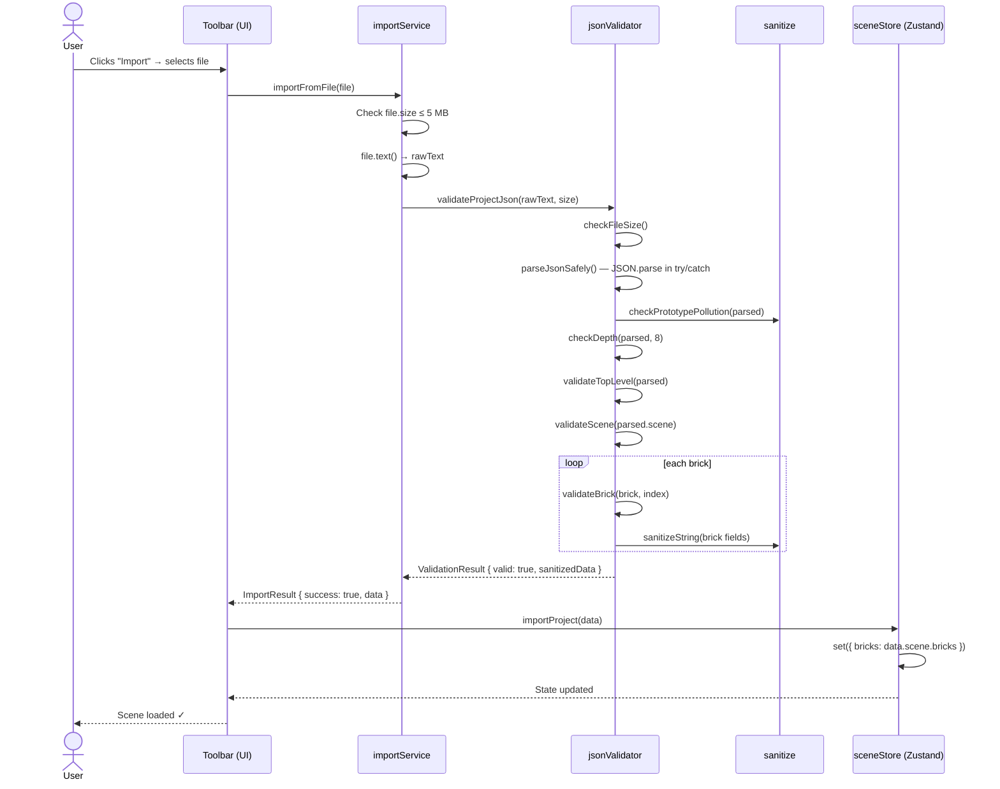
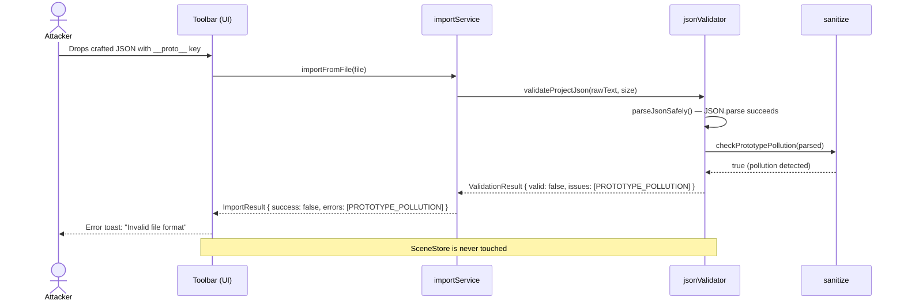
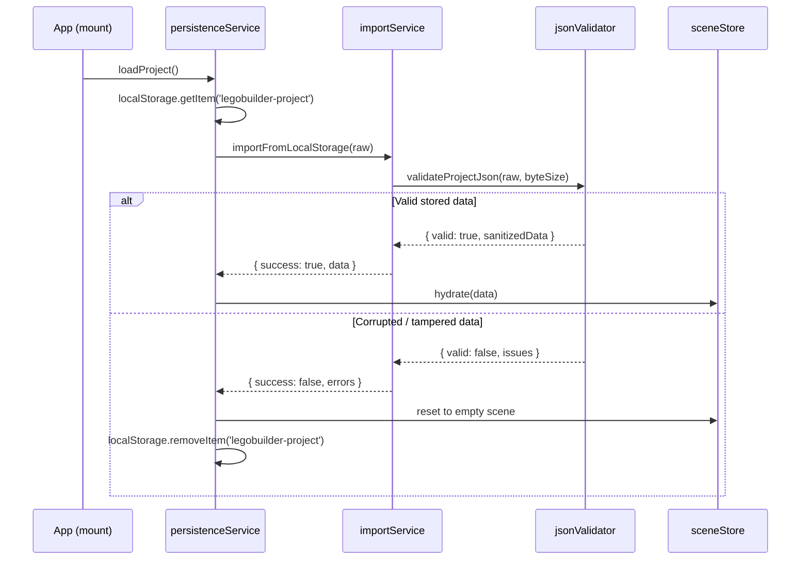

# Low-Level Design: NFR-SEC-001
## Validate All Imported JSON Files Against Schema; Prevent Arbitrary Code Execution

**FR-ID:** NFR-SEC-001  
**Issue:** [#32](https://github.com/sreenivasmrpivot/legobuilder/issues/32)  
**Status:** Draft — Awaiting Gate 6a Design Review  
**Author:** Spectra Design Agent  
**Date:** 2026-04-11  

---

## 1. Overview

NFR-SEC-001 mandates that **all JSON data imported into LegoBuilder** (project files, brick scenes, catalog overrides) is validated against a strict schema before any processing occurs. No executable code paths may be triggered by imported data. This LLD defines the validation architecture, schema contracts, error handling strategy, and security boundaries for the `importService` and `exportSchema` modules in the frontend SPA.

### 1.1 Scope

| In Scope | Out of Scope |
|---|---|
| JSON import validation (file picker, drag-and-drop, localStorage restore) | Server-side validation (no backend exists) |
| Schema definition for LegoBuilder project format v1 | Binary file formats (LDraw, BrickLink XML) |
| Malformed / oversized / malicious payload rejection | Runtime React prop validation |
| Prototype pollution prevention | Third-party library supply-chain security |
| Size and depth limits | Network request validation |

### 1.2 Affected Files

| File | Role | Change Type |
|---|---|---|
| `frontend/src/engine/exportSchema.ts` | Canonical JSON schema definition | Enhance |
| `frontend/src/services/importService.ts` | JSON parse + validate pipeline | Enhance |
| `frontend/src/engine/jsonValidator.ts` | New — pure validation engine | Create |
| `frontend/src/types/validation.ts` | New — validation result types | Create |
| `frontend/src/utils/sanitize.ts` | New — string sanitization helpers | Create |

---

## 2. Data Models

### 2.1 LegoBuilder Project JSON Schema (v1)

The canonical schema for a `.lbp` (LegoBuilder Project) JSON file:

```typescript
// frontend/src/engine/exportSchema.ts
export const LEGOBUILDER_SCHEMA_VERSION = '1.0.0';
export const MAX_FILE_SIZE_BYTES = 5 * 1024 * 1024; // 5 MB hard limit
export const MAX_BRICK_COUNT = 10_000;
export const MAX_STRING_LENGTH = 256;
export const MAX_JSON_DEPTH = 8;

export interface LegoBuilderProjectSchema {
  schemaVersion: string;       // semver string, e.g. "1.0.0"
  projectName: string;         // max 256 chars, no HTML/script
  createdAt: string;           // ISO 8601 timestamp
  updatedAt: string;           // ISO 8601 timestamp
  scene: SceneSchema;
}

export interface SceneSchema {
  bricks: BrickInstanceSchema[];
  camera?: CameraSchema;
}

export interface BrickInstanceSchema {
  id: string;                  // UUID v4 pattern
  catalogId: string;           // must exist in BRICK_CATALOG
  position: Vector3Schema;
  rotation: RotationSchema;
  color: string;               // hex color #RRGGBB
}

export interface Vector3Schema {
  x: number;                   // finite, -1000 to 1000
  y: number;                   // finite, 0 to 500
  z: number;                   // finite, -1000 to 1000
}

export interface RotationSchema {
  y: number;                   // 0 | 90 | 180 | 270 (degrees)
}

export interface CameraSchema {
  position: Vector3Schema;
  target: Vector3Schema;
  zoom: number;                // 0.1 to 10.0
}
```

### 2.2 Validation Result Type

```typescript
// frontend/src/types/validation.ts
export type ValidationSeverity = 'error' | 'warning';

export interface ValidationIssue {
  code: string;          // e.g. 'SCHEMA_VERSION_MISMATCH'
  severity: ValidationSeverity;
  path: string;          // JSON path, e.g. 'scene.bricks[3].color'
  message: string;       // human-readable, safe to display
}

export interface ValidationResult {
  valid: boolean;
  issues: ValidationIssue[];
  sanitizedData?: LegoBuilderProjectSchema; // only present when valid === true
}
```

### 2.3 Error Code Registry

| Code | Severity | Trigger |
|---|---|---|
| `FILE_TOO_LARGE` | error | Raw bytes > 5 MB |
| `INVALID_JSON_SYNTAX` | error | `JSON.parse` throws |
| `DEPTH_LIMIT_EXCEEDED` | error | Object nesting > 8 levels |
| `MISSING_REQUIRED_FIELD` | error | Required key absent |
| `WRONG_TYPE` | error | Field type mismatch |
| `SCHEMA_VERSION_MISMATCH` | error | `schemaVersion` not in supported list |
| `BRICK_COUNT_EXCEEDED` | error | `scene.bricks.length > 10,000` |
| `UNKNOWN_CATALOG_ID` | error | `catalogId` not in `BRICK_CATALOG` |
| `INVALID_UUID` | error | `id` fails UUID v4 regex |
| `OUT_OF_RANGE` | error | Numeric field outside allowed bounds |
| `STRING_TOO_LONG` | error | String field > 256 chars |
| `PROTOTYPE_POLLUTION` | error | Key is `__proto__`, `constructor`, or `prototype` |
| `INVALID_COLOR` | error | `color` fails `#RRGGBB` regex |
| `INVALID_ROTATION` | error | `rotation.y` not in `{0, 90, 180, 270}` |
| `INVALID_TIMESTAMP` | warning | `createdAt`/`updatedAt` not ISO 8601 |

---

## 3. Component Architecture

### 3.1 Module Dependency Graph

```
importService.ts
    │
    ├── jsonValidator.ts          ← pure validation, no side effects
    │       ├── exportSchema.ts   ← schema constants & type guards
    │       └── sanitize.ts       ← string sanitization helpers
    │
    └── sceneStore (Zustand)      ← only receives sanitizedData on success
```

### 3.2 `jsonValidator.ts` — Pure Validation Engine

```typescript
// frontend/src/engine/jsonValidator.ts

import { BRICK_CATALOG } from './brickCatalog';
import {
  MAX_FILE_SIZE_BYTES, MAX_BRICK_COUNT, MAX_STRING_LENGTH,
  MAX_JSON_DEPTH, LEGOBUILDER_SCHEMA_VERSION,
  LegoBuilderProjectSchema
} from './exportSchema';
import { ValidationResult, ValidationIssue } from '../types/validation';
import { sanitizeString, checkPrototypePollution } from '../utils/sanitize';

// ── Public API ────────────────────────────────────────────────────────────────

/**
 * Validates raw JSON text against the LegoBuilder project schema.
 * Returns a ValidationResult; never throws.
 * Does NOT mutate global state.
 */
export function validateProjectJson(
  rawText: string,
  fileSizeBytes: number
): ValidationResult { ... }

// ── Internal helpers (exported for unit testing) ─────────────────────────────

export function checkFileSize(bytes: number): ValidationIssue | null { ... }
export function parseJsonSafely(text: string): { data: unknown } | { error: ValidationIssue } { ... }
export function checkDepth(value: unknown, maxDepth: number, path?: string): ValidationIssue | null { ... }
export function validateTopLevel(data: unknown): ValidationIssue[] { ... }
export function validateScene(scene: unknown): ValidationIssue[] { ... }
export function validateBrick(brick: unknown, index: number): ValidationIssue[] { ... }
export function validateVector3(v: unknown, path: string): ValidationIssue[] { ... }
export function validateCamera(camera: unknown): ValidationIssue[] { ... }
export function validateColor(color: unknown, path: string): ValidationIssue | null { ... }
export function validateRotation(rotation: unknown, path: string): ValidationIssue | null { ... }
export function validateUUID(id: unknown, path: string): ValidationIssue | null { ... }
```

**Key design constraints:**
- `validateProjectJson` is a **pure function** — no I/O, no global mutation.
- All string fields are passed through `sanitizeString` before inclusion in `sanitizedData`.
- Prototype pollution check runs **before** any property access on parsed data.
- Validation short-circuits on `FILE_TOO_LARGE` and `INVALID_JSON_SYNTAX` (no further checks).

### 3.3 `sanitize.ts` — String Sanitization Helpers

```typescript
// frontend/src/utils/sanitize.ts

/**
 * Strips HTML tags and control characters from a string.
 * Truncates to maxLength. Returns empty string for non-string input.
 */
export function sanitizeString(value: unknown, maxLength = MAX_STRING_LENGTH): string { ... }

/**
 * Recursively checks an object for prototype pollution keys.
 * Returns true if any key is '__proto__', 'constructor', or 'prototype'.
 */
export function checkPrototypePollution(obj: unknown): boolean { ... }

/**
 * Validates a string matches ISO 8601 datetime format.
 */
export function isISO8601(value: string): boolean { ... }

/**
 * Validates a string matches UUID v4 format.
 */
export function isUUIDv4(value: string): boolean { ... }

/**
 * Validates a string matches #RRGGBB hex color format.
 */
export function isHexColor(value: string): boolean { ... }
```

### 3.4 `importService.ts` — Enhanced Import Pipeline

```typescript
// frontend/src/services/importService.ts

import { validateProjectJson } from '../engine/jsonValidator';
import { ValidationResult } from '../types/validation';

export interface ImportResult {
  success: boolean;
  data?: LegoBuilderProjectSchema;
  errors: ValidationIssue[];
  warnings: ValidationIssue[];
}

/**
 * Entry point for file-picker imports.
 * Reads File object, validates, returns ImportResult.
 * Never calls eval() or Function().
 */
export async function importFromFile(file: File): Promise<ImportResult> {
  // 1. Size guard (before reading)
  if (file.size > MAX_FILE_SIZE_BYTES) {
    return { success: false, errors: [FILE_TOO_LARGE_ISSUE], warnings: [] };
  }
  // 2. Read as text
  const text = await file.text();
  // 3. Validate
  const result = validateProjectJson(text, file.size);
  // 4. Return structured result
  return toImportResult(result);
}

/**
 * Entry point for localStorage restore.
 * Validates stored string before hydrating Zustand store.
 */
export function importFromLocalStorage(raw: string | null): ImportResult {
  if (!raw) return { success: false, errors: [EMPTY_PAYLOAD_ISSUE], warnings: [] };
  const result = validateProjectJson(raw, new Blob([raw]).size);
  return toImportResult(result);
}

/**
 * Entry point for drag-and-drop.
 * Delegates to importFromFile after MIME type check.
 */
export async function importFromDrop(dataTransfer: DataTransfer): Promise<ImportResult> {
  const file = dataTransfer.files[0];
  if (!file || !isAllowedMimeType(file.type)) {
    return { success: false, errors: [INVALID_MIME_ISSUE], warnings: [] };
  }
  return importFromFile(file);
}

// ── Private helpers ───────────────────────────────────────────────────────────
function isAllowedMimeType(type: string): boolean {
  return type === 'application/json' || type === 'application/octet-stream' || type === '';
}

function toImportResult(result: ValidationResult): ImportResult {
  return {
    success: result.valid,
    data: result.sanitizedData,
    errors: result.issues.filter(i => i.severity === 'error'),
    warnings: result.issues.filter(i => i.severity === 'warning'),
  };
}
```

---

## 4. API / Interface Contracts

### 4.1 `validateProjectJson` Contract

| Parameter | Type | Constraint |
|---|---|---|
| `rawText` | `string` | Raw file content, not pre-parsed |
| `fileSizeBytes` | `number` | Byte count from `File.size` or `Blob.size` |

**Returns:** `ValidationResult`

| Field | Type | Meaning |
|---|---|---|
| `valid` | `boolean` | `true` only if zero error-severity issues |
| `issues` | `ValidationIssue[]` | All errors and warnings found |
| `sanitizedData` | `LegoBuilderProjectSchema \| undefined` | Present only when `valid === true` |

**Guarantees:**
- Never throws — all exceptions are caught and converted to `ValidationIssue`.
- `sanitizedData` is a **deep clone** of the parsed data with all strings sanitized.
- `sanitizedData` contains **no prototype chain pollution** — created via `Object.create(null)` patterns.
- Execution time ≤ 200 ms for files up to 5 MB (measured in Vitest benchmarks).

### 4.2 `importFromFile` Contract

| Scenario | `success` | `errors` | `data` |
|---|---|---|---|
| Valid `.lbp` file | `true` | `[]` | Populated |
| File > 5 MB | `false` | `[FILE_TOO_LARGE]` | `undefined` |
| Malformed JSON | `false` | `[INVALID_JSON_SYNTAX]` | `undefined` |
| Schema violation | `false` | One or more issues | `undefined` |
| Prototype pollution | `false` | `[PROTOTYPE_POLLUTION]` | `undefined` |
| Unknown catalogId | `false` | `[UNKNOWN_CATALOG_ID]` | `undefined` |

### 4.3 Zustand Store Integration

```typescript
// sceneStore.ts — only accepts validated data
import { importFromFile } from '../services/importService';

const useSceneStore = create<SceneState>((set) => ({
  // ...
  importProject: async (file: File) => {
    const result = await importFromFile(file);
    if (!result.success) {
      // Surface errors to UI — never load partial data
      set({ importError: result.errors });
      return;
    }
    // Only reach here with fully validated, sanitized data
    set({ bricks: result.data!.scene.bricks, importError: null });
  },
}));
```

---

## 5. Sequence Diagrams

### 5.1 File Import — Happy Path



### 5.2 File Import — Malicious Payload Rejection



### 5.3 LocalStorage Restore — Validation on Hydration



---

## 6. Validation Algorithm Detail

### 6.1 Depth Check (Prototype Pollution & DoS Prevention)

```
function checkDepth(value, maxDepth, currentDepth = 0, path = 'root'):
  if currentDepth > maxDepth:
    return DEPTH_LIMIT_EXCEEDED issue at path
  if value is Array:
    for each element at index i:
      result = checkDepth(element, maxDepth, currentDepth + 1, path + '[' + i + ']')
      if result: return result
  if value is plain Object:
    for each key in Object.keys(value):   ← NOT for..in (avoids prototype chain)
      result = checkDepth(value[key], maxDepth, currentDepth + 1, path + '.' + key)
      if result: return result
  return null
```

### 6.2 Prototype Pollution Check

```
function checkPrototypePollution(obj, visited = new Set()):
  if obj is null or not object: return false
  if visited.has(obj): return false   ← circular reference guard
  visited.add(obj)
  for key in Object.keys(obj):
    if key in ['__proto__', 'constructor', 'prototype']: return true
    if typeof obj[key] === 'object':
      if checkPrototypePollution(obj[key], visited): return true
  return false
```

### 6.3 Safe JSON Parse

```
function parseJsonSafely(text):
  try:
    data = JSON.parse(text)   ← standard browser JSON.parse, no eval
    return { data }
  catch SyntaxError as e:
    return { error: { code: 'INVALID_JSON_SYNTAX', message: 'File is not valid JSON', ... } }
```

**Note:** `JSON.parse` is used exclusively. `eval()`, `new Function()`, and `setTimeout(string)` are **never** used in the import pipeline. ESLint rule `no-eval` is enforced.

### 6.4 String Sanitization

```
function sanitizeString(value, maxLength = 256):
  if typeof value !== 'string': return ''
  // Remove HTML tags
  cleaned = value.replace(/<[^>]*>/g, '')
  // Remove control characters (0x00–0x1F, 0x7F)
  cleaned = cleaned.replace(/[\x00-\x1F\x7F]/g, '')
  // Truncate
  return cleaned.slice(0, maxLength)
```

---

## 7. Security Considerations

### 7.1 Threat Model

| Threat | Attack Vector | Mitigation |
|---|---|---|
| **Prototype Pollution** | `{"__proto__": {"isAdmin": true}}` | `checkPrototypePollution()` before any property access |
| **JSON Bomb / DoS** | Deeply nested `{}` or huge arrays | Depth limit (8) + size limit (5 MB) + brick count limit (10,000) |
| **XSS via string fields** | `{"projectName": "<script>alert(1)</script>"}` | `sanitizeString()` strips HTML tags before storage |
| **Arbitrary Code Execution** | `eval()`-based parsers | `JSON.parse` only; ESLint `no-eval` rule enforced |
| **Path Traversal** | Malicious `id` or `catalogId` values | UUID v4 regex + catalog allowlist validation |
| **Integer Overflow** | Extreme numeric values | `Number.isFinite()` + range bounds checks |
| **Circular Reference** | `{"a": <ref to self>}` | `JSON.parse` throws on circular refs; caught by `parseJsonSafely` |
| **MIME Spoofing** | `.exe` renamed to `.json` | MIME type allowlist in `importFromDrop` |
| **LocalStorage Tampering** | Attacker modifies stored JSON | Full re-validation on every `importFromLocalStorage` call |

### 7.2 No-Eval Guarantee

The following are **prohibited** in `importService.ts`, `jsonValidator.ts`, and `sanitize.ts`:
- `eval()`
- `new Function()`
- `setTimeout(string, ...)`
- `setInterval(string, ...)`
- Dynamic `import()` with user-controlled paths
- `document.write()`
- `innerHTML` assignment with unsanitized data

Enforcement: ESLint rules `no-eval`, `no-new-func`, `no-implied-eval` are added to `.eslintrc`.

### 7.3 Content Security Policy

The nginx config (`nginx.conf`) should include:
```
Content-Security-Policy: default-src 'self'; script-src 'self'; object-src 'none';
```
This prevents inline script execution even if XSS were somehow injected.

### 7.4 Allowlist vs Denylist

Validation uses **allowlist** (whitelist) approach:
- Only known `catalogId` values (from `BRICK_CATALOG`) are accepted.
- Only `{0, 90, 180, 270}` are valid rotation values.
- Only `#RRGGBB` hex strings are valid colors.
- Only UUID v4 format is valid for `id` fields.

This is strictly safer than denylist approaches.

---

## 8. Error Handling Strategy

### 8.1 Fail-Fast Principle

Validation short-circuits on critical errors:

```
1. FILE_TOO_LARGE       → return immediately, do not read file content
2. INVALID_JSON_SYNTAX  → return immediately, do not traverse object
3. DEPTH_LIMIT_EXCEEDED → return immediately, do not validate fields
4. PROTOTYPE_POLLUTION  → return immediately, do not access any properties
```

For non-critical errors (field-level), validation continues to collect all issues.

### 8.2 User-Facing Error Messages

Error messages shown to users are **safe, generic, and non-leaking**:

| Code | User Message |
|---|---|
| `FILE_TOO_LARGE` | "File is too large. Maximum size is 5 MB." |
| `INVALID_JSON_SYNTAX` | "File is not a valid LegoBuilder project." |
| `SCHEMA_VERSION_MISMATCH` | "This project was created with an incompatible version." |
| `PROTOTYPE_POLLUTION` | "File contains invalid data and cannot be imported." |
| `BRICK_COUNT_EXCEEDED` | "Project contains too many bricks (max 10,000)." |
| Any other error | "Import failed. Please check the file and try again." |

**No internal error details, stack traces, or file paths are exposed to the user.**

### 8.3 Logging

- In development (`import.meta.env.DEV`): full `ValidationIssue[]` logged to `console.warn`.
- In production: no logging of validation details (prevents information leakage).

---

## 9. Performance Targets

| Metric | Target | Measurement |
|---|---|---|
| Validation time for 1,000-brick file | ≤ 50 ms | Vitest benchmark |
| Validation time for 10,000-brick file (max) | ≤ 200 ms | Vitest benchmark |
| Memory overhead during validation | ≤ 2× file size | Chrome DevTools heap snapshot |
| Bundle size increase (jsonValidator + sanitize) | ≤ 8 KB gzipped | Vite bundle analyzer |

---

## 10. Test Case Mapping

| Test ID | Description | Type | Expected Result |
|---|---|---|---|
| T-SEC-001-01 | Valid `.lbp` file with 100 bricks | Unit | `valid: true`, `sanitizedData` populated |
| T-SEC-001-02 | File with `__proto__` key in JSON | Unit | `valid: false`, code `PROTOTYPE_POLLUTION` |
| T-SEC-001-03 | File > 5 MB | Unit | `valid: false`, code `FILE_TOO_LARGE` |
| T-SEC-001-04 | Malformed JSON (syntax error) | Unit | `valid: false`, code `INVALID_JSON_SYNTAX` |
| T-SEC-001-05 | JSON with `<script>` in `projectName` | Unit | `valid: true`, `sanitizedData.projectName` has tags stripped |
| T-SEC-001-06 | JSON with depth > 8 | Unit | `valid: false`, code `DEPTH_LIMIT_EXCEEDED` |
| T-SEC-001-07 | JSON with unknown `catalogId` | Unit | `valid: false`, code `UNKNOWN_CATALOG_ID` |
| T-SEC-001-08 | JSON with 10,001 bricks | Unit | `valid: false`, code `BRICK_COUNT_EXCEEDED` |
| T-SEC-001-09 | JSON with `rotation.y: 45` (invalid) | Unit | `valid: false`, code `INVALID_ROTATION` |
| T-SEC-001-10 | JSON with `color: "red"` (not hex) | Unit | `valid: false`, code `INVALID_COLOR` |
| T-SEC-001-11 | LocalStorage tampered data | Unit | `valid: false`, store reset to empty scene |
| T-SEC-001-12 | Drag-and-drop with wrong MIME type | Unit | `valid: false`, code `INVALID_MIME` |
| T-SEC-001-13 | Valid file — sceneStore hydrated correctly | Integration | Zustand store contains expected bricks |
| T-SEC-001-14 | Invalid file — sceneStore NOT modified | Integration | Zustand store unchanged after failed import |

---

## 11. Implementation Notes for Coding Agent

1. **Do not use `ajv` or other JSON Schema libraries** — the validation is hand-rolled to avoid adding a large dependency and to maintain full control over error messages and behavior.
2. **`JSON.parse` is the only JSON parser** — never use `eval`, `new Function`, or any third-party parser.
3. **`Object.keys()` not `for...in`** — always use `Object.keys()` when iterating object properties to avoid prototype chain traversal.
4. **Deep clone sanitized data** — use `structuredClone()` (available in modern browsers) to produce `sanitizedData`, ensuring no reference to the original parsed object.
5. **ESLint rules to add** in `.eslintrc.cjs`:
   ```json
   "no-eval": "error",
   "no-new-func": "error",
   "no-implied-eval": "error"
   ```
6. **Test file location:** `frontend/src/engine/__tests__/jsonValidator.test.ts` and `frontend/src/services/__tests__/importService.test.ts`.
7. **Vitest** is the test runner (already configured in `vitest.config.ts`).

---

## 12. Accessibility & UX

- Import error messages are displayed in an ARIA `role="alert"` region so screen readers announce them immediately.
- Error toast auto-dismisses after 8 seconds but can be dismissed manually.
- The import button is disabled while validation is in progress (prevents double-submit).

---

## 13. Open Questions

| # | Question | Owner | Priority |
|---|---|---|---|
| 1 | Should schema version `1.0.0` be the only supported version, or should we support a range? | Product | Medium |
| 2 | Should warnings (e.g., `INVALID_TIMESTAMP`) block import or just be logged? | Product | Low |
| 3 | Should we add a `schemaVersion` migration path for future format changes? | Architecture | Medium |

---

*Generated by Spectra Design Agent — Gate 6a approval required before implementation.*
