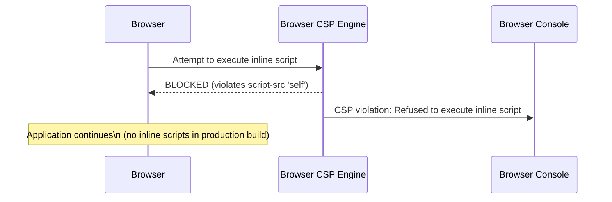
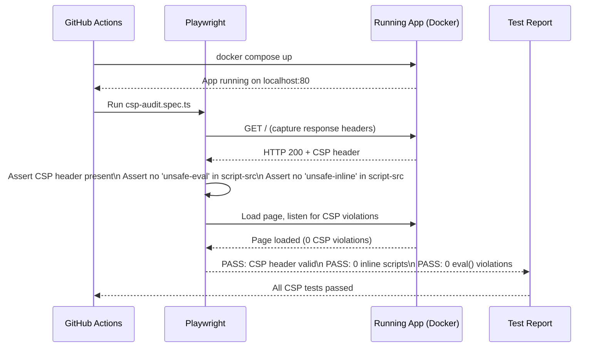

# Low-Level Design: NFR-SEC-002 — Content Security Policy Enforcement

**FR-ID:** NFR-SEC-002  
**Issue:** [#31](https://github.com/sreenivasmrpivot/legobuilder/issues/31)  
**Title:** Enforce Content Security Policy headers; eliminate inline scripts and eval()  
**Status:** Draft — Pending Design Review (Gate 6a)  
**Author:** Spectra Design Agent  
**Date:** 2026-04-12  

---

## 1. Overview

This document specifies the low-level design for enforcing a strict Content Security Policy (CSP) across the LegoBuilder frontend application. The goal is to prevent Cross-Site Scripting (XSS) attacks by:

1. Delivering a `Content-Security-Policy` HTTP response header from the Nginx server.
2. Eliminating all inline `<script>` blocks and `style` attributes from `index.html`.
3. Removing all uses of `eval()`, `new Function()`, and `setTimeout(string)` from application code.
4. Configuring Vite's build pipeline to produce nonce-compatible or hash-based CSP-safe output.
5. Adding automated CSP audit tooling to the CI pipeline.

The application is a **pure frontend SPA** (React + TypeScript + Vite) served by Nginx inside Docker. There is no backend server to inject headers dynamically, so all CSP headers are delivered via Nginx `add_header` directives.

---

## 2. Architecture Context

### 2.1 Current Stack

| Layer | Technology |
|-------|------------|
| Frontend framework | React 18 + TypeScript |
| Build tool | Vite 5 |
| CSS framework | Tailwind CSS |
| HTTP server | Nginx (production) / Vite dev server (development) |
| Container | Docker (multi-stage build) |
| Testing | Vitest (unit), Playwright (e2e) |

### 2.2 Deployment Topology

```
Browser
  │
  ▼
Nginx (Docker container)
  │  ← serves static assets from /usr/share/nginx/html
  │  ← adds CSP + security headers via nginx.conf
  ▼
Vite-built SPA (index.html + hashed JS/CSS bundles)
```

Because Nginx is the sole HTTP server, **all CSP headers are configured in `frontend/nginx.conf`**. The Vite build must produce output that is compatible with the chosen CSP directives.

---

## 3. CSP Policy Design

### 3.1 Policy Directives

The following CSP policy is designed for a Vite-built React SPA with no inline scripts and no eval:

```
Content-Security-Policy:
  default-src 'self';
  script-src 'self';
  style-src 'self' 'unsafe-inline';
  img-src 'self' data: blob:;
  font-src 'self';
  connect-src 'self';
  object-src 'none';
  base-uri 'self';
  form-action 'self';
  frame-ancestors 'none';
  upgrade-insecure-requests;
```

**Directive rationale:**

| Directive | Value | Rationale |
|-----------|-------|-----------|
| `default-src` | `'self'` | Deny all unlisted resource types from external origins |
| `script-src` | `'self'` | Only load scripts from same origin; no inline, no eval |
| `style-src` | `'self' 'unsafe-inline'` | Tailwind CSS injects runtime styles; `unsafe-inline` is required until CSS-in-JS is eliminated or nonces are used |
| `img-src` | `'self' data: blob:` | LEGO brick thumbnails may use data URIs; Three.js uses blob URLs |
| `font-src` | `'self'` | All fonts are bundled locally |
| `connect-src` | `'self'` | API calls are same-origin only |
| `object-src` | `'none'` | Disallow Flash/plugins |
| `base-uri` | `'self'` | Prevent base tag injection |
| `form-action` | `'self'` | Prevent form hijacking |
| `frame-ancestors` | `'none'` | Prevent clickjacking (equivalent to X-Frame-Options: DENY) |
| `upgrade-insecure-requests` | — | Force HTTPS for all sub-resources |

> **Note on `style-src 'unsafe-inline'`:** Tailwind CSS v3 uses a JIT engine that injects styles at runtime in development. In production, Vite extracts all CSS into static `.css` files, so `'unsafe-inline'` for styles is a conservative allowance. A future hardening pass (NFR-SEC-003) can replace this with a nonce or hash once all dynamic style injection is audited.

### 3.2 Inline Script Elimination

Vite's default production build does **not** inject inline scripts. However, the following must be verified and enforced:

| Source | Current State | Required Action |
|--------|--------------|----------------|
| `frontend/index.html` | May contain inline `<script>` tags | Audit and remove; move to external `.js` files |
| React component files | May use `dangerouslySetInnerHTML` | Audit; replace with safe DOM APIs |
| Third-party libraries | May inject inline scripts | Audit via `npm audit` + CSP report-only mode |
| Vite plugins | May inject inline bootstrap code | Configure `vite-plugin-csp` or equivalent |

### 3.3 eval() Elimination

The following patterns are prohibited and must be removed:

```typescript
// PROHIBITED
eval(expression)
new Function(string)
setTimeout(string, delay)   // string form only
setInterval(string, delay)  // string form only
document.write(html)
```

ESLint rule `no-eval` and `no-new-func` must be enabled in `frontend/eslint.config.js`.

---

## 4. Component Architecture

### 4.1 Modules Affected

```
frontend/
├── nginx.conf                    ← ADD: CSP header directives
├── index.html                    ← AUDIT: remove inline scripts/styles
├── vite.config.ts                ← ADD: CSP-compatible build options
├── eslint.config.js              ← ADD: no-eval, no-new-func rules
├── src/
│   ├── main.tsx                  ← AUDIT: no eval/inline script usage
│   ├── App.tsx                   ← AUDIT: no dangerouslySetInnerHTML
│   └── **/*.tsx                  ← AUDIT: all components
└── tests/
    └── e2e/
        └── csp-audit.spec.ts     ← NEW: Playwright CSP header test
```

### 4.2 nginx.conf Changes

The production Nginx configuration must add the following `add_header` directives inside the `server` block:

```nginx
# Content Security Policy
add_header Content-Security-Policy "
  default-src 'self';
  script-src 'self';
  style-src 'self' 'unsafe-inline';
  img-src 'self' data: blob:;
  font-src 'self';
  connect-src 'self';
  object-src 'none';
  base-uri 'self';
  form-action 'self';
  frame-ancestors 'none';
  upgrade-insecure-requests
" always;

# Additional security headers
add_header X-Content-Type-Options "nosniff" always;
add_header X-Frame-Options "DENY" always;
add_header X-XSS-Protection "1; mode=block" always;
add_header Referrer-Policy "strict-origin-when-cross-origin" always;
add_header Permissions-Policy "camera=(), microphone=(), geolocation=()" always;
```

### 4.3 Vite Build Configuration

Vite must be configured to avoid injecting inline scripts. The `vite.config.ts` should ensure:

```typescript
// vite.config.ts additions
export default defineConfig({
  build: {
    // Ensure no inline scripts in output
    // Vite 5 default: scripts are external files, not inline
    rollupOptions: {
      output: {
        // Disable inline dynamic imports that could violate CSP
        inlineDynamicImports: false,
      },
    },
  },
  // CSP-compatible dev server headers (for development parity)
  server: {
    headers: {
      'Content-Security-Policy':
        "default-src 'self'; script-src 'self' 'unsafe-eval'; style-src 'self' 'unsafe-inline'; img-src 'self' data: blob:; font-src 'self'; connect-src 'self' ws:; object-src 'none';",
    },
  },
});
```

> **Note:** The dev server CSP includes `'unsafe-eval'` for Vite's HMR (Hot Module Replacement) which uses `eval()` internally. This is **development-only** and is NOT present in the production Nginx CSP.

### 4.4 ESLint Configuration

Add the following rules to `frontend/eslint.config.js`:

```javascript
// eslint.config.js additions
{
  rules: {
    'no-eval': 'error',
    'no-new-func': 'error',
    'no-implied-eval': 'error',
    // Warn on dangerouslySetInnerHTML usage
    'react/no-danger': 'warn',
  },
}
```

---

## 5. Sequence Diagrams

### 5.1 Browser Request with CSP Header

```mermaid
sequenceDiagram
    participant Browser
    participant Nginx
    participant StaticFiles as Static Files (Vite Build)

    Browser->>Nginx: GET / HTTP/1.1
    Nginx->>StaticFiles: Read index.html
    StaticFiles-->>Nginx: index.html content
    Nginx-->>Browser: HTTP 200 OK\n  Content-Security-Policy: default-src 'self'; ...\n  X-Content-Type-Options: nosniff\n  X-Frame-Options: DENY\n  [body: index.html]

    Browser->>Nginx: GET /assets/index-[hash].js
    Nginx-->>Browser: HTTP 200 OK\n  [body: bundled JS]

    Note over Browser: Browser enforces CSP\n  Blocks any inline scripts\n  Blocks any eval() calls
```

### 5.2 CSP Violation Flow



### 5.3 CI CSP Audit Flow



---

## 6. Test Strategy

### 6.1 Test Cases

| Test ID | Type | Description | Tool | Pass Criteria |
|---------|------|-------------|------|---------------|
| T-SEC-002-01 | E2E | CSP header present and correct | Playwright | `Content-Security-Policy` header exists; contains `default-src 'self'`; does NOT contain `'unsafe-eval'` in `script-src` |
| T-SEC-002-02 | E2E | Zero inline scripts in HTML output | Playwright | `document.querySelectorAll('script:not([src])')` returns 0 elements |
| T-SEC-002-03 | E2E | Zero CSP violations on page load | Playwright | No `securitypolicyviolation` events fired during full page load |
| T-SEC-002-04 | Static | No eval() usage in source code | ESLint | `eslint --rule 'no-eval: error'` exits 0 |
| T-SEC-002-05 | Static | No inline scripts in index.html | HTML audit script | `grep -n '<script>' index.html` returns no matches without `src=` attribute |
| T-SEC-002-06 | E2E | Additional security headers present | Playwright | `X-Content-Type-Options: nosniff`, `X-Frame-Options: DENY` present |

### 6.2 Test File Location

```
frontend/tests/e2e/csp-audit.spec.ts   ← New Playwright test
frontend/tests/unit/csp-utils.test.ts  ← Optional: unit test for CSP utility functions
```

### 6.3 Playwright Test Sketch

```typescript
// frontend/tests/e2e/csp-audit.spec.ts
import { test, expect } from '@playwright/test';

test.describe('NFR-SEC-002: Content Security Policy', () => {
  test('T-SEC-002-01: CSP header is present and does not allow unsafe-eval', async ({ request }) => {
    const response = await request.get('/');
    const csp = response.headers()['content-security-policy'];
    expect(csp).toBeTruthy();
    expect(csp).toContain("default-src 'self'");
    expect(csp).not.toContain("'unsafe-eval'");
    expect(csp).not.toContain("'unsafe-inline'" /* in script-src */);
  });

  test('T-SEC-002-02: No inline scripts in rendered HTML', async ({ page }) => {
    await page.goto('/');
    const inlineScripts = await page.$$eval(
      'script:not([src])',
      (scripts) => scripts.length
    );
    expect(inlineScripts).toBe(0);
  });

  test('T-SEC-002-03: Zero CSP violations on page load', async ({ page }) => {
    const violations: string[] = [];
    page.on('console', (msg) => {
      if (msg.type() === 'error' && msg.text().includes('Content Security Policy')) {
        violations.push(msg.text());
      }
    });
    await page.goto('/');
    await page.waitForLoadState('networkidle');
    expect(violations).toHaveLength(0);
  });

  test('T-SEC-002-06: Additional security headers present', async ({ request }) => {
    const response = await request.get('/');
    const headers = response.headers();
    expect(headers['x-content-type-options']).toBe('nosniff');
    expect(headers['x-frame-options']).toBe('DENY');
  });
});
```

---

## 7. Error Handling Strategy

### 7.1 CSP Violation Handling

| Scenario | Behavior | Resolution |
|----------|----------|------------|
| Inline script blocked by CSP | Browser logs CSP violation to console; script does not execute | Remove inline script; move to external `.js` file |
| eval() blocked by CSP | Browser logs CSP violation; eval call throws | Replace with safe alternative (e.g., `JSON.parse` instead of `eval`) |
| Third-party library uses inline script | CSP blocks library initialization | Audit library; replace with CSP-compatible alternative or use nonce |
| Vite HMR blocked in dev | Dev server CSP allows `'unsafe-eval'` for HMR | Dev-only exception; not present in production |
| CSP header missing from Nginx | Browser applies no CSP restrictions | CI test T-SEC-002-01 catches this; Nginx config must be validated in CI |

### 7.2 Rollback Strategy

If the CSP policy causes unexpected breakage in production:

1. **Immediate:** Switch to `Content-Security-Policy-Report-Only` mode by changing the Nginx header name. This logs violations without blocking.
2. **Short-term:** Identify violating resources from browser console logs.
3. **Resolution:** Fix the violating code or add a specific allowance to the CSP policy.
4. **Re-enable:** Switch back to enforcing mode after all violations are resolved.

---

## 8. Security Considerations

### 8.1 Threat Model

| Threat | Mitigation |
|--------|------------|
| Reflected XSS via injected inline script | `script-src 'self'` blocks all inline scripts |
| DOM-based XSS via eval() | `script-src 'self'` (no `'unsafe-eval'`) blocks eval |
| Stored XSS via user-generated content | `script-src 'self'` + React's default HTML escaping |
| Clickjacking | `frame-ancestors 'none'` + `X-Frame-Options: DENY` |
| MIME-type sniffing attacks | `X-Content-Type-Options: nosniff` |
| Mixed content (HTTP resources on HTTPS page) | `upgrade-insecure-requests` directive |
| Data exfiltration via external connections | `connect-src 'self'` restricts XHR/fetch to same origin |

### 8.2 Known Limitations

1. **`style-src 'unsafe-inline'`:** Tailwind CSS may inject runtime styles. This is a known limitation. A future hardening pass should audit all dynamic style injection and replace with nonce-based or hash-based CSP for styles.
2. **Third-party scripts:** If any third-party analytics or monitoring scripts are added in the future, the CSP `script-src` directive must be updated to include their origins.
3. **Nonce-based CSP:** A nonce-based approach (where each inline script gets a unique nonce per request) is more secure but requires server-side rendering or a dynamic Nginx configuration. This is out of scope for the current static SPA architecture.

### 8.3 OWASP Alignment

- **OWASP A03:2021 – Injection (XSS):** Directly mitigated by CSP `script-src 'self'` and elimination of inline scripts.
- **OWASP A05:2021 – Security Misconfiguration:** Addressed by adding `X-Content-Type-Options`, `X-Frame-Options`, and `Referrer-Policy` headers.

---

## 9. Implementation Checklist

The frontend-coding agent must complete the following:

- [ ] **nginx.conf:** Add `Content-Security-Policy` header with the policy defined in §3.1
- [ ] **nginx.conf:** Add `X-Content-Type-Options`, `X-Frame-Options`, `X-XSS-Protection`, `Referrer-Policy`, `Permissions-Policy` headers
- [ ] **index.html:** Audit and remove all inline `<script>` blocks (move to external files)
- [ ] **index.html:** Audit and remove all inline `style` attributes
- [ ] **vite.config.ts:** Set `inlineDynamicImports: false`; add dev server CSP headers
- [ ] **eslint.config.js:** Add `no-eval`, `no-new-func`, `no-implied-eval`, `react/no-danger` rules
- [ ] **Source code audit:** Search all `.tsx`/`.ts` files for `eval(`, `new Function(`, `dangerouslySetInnerHTML`
- [ ] **tests/e2e/csp-audit.spec.ts:** Implement Playwright tests T-SEC-002-01 through T-SEC-002-06
- [ ] **CI pipeline:** Ensure Playwright e2e tests run against the Docker production build

---

## 10. Acceptance Criteria Mapping

| Acceptance Criterion | Design Element | Test ID |
|---------------------|----------------|--------|
| Zero inline `<script>` tags in HTML output | §3.2 Inline Script Elimination + §4.2 nginx.conf | T-SEC-002-02 |
| No `eval()` usage in application code | §3.3 eval() Elimination + §4.4 ESLint | T-SEC-002-04 |
| `Content-Security-Policy` header present on all responses | §4.2 nginx.conf | T-SEC-002-01 |
| CSP header blocks `'unsafe-eval'` and `'unsafe-inline'` in script-src | §3.1 Policy Directives | T-SEC-002-01 |
| Zero CSP violations on page load | §5.3 CI CSP Audit Flow | T-SEC-002-03 |
| Additional security headers present | §4.2 nginx.conf | T-SEC-002-06 |

---

## 11. Open Questions

| # | Question | Impact | Owner |
|---|----------|--------|-------|
| 1 | Does Tailwind CSS v3 JIT inject any inline styles in the production build? | May allow removing `'unsafe-inline'` from `style-src` | Frontend-coding agent to verify during implementation |
| 2 | Are there any third-party scripts (analytics, monitoring) planned? | Would require updating `script-src` | Product Owner |
| 3 | Should a `report-uri` or `report-to` endpoint be configured for CSP violation reporting? | Requires a backend endpoint or third-party service | Architecture decision needed |
| 4 | Does Three.js (used for 3D brick rendering) use any eval() or inline scripts? | May require CSP adjustments | Frontend-coding agent to verify |

---

*Generated by Spectra Design Agent — NFR-SEC-002 | LegoBuilder | 2026-04-12*
