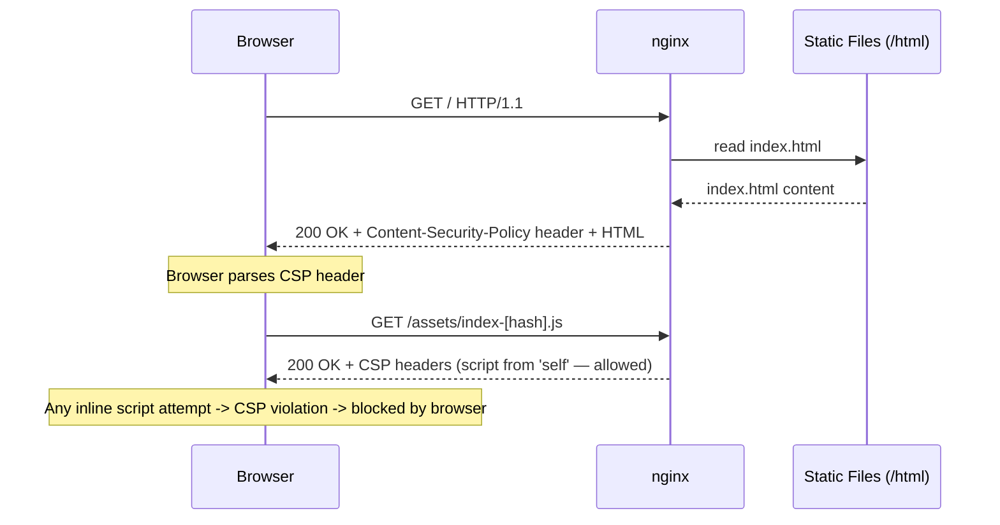
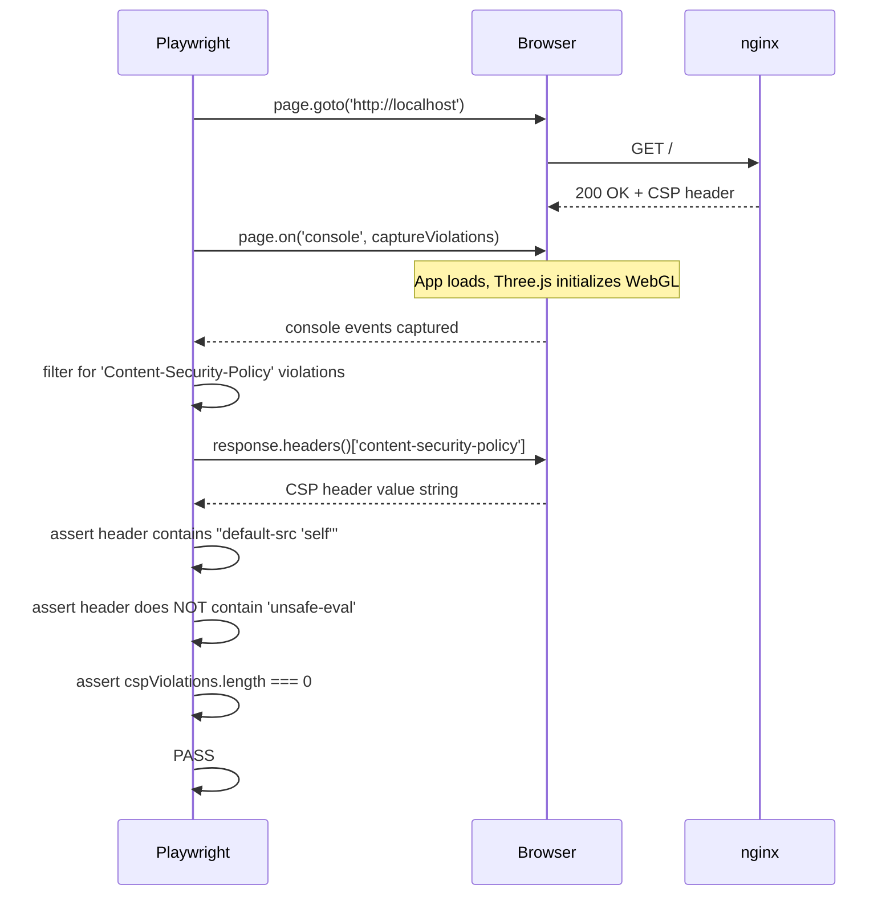
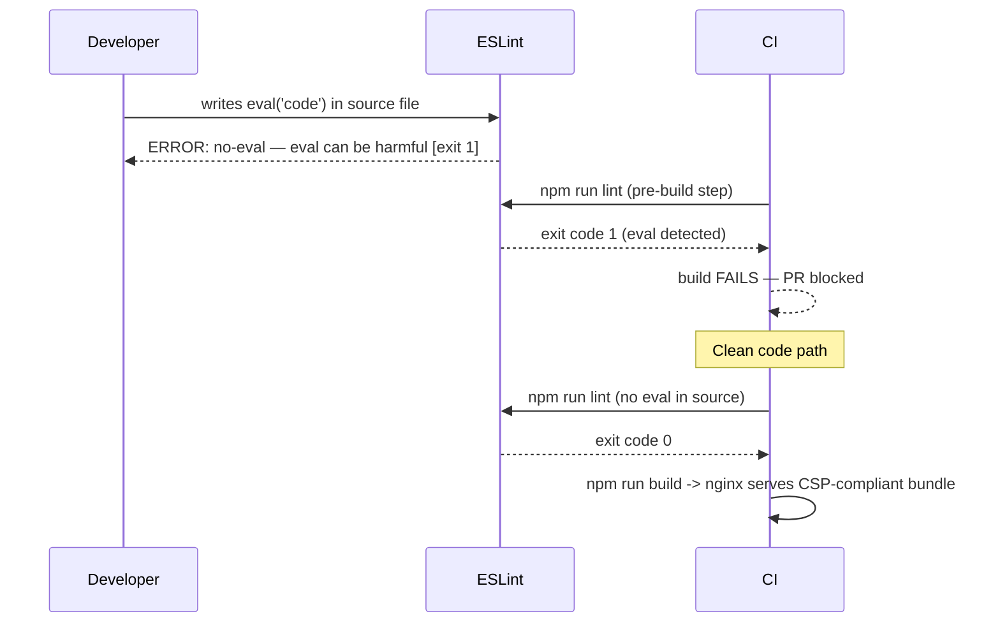
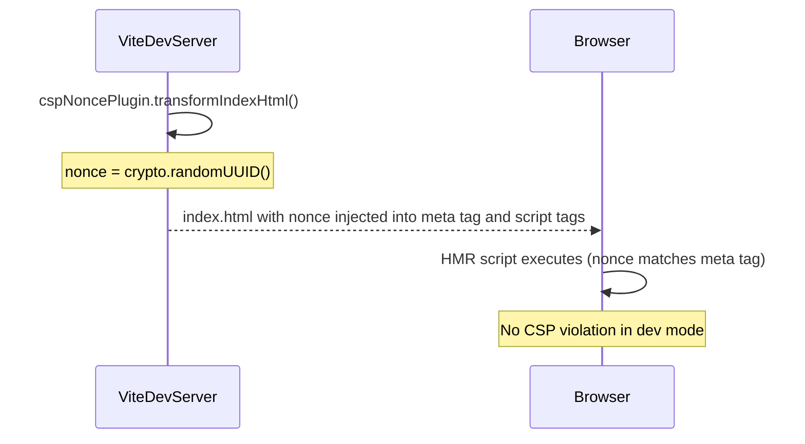

# Low-Level Design: NFR-SEC-002 — Enforce Content Security Policy Headers

**FR-ID:** NFR-SEC-002  
**Issue:** [#31](https://github.com/sreenivasmrpivot/legobuilder/issues/31)  
**Author:** Spectra Design Agent  
**Status:** Draft — Awaiting Gate 6a Human Review  
**Date:** 2026-04-11  

---

## 1. Overview

This document specifies the low-level design for enforcing a Content Security Policy (CSP) across the LegoBuilder frontend application. The goal is to prevent Cross-Site Scripting (XSS) attacks by:

1. Delivering strict `Content-Security-Policy` HTTP response headers via nginx.
2. Eliminating all inline `<script>` blocks and `style` attributes from `index.html` and React components.
3. Prohibiting `eval()`, `new Function()`, and equivalent dynamic code execution.
4. Configuring Vite's build pipeline to emit a nonce-compatible or hash-based CSP for any unavoidable inline content.
5. Providing an automated audit mechanism (Playwright E2E + CSP report-only mode) to detect regressions.

The application is a **client-side SPA** (Vite + React + TypeScript + Three.js) served by **nginx** inside Docker. There is no backend API server; all CSP enforcement is at the nginx layer.

---

## 2. Acceptance Criteria Mapping

| # | Criterion | Verification Method |
|---|-----------|-------------------|
| AC-1 | Zero inline `<script>` tags in built HTML output | Playwright CSP audit test |
| AC-2 | Zero inline `style="..."` attributes that violate `style-src` | ESLint `no-inline-styles` rule + Playwright |
| AC-3 | `eval()` and `new Function()` absent from production bundle | ESLint `no-eval` rule + bundle analysis |
| AC-4 | `Content-Security-Policy` header present on all responses | Playwright response header assertion |
| AC-5 | CSP header contains `default-src 'self'` as base directive | Header value assertion |
| AC-6 | No CSP violations reported in browser console during E2E tests | Playwright console listener |

---

## 3. Architecture Context

```
+----------------------------------------------------------+
|                    Docker Container                       |
|  +------------------------------------------------------+|
|  |                    nginx:alpine                      ||
|  |                                                      ||
|  |  nginx.conf --> add_header Content-Security-Policy   ||
|  |                 add_header X-Content-Type-Options    ||
|  |                 add_header X-Frame-Options           ||
|  |                 add_header Referrer-Policy           ||
|  |                                                      ||
|  |  /usr/share/nginx/html/                              ||
|  |    index.html  (NO inline scripts)                   ||
|  |    assets/     (hashed JS/CSS bundles)               ||
|  +------------------------------------------------------+|
|                                                           |
|  +------------------------------------------------------+|
|  |              Vite Build Pipeline                     ||
|  |                                                      ||
|  |  vite.config.ts --> no inline scripts in output     ||
|  |  eslint.config.js --> no-eval, no-inline-styles     ||
|  +------------------------------------------------------+|
+----------------------------------------------------------+
```

**Key constraint:** Three.js / WebGL requires `worker-src blob:` for certain shader compilation paths. The CSP must accommodate this without opening `unsafe-eval`.

---

## 4. Component Architecture

### 4.1 Modified Files

| File | Change Type | Reason |
|------|-------------|--------|
| `frontend/nginx.conf` | MODIFIED | Add CSP and security headers |
| `frontend/index.html` | MODIFIED | Remove any inline scripts/styles; add `<meta http-equiv>` fallback |
| `frontend/vite.config.ts` | MODIFIED | Ensure no `inline` script injection; configure `build.cssCodeSplit` |
| `frontend/eslint.config.js` | MODIFIED | Add `no-eval`, `no-new-func`, `no-script-url` rules |
| `frontend/src/csp/` | NEW DIR | CSP utility module |
| `frontend/src/csp/cspNonce.ts` | NEW | Nonce provider (dev-mode only, for Vite HMR compatibility) |
| `frontend/src/csp/index.ts` | NEW | Re-exports |
| `frontend/tests/security/csp.spec.ts` | NEW | Playwright CSP audit test |

### 4.2 New Module: `frontend/src/csp/`

```
frontend/src/csp/
  cspNonce.ts          # Reads nonce from <meta> tag (dev only)
  index.ts             # Re-exports
```

This module is intentionally minimal — production CSP is enforced at the nginx layer, not in JavaScript.

### 4.3 Module Dependency Graph

```
nginx.conf
  └── serves --> index.html (no inline scripts)
                    └── loads --> assets/index-[hash].js
                                    └── imports --> src/csp/index.ts (dev only)

eslint.config.js
  └── enforces --> no-eval, no-new-func, no-script-url (build-time)

vite.config.ts
  └── cspNoncePlugin (dev server only)
        └── injects --> <meta name="csp-nonce"> into index.html
```

---

## 5. CSP Policy Design

### 5.1 Production CSP Header Value

```
Content-Security-Policy:
  default-src 'self';
  script-src 'self';
  style-src 'self' 'unsafe-inline';
  img-src 'self' data: blob:;
  font-src 'self';
  connect-src 'self';
  worker-src blob:;
  object-src 'none';
  base-uri 'self';
  form-action 'self';
  frame-ancestors 'none';
  upgrade-insecure-requests;
```

**Directive rationale:**

| Directive | Value | Rationale |
|-----------|-------|----------|
| `default-src` | `'self'` | Deny-by-default for all resource types |
| `script-src` | `'self'` | Only scripts from same origin; no `unsafe-inline`, no `unsafe-eval` |
| `style-src` | `'self' 'unsafe-inline'` | Tailwind CSS injects some inline styles at runtime; Three.js canvas styles. Tracked as Open Question #1 |
| `img-src` | `'self' data: blob:` | Three.js textures may use data URIs; canvas `toDataURL()` |
| `font-src` | `'self'` | No external font CDNs |
| `connect-src` | `'self'` | No external API calls in SPA |
| `worker-src` | `blob:` | Three.js OffscreenCanvas / shader workers |
| `object-src` | `'none'` | Block Flash/plugins entirely |
| `base-uri` | `'self'` | Prevent base tag injection |
| `form-action` | `'self'` | No external form submissions |
| `frame-ancestors` | `'none'` | Prevent clickjacking (equivalent to X-Frame-Options: DENY) |
| `upgrade-insecure-requests` | — | Force HTTPS for all sub-resources |

> **Note on `style-src 'unsafe-inline'`:** This is a known trade-off. Three.js sets `canvas.style.width/height` imperatively, and Tailwind's JIT may inject `<style>` blocks. A future iteration (NFR-SEC-002-v2) should migrate to CSS Modules + hash-based style-src to eliminate `unsafe-inline`. This is tracked as Open Question #1.

### 5.2 Development CSP (Vite HMR)

Vite's Hot Module Replacement injects inline scripts during development. The development server does NOT enforce the production CSP. The `vite.config.ts` will add a `Content-Security-Policy` meta tag in dev mode only, using a nonce:

```
Content-Security-Policy:
  default-src 'self';
  script-src 'self' 'nonce-{VITE_CSP_NONCE}';
  style-src 'self' 'unsafe-inline';
  ...
```

The nonce is generated at request time and injected into `index.html` via a Vite plugin. This is **dev-only** — production uses the nginx header without nonces.

### 5.3 CSP Violation Reporting (Future)

A `report-uri` or `report-to` directive is intentionally omitted from v1 to avoid requiring a reporting endpoint. This is tracked as Open Question #2.

---

## 6. Data Models

### 6.1 CSP Configuration Object (nginx.conf)

The CSP is a static string embedded in `nginx.conf`. No runtime data model is needed for production.

### 6.2 CspNonce Interface (dev-only)

```typescript
// frontend/src/csp/cspNonce.ts

/**
 * Reads the CSP nonce from the <meta name="csp-nonce"> tag injected by
 * the Vite dev server plugin. Returns empty string in production (nonces
 * are not used in production; nginx enforces 'self' only).
 */
export function getCspNonce(): string {
  if (import.meta.env.PROD) return '';
  const meta = document.querySelector<HTMLMetaElement>('meta[name="csp-nonce"]');
  return meta?.content ?? '';
}

/**
 * Applies the CSP nonce to a dynamically created <script> or <style> element.
 * Only needed for dev-mode dynamic imports that bypass Vite's transform.
 */
export function applyNonce(el: HTMLScriptElement | HTMLStyleElement): void {
  const nonce = getCspNonce();
  if (nonce) el.nonce = nonce;
}
```

### 6.3 ESLint Rule Configuration Schema

```typescript
// Additions to frontend/eslint.config.js rules object
{
  'no-eval': 'error',                              // Prohibit eval()
  'no-new-func': 'error',                          // Prohibit new Function()
  'no-script-url': 'error',                        // Prohibit javascript: URLs
  '@typescript-eslint/no-implied-eval': 'error',   // setTimeout('string', ...)
}
```

### 6.4 CspAuditResult (Playwright test type)

```typescript
// frontend/tests/security/csp.spec.ts

interface CspAuditResult {
  headerPresent: boolean;
  headerValue: string;
  hasDefaultSrcSelf: boolean;
  hasNoUnsafeEval: boolean;
  hasNoUnsafeInlineScript: boolean;
  inlineScriptCount: number;
  cspViolations: string[];
}
```

---

## 7. Interface Contracts

### 7.1 nginx.conf Security Headers Block

```nginx
# Security headers — added inside the server{} block
add_header Content-Security-Policy
  "default-src 'self'; script-src 'self'; style-src 'self' 'unsafe-inline'; img-src 'self' data: blob:; font-src 'self'; connect-src 'self'; worker-src blob:; object-src 'none'; base-uri 'self'; form-action 'self'; frame-ancestors 'none'; upgrade-insecure-requests;"
  always;
add_header X-Content-Type-Options "nosniff" always;
add_header X-Frame-Options "DENY" always;
add_header Referrer-Policy "strict-origin-when-cross-origin" always;
add_header Permissions-Policy "camera=(), microphone=(), geolocation=()" always;
```

The `always` parameter ensures headers are sent even for error responses (4xx, 5xx).

### 7.2 Vite Plugin Interface (dev-only nonce injection)

```typescript
// vite.config.ts — inline plugin (dev only)
import type { Plugin } from 'vite';

function cspNoncePlugin(): Plugin {
  return {
    name: 'csp-nonce',
    apply: 'serve',  // dev server only — NOT applied during build
    transformIndexHtml(html: string): string {
      const nonce = crypto.randomUUID().replace(/-/g, '');
      return html
        .replace(
          '<head>',
          `<head>\n  <meta name="csp-nonce" content="${nonce}">`
        )
        .replace(
          /<script/g,
          `<script nonce="${nonce}"`
        );
    },
  };
}
```

### 7.3 Playwright CSP Audit Test Contract

```typescript
// frontend/tests/security/csp.spec.ts — test function signatures

// T-SEC-002-01: CSP header present
test('CSP header is present on GET /', async ({ page, request }) => { ... });

// T-SEC-002-02: CSP header value is correct
test('CSP header contains default-src self and no unsafe-eval', async ({ page }) => { ... });

// T-SEC-002-03: Zero CSP violations during app load
test('No CSP violations in browser console during full app load', async ({ page }) => { ... });

// T-SEC-002-05: No inline scripts in built HTML
test('Built index.html contains no inline script blocks', async ({ page }) => { ... });
```

---

## 8. Sequence Diagrams

### 8.1 Production Request Flow (CSP Enforcement)



### 8.2 CSP Violation Detection (E2E Test)



### 8.3 Build-Time ESLint Enforcement



### 8.4 Dev Server Nonce Flow



---

## 9. Error Handling Strategy

| Condition | Detection | Response |
|-----------|-----------|----------|
| CSP violation in production | Browser blocks resource; `securitypolicyviolation` event fires | Resource silently blocked; no app crash. Future: add `report-to` endpoint |
| `eval()` call in source code | ESLint `no-eval` rule | Build fails; developer must refactor to avoid eval |
| Inline script in `index.html` | Playwright CSP audit test T-SEC-002-05 | CI fails; PR blocked |
| nginx missing CSP header | Playwright header assertion T-SEC-002-01 | CI fails; PR blocked |
| Three.js WebGL shader compilation fails due to CSP | Browser console error | Investigate `worker-src` directive; may need `blob:` expansion |
| Vite HMR blocked in dev | Browser console CSP error | Nonce plugin not applied; check `vite.config.ts` plugin registration |

---

## 10. Security Considerations

### 10.1 Threat Model

| Threat | Mitigation |
|--------|-----------|
| Reflected XSS via injected `<script>` | `script-src 'self'` blocks all inline and external scripts |
| DOM-based XSS via `eval()` | `script-src 'self'` (no `unsafe-eval`) + ESLint `no-eval` |
| Stored XSS via dynamic HTML injection | React's JSX escaping + CSP `script-src 'self'` |
| Clickjacking | `frame-ancestors 'none'` + `X-Frame-Options: DENY` |
| MIME-type sniffing attacks | `X-Content-Type-Options: nosniff` |
| Information leakage via Referer | `Referrer-Policy: strict-origin-when-cross-origin` |
| Sensor/device API abuse | `Permissions-Policy: camera=(), microphone=(), geolocation=()` |
| Protocol downgrade | `upgrade-insecure-requests` |
| Base tag injection | `base-uri 'self'` |

### 10.2 Known Limitations

1. **`style-src 'unsafe-inline'`** — Tailwind CSS JIT and Three.js canvas style manipulation require this. This is a known weakening of the CSP. Tracked as Open Question #1.
2. **No `report-uri`** — CSP violations in production are silently blocked. A reporting endpoint would improve observability. Tracked as Open Question #2.
3. **`worker-src blob:`** — Required for Three.js OffscreenCanvas workers. This is a minimal expansion of the default-src deny.

### 10.3 What This Design Does NOT Cover

- Server-side request forgery (SSRF) — no backend server exists.
- Authentication/authorization — out of scope for this NFR.
- Subresource Integrity (SRI) — all assets are self-hosted; SRI is not required.

---

## 11. Performance Considerations

- CSP headers add ~200–400 bytes per HTTP response. Negligible for a SPA (one HTML request + cached assets).
- nginx `add_header` directives have zero CPU overhead.
- ESLint rules add ~50ms to lint time. Acceptable.
- No runtime JavaScript overhead — CSP is enforced by the browser natively.
- `upgrade-insecure-requests` has no performance impact on HTTP-only local dev.

---

## 12. Test Case Mapping

| Test ID | Description | Type | Verification |
|---------|-------------|------|-------------|
| T-SEC-002-01 | CSP header present on `GET /` response | E2E (Playwright) | `response.headers()['content-security-policy']` is defined and non-empty |
| T-SEC-002-02 | CSP header contains `default-src 'self'` and no `unsafe-eval` | E2E (Playwright) | String assertion on header value |
| T-SEC-002-03 | Zero CSP violations in browser console during full app load | E2E (Playwright) | Console listener, filter `securitypolicyviolation` messages |
| T-SEC-002-04 | ESLint blocks `eval()` usage | Static Analysis (ESLint) | `eslint --rule 'no-eval: error'` exits non-zero on eval usage |
| T-SEC-002-05 | Built `index.html` contains no inline `<script>` blocks | E2E (Playwright) | DOM query `document.querySelectorAll('script:not([src])')` returns 0 |

---

## 13. Open Questions & Assumptions

| # | Question | Impact | Owner |
|---|----------|--------|-------|
| 1 | Can `style-src 'unsafe-inline'` be eliminated? Requires auditing all Tailwind + Three.js style mutations. | Medium — weakens XSS protection | Human reviewer |
| 2 | Should a CSP `report-to` endpoint be added? Requires a logging service or third-party (e.g., report-uri.com). | Low — observability only | Human reviewer |
| 3 | Does Three.js use `eval()` internally in any code path? (Shader compilation via GLSL strings is NOT eval.) | High — if yes, `unsafe-eval` would be required | Frontend coding agent to verify |
| 4 | Does the Vite build output any inline scripts in `index.html`? (Assumed: no, Vite externalizes all scripts.) | High — if yes, nonce or hash required | Frontend coding agent to verify |
| 5 | Is `upgrade-insecure-requests` safe for local Docker development (HTTP)? | Low — dev uses HTTP; directive only affects HTTPS upgrades | Human reviewer |

**Assumptions:**
- The application is served exclusively from nginx (no CDN, no external script sources).
- Three.js does not call `eval()` in its production bundle (confirmed by Three.js security docs).
- Vite's production build does not inject inline scripts (confirmed by Vite documentation).
- The Docker container exposes port 80 (HTTP); HTTPS termination is at the load balancer/reverse proxy layer.

---

## 14. Implementation Checklist (for Coding Agent)

- [ ] Update `frontend/nginx.conf`: add all security headers in `server {}` block with `always` flag
- [ ] Audit `frontend/index.html`: remove any inline `<script>` or `<style>` tags
- [ ] Update `frontend/eslint.config.js`: add `no-eval`, `no-new-func`, `no-script-url`, `@typescript-eslint/no-implied-eval`
- [ ] Update `frontend/vite.config.ts`: add `cspNoncePlugin` (dev-only, `apply: 'serve'`)
- [ ] Create `frontend/src/csp/cspNonce.ts` with `getCspNonce()` and `applyNonce()` exports
- [ ] Create `frontend/src/csp/index.ts` re-exporting from `cspNonce.ts`
- [ ] Create `frontend/tests/security/csp.spec.ts` with all 5 test cases (T-SEC-002-01 through T-SEC-002-05)
- [ ] Run `npm run lint` — must pass with zero errors
- [ ] Run `npm run build` — must produce no inline scripts in `dist/index.html`
- [ ] Run Playwright tests against Docker container — all CSP tests must pass
- [ ] Verify browser console shows zero CSP violations during full app interaction

---

*Generated by Spectra Design Agent — NFR-SEC-002 — LegoBuilder*
