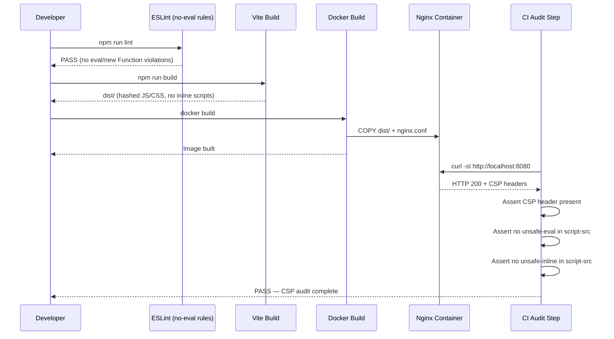
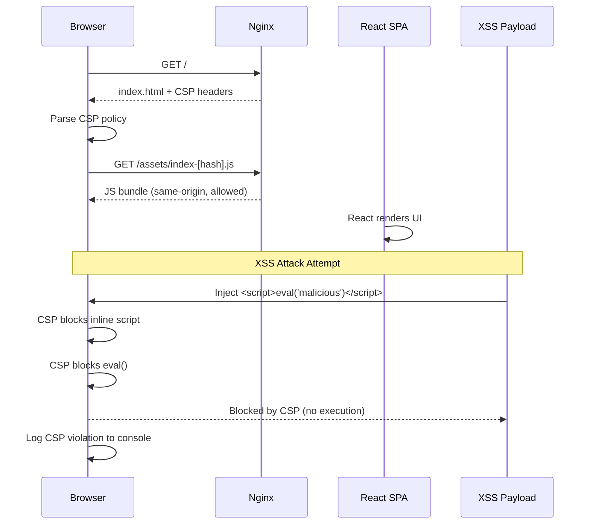
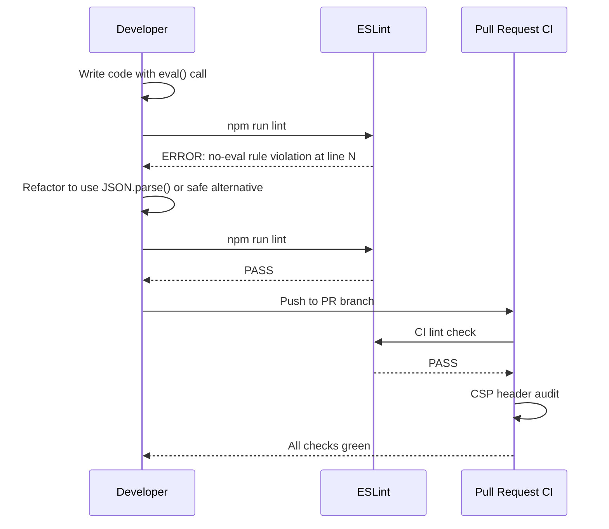

# Low-Level Design: NFR-SEC-002 — Content Security Policy Enforcement

**FR-ID:** NFR-SEC-002  
**Issue:** [#31](https://github.com/sreenivasmrpivot/legobuilder/issues/31)  
**Title:** Enforce Content Security Policy headers; eliminate inline scripts and eval()  
**Author:** Design Agent (Spectra Framework)  
**Status:** Draft — Awaiting Gate 6a Human Review  
**Date:** 2026-04-11  

---

## 1. Overview

This document provides the Low-Level Design for enforcing a strict Content Security Policy (CSP) across the LegoBuilder frontend SPA. LegoBuilder is a pure client-side React + Vite + TypeScript application served via Nginx. There is no backend API server; all HTTP response headers must be injected at the Nginx layer.

The NFR mandates:
- CSP headers SHALL prevent XSS attacks.
- Zero inline `<script>` tags in the built HTML output.
- Zero `eval()` or equivalent dynamic code execution (`new Function()`, `setTimeout(string)`, etc.).
- Validated via CSP header audit and automated scan in CI.

---

## 2. Architecture Context

```
┌─────────────────────────────────────────────────────────────────┐
│                     LegoBuilder SPA Stack                       │
│                                                                 │
│  Browser ──► Nginx (Docker) ──► /usr/share/nginx/html/         │
│                │                  index.html                    │
│                │                  assets/index-[hash].js        │
│                │                  assets/index-[hash].css       │
│                │                                                │
│                └── HTTP Response Headers (nginx.conf)           │
│                     Content-Security-Policy: ...                │
│                     X-Content-Type-Options: nosniff             │
│                     X-Frame-Options: DENY                       │
│                     Referrer-Policy: strict-origin-when-...     │
└─────────────────────────────────────────────────────────────────┘

 Build Pipeline:
  Source (TSX/TS) ──► Vite Build ──► Hashed JS/CSS bundles
                                      (no inline scripts)
                                      (no eval())
```

**Key architectural facts:**
- Vite produces fully hashed, external JS/CSS bundles — no inline scripts by default.
- The `index.html` entry point contains only a `<script type="module" src="...">` tag (external, not inline).
- Nginx serves the static build output and injects all security headers.
- No server-side rendering; no dynamic HTML generation.

---

## 3. CSP Policy Design

### 3.1 Directive Specification

| Directive | Value | Rationale |
|-----------|-------|----------|
| `default-src` | `'self'` | Deny all unlisted resource types from external origins |
| `script-src` | `'self'` | Allow only same-origin scripts; no `'unsafe-inline'`, no `'unsafe-eval'` |
| `style-src` | `'self' 'unsafe-inline'` | Tailwind CSS injects runtime styles; inline styles required (see §3.2) |
| `img-src` | `'self' data: blob:` | Allow same-origin images, data URIs (canvas exports), and blob URLs |
| `font-src` | `'self'` | Fonts served from same origin only |
| `connect-src` | `'self'` | XHR/fetch restricted to same origin (no external APIs) |
| `media-src` | `'none'` | No audio/video content |
| `object-src` | `'none'` | Block Flash/plugins entirely |
| `frame-src` | `'none'` | No iframes |
| `frame-ancestors` | `'none'` | Prevent clickjacking (supersedes X-Frame-Options) |
| `base-uri` | `'self'` | Prevent base tag injection |
| `form-action` | `'self'` | Restrict form submissions to same origin |
| `upgrade-insecure-requests` | (present) | Force HTTPS for all sub-resources |

**Full CSP header value:**
```
Content-Security-Policy:
  default-src 'self';
  script-src 'self';
  style-src 'self' 'unsafe-inline';
  img-src 'self' data: blob:;
  font-src 'self';
  connect-src 'self';
  media-src 'none';
  object-src 'none';
  frame-src 'none';
  frame-ancestors 'none';
  base-uri 'self';
  form-action 'self';
  upgrade-insecure-requests;
```

### 3.2 Inline Style Rationale

Tailwind CSS v3 uses a JIT (Just-In-Time) compiler that generates utility classes at build time into a single CSS bundle. However, some React component libraries and Tailwind's own `@apply` directives may inject `style` attributes at runtime. The `'unsafe-inline'` for `style-src` is a deliberate, scoped exception:

- **Scope:** `style-src` only — scripts remain fully locked down.
- **Risk:** Inline styles cannot execute JavaScript; CSS injection risk is low.
- **Alternative considered:** `style-src 'nonce-{nonce}'` — rejected because Nginx serves static files and cannot generate per-request nonces without a dynamic server.
- **Future path:** If a Node.js SSR layer is added, migrate to nonce-based style CSP.

### 3.3 Hash-Based Script Integrity (Optional Enhancement)

For any future inline scripts that cannot be eliminated (e.g., analytics snippets), the design supports hash-based allowlisting:
```
script-src 'self' 'sha256-<base64-hash-of-script-content>';
```
This is documented as a future extension; no inline scripts exist in the current codebase.

---

## 4. Component Architecture

### 4.1 Modules Affected

| Module | File | Change Type | Description |
|--------|------|-------------|-------------|
| Nginx config | `frontend/nginx.conf` | Modify | Add CSP and security headers to `add_header` directives |
| HTML entry | `frontend/index.html` | Audit/Verify | Confirm zero inline scripts; add `<meta http-equiv>` fallback |
| Vite config | `frontend/vite.config.ts` | Audit/Verify | Confirm no `eval()` in plugins; no inline script injection |
| ESLint config | `frontend/eslint.config.js` | Modify | Add `no-eval` and `no-new-func` rules |
| CI workflow | `.github/workflows/` | Add | CSP header audit step using `curl` + `grep` |
| Playwright E2E | `frontend/tests/` | Add | CSP violation detection test |

### 4.2 Nginx Configuration Design

**File:** `frontend/nginx.conf`

```nginx
server {
    listen 80;
    server_name _;
    root /usr/share/nginx/html;
    index index.html;

    # Security Headers
    add_header Content-Security-Policy "
        default-src 'self';
        script-src 'self';
        style-src 'self' 'unsafe-inline';
        img-src 'self' data: blob:;
        font-src 'self';
        connect-src 'self';
        media-src 'none';
        object-src 'none';
        frame-src 'none';
        frame-ancestors 'none';
        base-uri 'self';
        form-action 'self';
        upgrade-insecure-requests;
    " always;

    add_header X-Content-Type-Options "nosniff" always;
    add_header X-Frame-Options "DENY" always;
    add_header Referrer-Policy "strict-origin-when-cross-origin" always;
    add_header Permissions-Policy "camera=(), microphone=(), geolocation=()" always;

    # SPA routing — serve index.html for all routes
    location / {
        try_files $uri $uri/ /index.html;
    }

    # Cache static assets
    location /assets/ {
        expires 1y;
        add_header Cache-Control "public, immutable";
    }
}
```

### 4.3 ESLint Rule Additions

**File:** `frontend/eslint.config.js`

Add the following rules to the existing ESLint flat config:
```javascript
// Prohibit eval() and equivalent dynamic code execution
{
  rules: {
    'no-eval': 'error',
    'no-new-func': 'error',
    'no-implied-eval': 'error',
  }
}
```

These rules enforce at the source level that no `eval()`, `new Function()`, or `setTimeout(string)` patterns are introduced.

### 4.4 HTML Entry Point Audit

**File:** `frontend/index.html`

The Vite-generated `index.html` must contain:
- ✅ `<script type="module" src="/assets/index-[hash].js">` — external, not inline
- ❌ No `<script>` tags with inline content
- ❌ No `onclick`, `onload`, or other inline event handlers
- ❌ No `javascript:` URIs

A `<meta http-equiv="Content-Security-Policy">` tag is NOT added to `index.html` because:
1. Nginx headers take precedence and are more reliable.
2. Meta CSP does not support `frame-ancestors`.
3. Duplicate CSP declarations can cause confusion.

### 4.5 CI Audit Step Design

**File:** `.github/workflows/ci.yml` (new step added to existing workflow)

```yaml
- name: CSP Header Audit
  run: |
    # Start the built container
    docker run -d --name legobuilder-csp-test -p 8080:80 legobuilder:test
    sleep 2

    # Verify CSP header is present
    CSP=$(curl -sI http://localhost:8080 | grep -i 'content-security-policy')
    if [ -z "$CSP" ]; then
      echo "FAIL: Content-Security-Policy header missing"
      exit 1
    fi
    echo "PASS: CSP header found: $CSP"

    # Verify no unsafe-eval in script-src
    if echo "$CSP" | grep -q "unsafe-eval"; then
      echo "FAIL: unsafe-eval found in CSP"
      exit 1
    fi
    echo "PASS: No unsafe-eval in CSP"

    # Verify no unsafe-inline in script-src
    SCRIPT_SRC=$(echo "$CSP" | grep -oP "script-src[^;]+")
    if echo "$SCRIPT_SRC" | grep -q "unsafe-inline"; then
      echo "FAIL: unsafe-inline found in script-src"
      exit 1
    fi
    echo "PASS: No unsafe-inline in script-src"

    docker stop legobuilder-csp-test
    docker rm legobuilder-csp-test
```

---

## 5. Data Models

This NFR does not introduce new data entities. The relevant configuration data structures are:

### 5.1 CSP Directive Model

```typescript
// Conceptual type for CSP validation in tests
interface CSPDirectives {
  'default-src': string[];
  'script-src': string[];
  'style-src': string[];
  'img-src': string[];
  'font-src': string[];
  'connect-src': string[];
  'media-src': string[];
  'object-src': string[];
  'frame-src': string[];
  'frame-ancestors': string[];
  'base-uri': string[];
  'form-action': string[];
  'upgrade-insecure-requests'?: boolean;
}

// Expected policy for test assertions
const EXPECTED_CSP: Partial<CSPDirectives> = {
  'script-src': ["'self'"],          // No 'unsafe-inline', no 'unsafe-eval'
  'object-src': ["'none'"],
  'frame-ancestors': ["'none'"],
  'base-uri': ["'self'"],
};
```

### 5.2 Nginx Header Configuration Schema

```yaml
# Conceptual schema for nginx security headers
security_headers:
  Content-Security-Policy:
    directives:
      default-src: "'self'"
      script-src: "'self'"
      style-src: "'self' 'unsafe-inline'"
      img-src: "'self' data: blob:"
      font-src: "'self'"
      connect-src: "'self'"
      media-src: "'none'"
      object-src: "'none'"
      frame-src: "'none'"
      frame-ancestors: "'none'"
      base-uri: "'self'"
      form-action: "'self'"
      upgrade-insecure-requests: true
  X-Content-Type-Options: nosniff
  X-Frame-Options: DENY
  Referrer-Policy: strict-origin-when-cross-origin
  Permissions-Policy: "camera=(), microphone=(), geolocation=()"
```

---

## 6. Sequence Diagrams

### 6.1 Build-Time CSP Compliance Flow



### 6.2 Runtime CSP Enforcement Flow



### 6.3 Developer Remediation Flow (ESLint Violation)



---

## 7. Error Handling Strategy

### 7.1 CSP Violation Handling

| Scenario | Behavior | Recovery |
|----------|----------|----------|
| Inline script in built HTML | Browser blocks execution; CSP violation logged to console | Fix: Remove inline script; use external module |
| `eval()` call at runtime | Browser blocks; CSP violation logged | Fix: Refactor to safe alternative (JSON.parse, Function constructor avoided) |
| External script from CDN | Browser blocks (not in `script-src 'self'`) | Fix: Self-host the dependency or add to `script-src` with justification |
| Inline style blocked | Not blocked (`style-src 'unsafe-inline'` permitted) | N/A |
| External image blocked | Blocked if not `data:` or `blob:` | Fix: Proxy image through same origin or add specific host to `img-src` |

### 7.2 CI Audit Failure Handling

| Failure Mode | CI Behavior | Resolution |
|-------------|-------------|------------|
| CSP header missing from Nginx response | CI step exits with code 1; PR blocked | Fix `nginx.conf` `add_header` directive |
| `unsafe-eval` detected in CSP | CI step exits with code 1; PR blocked | Remove `'unsafe-eval'` from CSP; fix source code |
| `unsafe-inline` in `script-src` | CI step exits with code 1; PR blocked | Remove `'unsafe-inline'` from `script-src` |
| Docker container fails to start | CI step exits with code 1 | Fix Docker build; check port conflicts |

### 7.3 ESLint Violation Handling

| Violation | ESLint Rule | Severity | Resolution |
|-----------|-------------|----------|------------|
| `eval(expression)` | `no-eval` | error | Replace with `JSON.parse()`, `Function.prototype.call()`, or restructure logic |
| `new Function(string)` | `no-new-func` | error | Replace with named function or module import |
| `setTimeout(string, ms)` | `no-implied-eval` | error | Replace with `setTimeout(() => fn(), ms)` |
| `setInterval(string, ms)` | `no-implied-eval` | error | Replace with `setInterval(() => fn(), ms)` |

---

## 8. Security Considerations

### 8.1 Threat Model

| Threat | Attack Vector | CSP Mitigation |
|--------|--------------|----------------|
| Reflected XSS | Attacker injects `<script>` via URL parameter | `script-src 'self'` blocks inline script execution |
| Stored XSS | Malicious script stored in user data rendered in DOM | `script-src 'self'` blocks inline; `eval()` blocked |
| DOM-based XSS | `eval()` or `innerHTML` with attacker-controlled data | `script-src` blocks `eval()`; ESLint prevents `eval()` at source |
| Clickjacking | Embedding app in malicious iframe | `frame-ancestors 'none'` prevents framing |
| Data exfiltration | Malicious script POSTs data to external server | `connect-src 'self'` restricts outbound connections |
| MIME sniffing | Browser executes non-script as script | `X-Content-Type-Options: nosniff` prevents MIME confusion |
| Protocol downgrade | HTTP resource loaded in HTTPS page | `upgrade-insecure-requests` forces HTTPS |

### 8.2 CSP Bypass Risks and Mitigations

| Risk | Likelihood | Mitigation |
|------|-----------|------------|
| `'unsafe-inline'` in `style-src` enables CSS injection | Low | CSS injection cannot execute JS; monitor for CSS-based data exfiltration |
| Third-party Vite plugins injecting eval() | Low | Audit `vite.config.ts` plugins; pin plugin versions |
| React's `dangerouslySetInnerHTML` | Medium | Code review gate; ESLint plugin `eslint-plugin-react` warns on usage |
| Prototype pollution enabling eval bypass | Low | TypeScript strict mode + ESLint reduce risk |

### 8.3 Complementary Security Headers

The following headers are added alongside CSP for defense-in-depth:

| Header | Value | Purpose |
|--------|-------|--------|
| `X-Content-Type-Options` | `nosniff` | Prevent MIME-type sniffing |
| `X-Frame-Options` | `DENY` | Legacy clickjacking protection (redundant with `frame-ancestors`) |
| `Referrer-Policy` | `strict-origin-when-cross-origin` | Limit referrer information leakage |
| `Permissions-Policy` | `camera=(), microphone=(), geolocation=()` | Disable sensitive browser APIs |

---

## 9. Performance Considerations

| Concern | Impact | Assessment |
|---------|--------|------------|
| CSP header size | ~400 bytes per response | Negligible; HTTP/2 header compression mitigates |
| Nginx `add_header` processing | Microseconds per request | No measurable impact |
| ESLint additional rules | +~50ms lint time | Negligible |
| CI audit step (Docker start + curl) | +~15s CI time | Acceptable; runs in parallel with other checks |
| Browser CSP parsing | ~1ms per page load | Negligible |

---

## 10. Test Case Mapping

| Test ID | Description | Type | Verification Method |
|---------|-------------|------|---------------------|
| T-FE-SEC-002-01 | CSP header present in Nginx HTTP response | Integration | `curl -sI` + grep in CI |
| T-FE-SEC-002-02 | `script-src` contains no `'unsafe-inline'` or `'unsafe-eval'` | Integration | Parse CSP header value in CI |
| T-FE-SEC-002-03 | Built `index.html` contains zero inline `<script>` blocks | Static analysis | `grep -n '<script[^>]*>[^<]'` on dist/index.html |
| T-FE-SEC-002-04 | ESLint `no-eval`, `no-new-func`, `no-implied-eval` rules pass on all source files | Static analysis | `npm run lint` in CI |
| T-FE-SEC-002-05 | `frame-ancestors 'none'` present in CSP | Integration | Parse CSP header in CI |
| T-FE-SEC-002-06 | `object-src 'none'` present in CSP | Integration | Parse CSP header in CI |
| T-FE-SEC-002-07 | Playwright: No CSP violations logged during app load and interaction | E2E | Playwright `page.on('console')` listener for CSP errors |

---

## 11. Implementation Checklist

- [ ] Update `frontend/nginx.conf` — add `Content-Security-Policy` and companion headers
- [ ] Audit `frontend/index.html` — verify zero inline scripts (Vite default is compliant)
- [ ] Update `frontend/eslint.config.js` — add `no-eval`, `no-new-func`, `no-implied-eval` rules
- [ ] Add CI audit step to `.github/workflows/ci.yml` — CSP header verification
- [ ] Add Playwright test — CSP violation detection during E2E run
- [ ] Verify Vite build output: `dist/index.html` has no inline scripts
- [ ] Verify Tailwind CSS bundle is external (not inline) in production build
- [ ] Document any future `img-src` or `connect-src` additions in this LLD

---

## 12. Acceptance Criteria Mapping

| Acceptance Criterion | Design Element | Test ID |
|---------------------|---------------|--------|
| Zero inline `<script>` tags in built HTML | Vite external bundle + ESLint rules | T-FE-SEC-002-03 |
| No `eval()` in source code | ESLint `no-eval`, `no-new-func`, `no-implied-eval` | T-FE-SEC-002-04 |
| CSP header present in HTTP response | Nginx `add_header Content-Security-Policy` | T-FE-SEC-002-01 |
| `script-src` excludes `unsafe-inline` and `unsafe-eval` | CSP directive design (§3.1) | T-FE-SEC-002-02 |
| `frame-ancestors 'none'` enforced | CSP directive design (§3.1) | T-FE-SEC-002-05 |
| Validated via automated scan in CI | CI audit step (§4.5) | T-FE-SEC-002-01, T-FE-SEC-002-02 |

---

## 13. Open Questions / Assumptions

| # | Question / Assumption | Resolution Path |
|---|----------------------|-----------------|
| 1 | **Assumption:** Current `index.html` has no inline scripts (Vite default). | Verify during implementation by inspecting `dist/index.html` post-build. |
| 2 | **Assumption:** No third-party CDN scripts are loaded (no `<script src="https://...">` in index.html). | Verify during implementation; if CDN scripts exist, add their origin to `script-src`. |
| 3 | **Question:** Does Tailwind's JIT mode inject any `<style>` tags at runtime that would be blocked? | Test with `style-src 'self'` first; fall back to `'unsafe-inline'` if needed (already designed in). |
| 4 | **Question:** Are there any Vite plugins (e.g., `@vitejs/plugin-react`) that inject eval() in dev mode? | Dev mode is exempt from production CSP; production build must be verified. |
| 5 | **Assumption:** Nginx is the sole HTTP server; no CDN or reverse proxy strips headers. | Confirm deployment topology before production release. |

---

*Generated by Spectra Framework — Design Agent*  
*Spectra-Agent: design-agent | Spectra-FRs: NFR-SEC-002 | Gate: pending*
